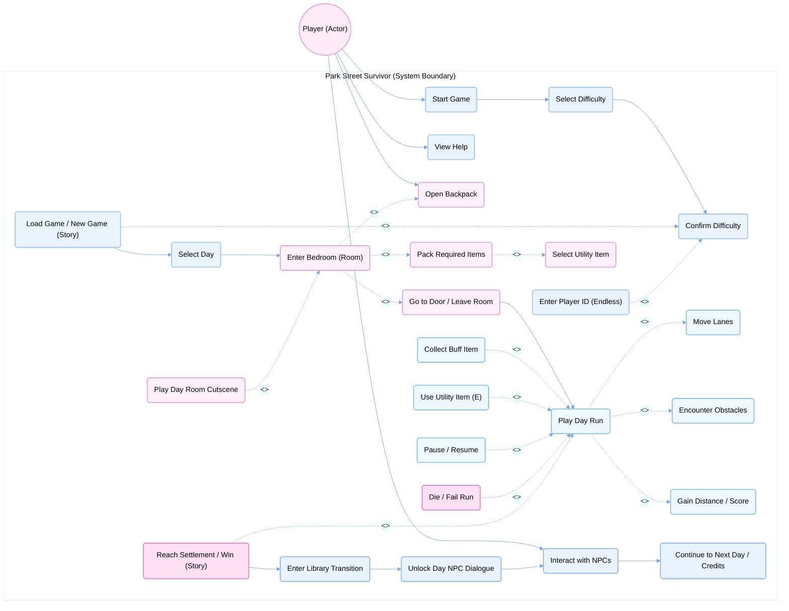
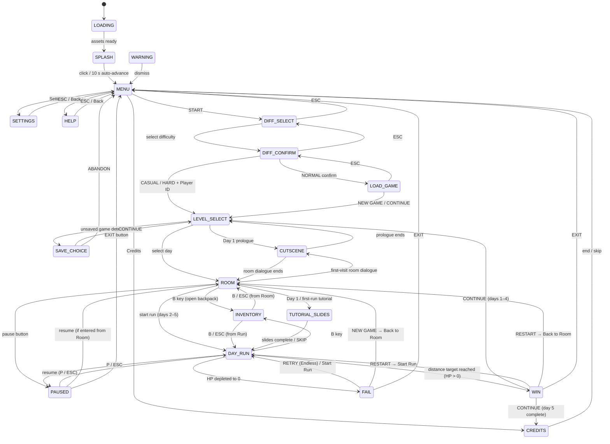

<div align="center">


<br>

# Park Street Survivor

<p>
  
  
  

<br>


<br><br>

> *"Sprint through the fragmented memories of a Bristol CS graduate: A 5-day surrealist journey on Park Street where every gift from the past shapes your ultimate choice — to wake up or to fade away."*

<br>

<div align="center">

[](https://uob-comsm0166.github.io/2026-group-7/)
[](https://uob-comsm0166.github.io/2026-group-7/pss/)

</div>

<br>


</div>

<br>

<a name="group-members"></a>
<h2 align="center">Group Members</h2>

<div align="center">

<br><br>

<div align="center">

| Role | Name | Email |
|:---:|:---:|:---:|
| **Core Mechanism Designer, Scripts Designer** | Charlotte Yu | fe22207@bristol.ac.uk |
| **Aesthetic Designer, Scripts Designer** | Lucca Zhou | pn25381@bristol.ac.uk |
| **Level Designer, Scripts Designer** | Ray Wang | nz25771@bristol.ac.uk |
| **UI/UX & Audio Designer, Scripts Designer** | Layla Pei | jj25661@bristol.ac.uk |

</div>

</div>

<br>

<p align="center"></p>


<br>

<a name="table-of-contents"></a>
<h2 align="center">Table of Contents</h2>

<div align="center">

| # | Section | Description |
|:---:|:---:|:---|
| 00 | [Labs](#labs) | Weekly lab tasks & documentation |
| 01 | [Introduction](#introduction) | Game overview & what makes it novel |
| 02 | [Requirements](#requirements) | Ideation, use cases & user stories |
| 03 | [Design](#design) | System architecture, state machine & class diagrams |
| 04 | [Implementation](#implementation) | Key technical challenges |
| 05 | [Evaluation](#evaluation) | Qualitative & quantitative testing |
| 06 | [Process](#process) | Team workflow & reflection |
| 07 | [Conclusion](#conclusion) | Lessons learnt & future work |
| 08 | [Contribution](#contribution) | Individual contributions |

</div>

<br>


<br>

<a name="repository-structure"></a>
<h2 align="center">Repository Structure</h2>

```text
2026-group-7/
├── README.md               ← You are here — main project documentation
├── ArtAsset/               ← Raw art source files (sprites, backgrounds, UI, fonts, audio)
├── docs/
│   ├── pss/                ← Playable game (entry: sketch.js + all game source in src/)
│   │   ├── sketch.js       ← Main draw loop and global state machine
│   │   ├── src/            ← All game modules (Player, ObstacleSystem, Cutscene, etc.)
│   │   └── assets/         ← In-game assets loaded at runtime
│   ├── Labs/               ← Weekly lab documentation (one folder per week)
│   │   ├── Week_1_List_of_Ideas/
│   │   ├── Week_2_Paint_App/
│   │   ├── Week_3_Prototype/
│   │   ├── Week_4_User_Story/
│   │   ├── Week_5_Object_Orientated_Design/
│   │   ├── Week_7_Evaluation/
│   │   ├── Week_8_Evaluation_2/
│   │   └── Week_9_QA_Testing/
│   ├── assets/             ← Images and diagrams used in this README
│   ├── index.html          ← Project site — home page
│   ├── meetings.html       ← Project site — full meeting log
│   ├── labs.html           ← Project site — labs overview
│   └── technical.html      ← Project site — technical documentation
```

> **Meeting notes:** Every sprint planning session, stand-up, and retrospective is logged on the [Project Site](https://uob-comsm0166.github.io/2026-group-7/meetings.html). The meeting log is the canonical record of all decisions, action items, and velocity data across the project.

<br>


<br>

<a name="labs"></a>
<h2 align="center">Labs</h2>

<div align="center">

| Week | Title | Documentation |
|:---:|:---|:---:|
| 01 | **Lab 1: List of Game Ideas** | [README](./docs/Labs/Week_1_List_of_Ideas/) |
| 02 | **Lab 2: Paint System & Game Brainstorming** | [README](./docs/Labs/Week_2_Paint_App/) |
| 03 | **Lab 3: Prototype & Game Selection** | [README](./docs/Labs/Week_3_Prototype/README.md) |
| 04 | **Lab 4: User Stories & Requirements Engineering** | [README](./docs/Labs/Week_4_User_Story/README.md) |
| 05 | **Lab 5: Object-Oriented Design & Agile Estimation** | [README](./docs/Labs/Week_5_Object_Orientated_Design/README.md) |
| 07 | **Lab 7: Think Aloud Study & Heuristic Evaluation** | [README](./docs/Labs/Week_7_Evaluation/README.md) |
| 08 | **Lab 8: HCI Evaluation — NASA-TLX & SUS** | [README](./docs/Labs/Week_8_Evaluation_2/README.md) |
| 09 | **Lab 9: Quality Assurance — Black-Box & White-Box Testing** | [README](./docs/Labs/Week_9_QA_Testing/README.md) |
| 12 | **Lab 12: Sustainability — SusAF & Green Software Patterns** | [README](./docs/Labs/Week_12_Sustainability/README.md) |

</div>

<br>


<br>

<a name="introduction"></a>
<h2 align="center">Introduction</h2>

**Park Street Survivor** is a narrative-driven runner set in the heart of Bristol, built around two distinct modes.

In **Story Mode**, each run is a chapter in Iris’s week — five days of escalating tension, branching dialogue, and choices that quietly reshape the ending. The run is the vehicle; the story is the destination.

In **Endless Mode**, the narrative falls away and only the run remains. Survive as long as possible on an ever-harder Park Street, chase a high score, and climb the leaderboard.

Both modes share the same core: keep moving, dodge obstacles, don’t fall behind. But woven beneath every sprint in Story Mode is a story that grows heavier with each passing day — one that asks whether surviving the hill is really the hardest part of Iris’s week.

<br>

## Gameplay — The Runner

The runner mechanics draw from the energy of two mobile classics. Like *Temple Run*[^1], the player must read the environment instantly and commit to split-second decisions. Like *Subway Surfers*[^2], the game takes place in a vivid urban setting full of life and hazards — buses, scooters, and everything Bristol throws at you.

<div align="center">

| Temple Run — Reflex-driven obstacle avoidance | Subway Surfers — Urban parkour runner |
|:---:|:---:|
|  |  |

</div>

<br>

## Aesthetics & Narrative — Something Deeper

Unlike disjointed UI approaches, every visual and narrative element in Park Street Survivor is designed as a unified whole. The dreamlike quality of the storyline — Iris slipping between memory, exhaustion, and surreal vision — led us to *Omori*[^3] as a key aesthetic reference: its handcrafted pixel art and purple-pink palette perfectly capture that boundary between the subconscious and the waking world. The grounded warmth of everyday life draws from *Stardew Valley*[^4], while the bold, character-driven presentation takes its cues from *Persona 5*[^5]. To reflect this duality in our own palette, we chose pink and purple as the primary colour — representing the dream — and yellow as the contrast colour for reality, striking and immediately readable against the softer tones.

<div align="center">

<table>
<tr>
  <td align="center" width="50%" valign="top">
    
    <br><i>Omori — Dreamlike pixel art, purple-pink palette</i>
  </td>
  <td align="center" width="50%" valign="top">
    
    <br><i>Stardew Valley — Pixel warmth & daily routine</i>
  </td>
</tr>
<tr>
  <td align="center" colspan="2">
    
    <br><i>Persona 5 — Bold UI & character-driven narrative</i>
  </td>
</tr>
</table>

</div>

<br>

## The Story — Five Days, One Question

Iris is a Bristol CS student who starts every morning the same way: pack her bag, climb Park Street, make it to class. Day one feels almost hopeful — bright weather, good energy, a straightforward hill to climb. But by day two, her body is already protesting. By day three, something feels off. By day four, the world itself seems to be unravelling.

Each run is a fragment of Iris’s week. The items she picks up, the people she meets, the choices she makes — they all accumulate. The story does not announce itself; it seeps through, line by line, until you realise this was never just a runner game.

*What exactly happened before this week began? And when the end of Day 5 arrives — what will you choose?*

## What Makes It Original

The game started as a parkour runner — fast, Bristol-set, fun to play. But the team felt it was too thin on its own. A runner without weight is forgettable, and the team wanted to make something that stayed with people.

The narrative layer came from asking an honest question: what pressures do we face now, as students, and what might we face after graduation? The story of Iris grew from that conversation — the exhaustion, the daily grind of climbing the same hill, the way small things accumulate into something harder to name. Several of the NPCs Iris encounters along the way are drawn in part from the team members themselves.

<br>

## What You'll Face on Park Street

*The cards below are taken directly from the in-game Help screen — Iris's survival reference before every run.*

<br>

**Characters**

<div align="center">

<table>
<tr>
  <td align="center" width="190">
    
    <br><sub><b>Iris</b></sub>
    <br><sub><i>Protagonist</i></sub>
  </td>
  <td align="center" width="130">
    
    <br><sub><i>NPC · Day 1</i></sub>
    <br><sub><b>???</b></sub>
  </td>
  <td align="center" width="130">
    
    <br><sub><i>NPC · Day 2</i></sub>
    <br><sub><b>???</b></sub>
  </td>
  <td align="center" width="130">
    
    <br><sub><i>NPC · Day 3</i></sub>
    <br><sub><b>???</b></sub>
  </td>
  <td align="center" width="130">
    
    <br><sub><i>NPC · Day 4</i></sub>
    <br><sub><b>???</b></sub>
  </td>
  <td align="center" width="130">
    
    <br><sub><i>NPC · Day 5</i></sub>
    <br><sub><b>???</b></sub>
  </td>
</tr>
</table>

</div>

> *5 people cross Iris's path across the five days — each carrying a gift for Iris. Play to find out who they are and why they are here.*

<br>

**Power-ups**

<div align="center">

<table>
<tr>
  <td align="center" width="150">
    
    <br><sub><b>Coffee</b></sub>
  </td>
  <td align="center" width="150">
    
    <br><sub><b>Scooter</b></sub>
  </td>
  <td align="center" width="150">
    
    <br><sub><b>Motorcycle</b></sub>
  </td>
</tr>
</table>

</div>

<br>

**Hazards**

<div align="center">

<table>
<tr>
  <td align="center" width="130">
    
    <br><sub><b>Bus</b></sub>
  </td>
  <td align="center" width="130">
    
    <br><sub><b>Car</b></sub>
  </td>
  <td align="center" width="130">
    
    <br><sub><b>Ambulance</b></sub>
  </td>
  <td align="center" width="130">
    
    <br><sub><b>Scooter Rider</b></sub>
  </td>
  <td align="center" width="130">
    
    <br><sub><b>Kebab Cart</b></sub>
  </td>
</tr>
<tr>
  <td align="center" width="130">
    
    <br><sub><b>Ice Cream Cart</b></sub>
  </td>
  <td align="center" width="130">
    
    <br><sub><b>Promoter</b></sub>
  </td>
  <td align="center" width="130">
    
    <br><sub><b>Homeless</b></sub>
  </td>
  <td align="center" width="130">
    
    <br><sub><b>???</b></sub>
  </td>
  <td align="center" width="130">
    
    <br><sub><b>???</b></sub>
  </td>
</tr>
</table>

</div>

<br>

> *2 more hazards are waiting to catch you off guard. Press `P` during any run to pause — the full Help screen is one click away.*

<br>


<br>

<a name="requirements"></a>
<h2 align="center">Requirements</h2>

### 2.1 Early Design and Ideation

We each pitched a game idea independently at the start — eleven concepts total across genres like tower defence, roguelike, and puzzle-platformer. Six were cut in the first round because they were either too complex to build within the timeline or not original enough. The remaining five were scored by the whole team across four criteria: Creativity, Difficulty (scored inversely — harder to build means lower score), Player Interest, and Extendability.

<div align="center">

| Game | Creativity | Difficulty ↓ | Interest | Extendability | Total |
| :--- | :---: | :---: | :---: | :---: | :---: |
| **Park Street Survivor** * | 5 | 0 | 3 | 3 | **11** |
| **The Strongest Support** * | 2 | 2 | 3 | 2 | **9** |
| Tableturf Battle | 3 | 0 | 2 | 2 | 7 |
| Pico Park | 0 | 4 | 0 | 2 | 6 |
| Plants vs. Zombies | 0 | 2 | 1 | 0 | 3 |

* Selected as finalists for prototype phase
↓ Difficulty is scored inversely — lower score = higher implementation complexity

Table 1: Game Concept Evaluation (Round 2 — after first-round eliminations)

</div>

The two highest-scoring concepts went into a short prototype phase. We built and demoed both, then agreed as a team. The prototype covered three core gameplay states: preparation, failure, and success.

<div align="center">

#### Prototype A — Park Street Survivor

| | |
| :---: | :--- |
|  | **Prototype — Preparing for the run**<br><br>Before each run the player enters the Room scene, where they can interact with the desk to manage their backpack and choose a utility item to carry into the day. |
|  | **Prototype — Failure state**<br><br>If the player’s health drains to zero, they collide with a bus, or run out of time, the fail screen is triggered — each outcome displays a distinct reason code. |
|  | **Prototype — Success state**<br><br>Reaching the day’s distance target with HP remaining triggers a brief victory transition before advancing the narrative to the next day. |

</div>

Park Street Survivor won because it scored highest on originality and extendability. The Strongest Support’s indirect-control mechanic also made it hard to form any emotional connection with the game — which matters a lot when the whole point is narrative. A runner fits naturally into p5.js too: the core loop is self-contained and clean, with real space to layer story and mechanics on top.

### 2.2 Stakeholders

<p align="center">
  
</p>


### 2.3 Epics

Development work was organised into four epics, each representing a distinct pillar of the game:

- **Infrastructure:** Version control, repository structure, GitHub Pages deployment, lab documentation, and the project website — everything outside the game itself.
- **Core Gameplay & Mechanics:** Player movement, lane-switching physics, health decay, collision detection, obstacle behaviour, procedural level generation, save system, state machine architecture, and all core engine systems.
- **Aesthetics, UX & Audio:** Visual asset design, HUD layout, feedback effects, background music routing, and sound effect integration.
- **Narrative Logic:** The five-day story structure, dialogue node graph, cutscene engine, branching choices, and the room scene between each run.

### 2.4 User Stories

User stories were written for each epic using the "As a [user], I want [goal] so that [reason]" format with Given–When–Then acceptance criteria.

#### Epic: Core Gameplay & Mechanics · [PSS-133](https://charlotteyu47.atlassian.net/browse/PSS-133)

> **Target Player**
> *"As a player, I want my health to decay during the run so that I feel urgency and need to actively collect coffee to survive."*
>
> Given a run is active / When each frame ticks / Then HP decreases at a fixed rate (0.02/frame on Day 1, rising to 0.04/frame on Day 5).
>
> Implemented in [PSS-162](https://charlotteyu47.atlassian.net/browse/PSS-162) · commit `5b870fb`

#### Epic: Narrative Logic · [PSS-134](https://charlotteyu47.atlassian.net/browse/PSS-134)

> **Target Player**
> *"As a player, I want dialogue choices that affect the story outcome so that my decisions feel meaningful and encourage replaying."*
>
> Given a branching dialogue node is reached / When I select an option / Then the narrative advances along that branch and the choice is saved to the save file.
>
> Implemented in [PSS-144](https://charlotteyu47.atlassian.net/browse/PSS-144) · commit `2f06281` — extended to data-driven architecture in [PSS-166](https://charlotteyu47.atlassian.net/browse/PSS-166) · commit `06dd113`

#### Epic: Aesthetics, UX & Audio · [PSS-135](https://charlotteyu47.atlassian.net/browse/PSS-135)

> **Target Player**
> *"As a player, I want the background music to change between scenes so that each phase of the game feels tonally distinct."*
>
> Given the game transitions to a new state / When the BGM manager detects the change / Then the corresponding track fades in without overlap from the previous one.
>
> Implemented in [PSS-22](https://charlotteyu47.atlassian.net/browse/PSS-22) · commit `4e8903b`

#### Epic: Infrastructure · [PSS-132](https://charlotteyu47.atlassian.net/browse/PSS-132)

> **Development Team / Course Evaluator**
> *"As a contributor, I want the game to be playable from a GitHub Pages URL so that anyone can access it without installation."*
>
> Given a commit is pushed to main / When GitHub Pages deployment completes / Then the game is accessible in any modern desktop browser.
>
> Implemented in [PSS-39](https://charlotteyu47.atlassian.net/browse/PSS-39) · commit `eabe8c5`

### 2.5 Functional Requirements (MoSCoW[^6])

<div align="center">

| Priority | Requirement |
| :--- | :--- |
| **Must Have** | Four-lane horizontal movement with spring-damper physics |
| **Must Have** | Passive health decay per frame and coffee collection to restore health |
| **Must Have** | Collision detection for vehicles, scooters, and NPC hazards |
| **Must Have** | Instant-fail on large vehicle (bus/ambulance) collision |
| **Must Have** | Five narrative days with distinct obstacle profiles and health decay rates |
| **Must Have** | Branching dialogue system with node-graph architecture and choice persistence |
| **Should Have** | Backpack inventory system with active item usage (E key) |
| **Should Have** | Procedural obstacle spawning with fairness and difficulty scaling |
| **Should Have** | Local leaderboard with high-score tracking per difficulty mode *(implemented)* |
| **Should Have** | Brightness control via CSS filter with persistent user preference |
| **Should Have** | Fullscreen toggle via keyboard shortcut ([F]) with whole-page Fullscreen API |
| **Could Have** | Puddle trap mechanic with interactive escape *(implemented)* |
| **Could Have** | Unlockable Casual and Hard difficulty modes (endless runs) |
| **Won’t Have** | Online multiplayer or networked leaderboard features |

Table 2: MoSCoW Functional Requirements

</div>

### 2.8 Use Case Diagram

> **Note on notation:** GitHub's Markdown renderer does not support PlantUML, which provides native UML Use Case diagram syntax[^10]. The diagram below is rendered using Mermaid's flowchart module — the closest available approximation within this environment. UML semantics are preserved: the subgraph represents the system boundary, nodes represent use cases, `P` represents the Player actor, and `<<include>>`/`<<extend>>` stereotypes follow standard UML convention.



<br>

The player starts from the menu, selects a difficulty, and moves through the room preparation into the day run. Story Mode unlocks the library sequence after each win; Endless Mode routes directly to the result screen.

<br>


<br>

<a name="design"></a>
<h2 align="center">Design</h2>

### 3.1 System Architecture

Park Street Survivor is built on a single-canvas p5.js application driven by a centralised Finite State Machine (FSM). The entry point, `SketchCore` (implemented in `sketch.js`), acts as the sole orchestrator: it owns every top-level system as a singleton, runs the main `draw()` loop, and routes execution to the appropriate subsystem based on the current game state integer held in `GameState`. Note that `SketchCore` is an architectural abstraction — in p5.js's global mode, `sketch.js` is not a JavaScript class but a collection of global functions (`preload`, `setup`, `draw`, etc.) that together form the engine's entry point. It is modelled as a class in the diagram to represent its logical ownership of all singleton instances. More broadly, our separation of engine, gameplay, UI, audio, and persistence reflects the modular view of game engines described by Lewis and Whitehead (2011), where large interactive systems are organised around clearly bounded responsibilities.[^16]

The key architectural constraint throughout is **one-directional data flow per subsystem**: gameplay classes signal upward to `LevelController` and `FeedbackLayer`, but neither has any knowledge of `MainMenu` or `SaveSystem`. This keeps coupling low and allows individual layers to be tested and replaced independently.

### 3.2 State Machine Diagram

The FSM comprises **20 discrete states** spread across four functional regions: Launch, Menu, Story/Endless, and Gameplay. The diagram below maps every reachable transition.



### 3.3 Class Diagram

The diagram is colour-coded by system layer. Each colour group is summarised in the table above.

<div align="center">

| Colour | Category | Classes |
|--------|----------|---------|
|  Pink | **Engine** | `SketchCore` |
|  Purple | **State / Config** | `GameState`, `GlobalConfig` |
|  Yellow | **Menu** | `MainMenu`, `TimeWheel` |
|  Peach | **UI Components** | `UIButton`, `UISlider`, `DialogueBox` |
|  Mint | **Scene** | `RoomScene`, `BackpackVisual` |
|  Blue | **Gameplay** | `Player`, `Environment`, `ObstacleManager`, `LevelController`, `ProceduralLevel`, `TutorialLevel`, `FeedbackLayer` |
|  Lavender | **Data** | `InventorySystem`, `DialogueData` |
|  Amber | **Narrative** | `CutsceneModule` |
|  Green | **Audio** | `BGMManager` |
|  Rose | **Persistence** | `SaveSystem`, `LeaderboardManager` |
|  Red | **End Screens** | `EndScreenBase`, `FailScreen`, `SuccessScreen`, `EndScreenManager` |
|  Grey | **Dev Tools** | `TestingPanel` |

</div>

```mermaid
classDiagram
direction LR

    %% ══════════════════════════════════════════════════════════
    %% ENGINE / CORE
    %% ══════════════════════════════════════════════════════════

    class SketchCore {
        +int currentDayID
        +int currentUnlockedDay
        +bool developerMode
        +Object assets
        +Object fonts
        +Object globalFade
        +Object tutorialHints
        +Object titleDrop
        +float masterVolumeBGM
        +float masterVolumeSFX
        +Object bgms
        +preload() void
        +setup() void
        +draw() void
        +runGameLoop() void
        +triggerTransition(callback) void
        +setupRun(dayID) void
        +setupRunDirectly(dayID) void
        +renderGlobalFade() void
        +drawLoadingScreen() void
        +drawSplashScreen() void
        +drawOtherBgWithOverlay() void
        +drawPauseButton() void
        +renderPauseOverlay() void
        +renderStoryRecap() void
        +keyPressed() void
        +mousePressed() void
        +mouseReleased() void
        +mouseDragged() void
        +mouseMoved() void
    }

    class GameState {
        +int currentState
        +int previousState
        +String failReason
        +bool isFirstTimeInRoom
        +String runUtilityItemName
        +int runUtilityItemCharges
        +bool runUtilityItemArmed
        +setState(newState) void
        +resetFlags() void
        +saveRunUtilityItemSnapshot(name, charges, armed) void
        +clearRunUtilityItemSnapshot() void
    }

    class GlobalConfig {
        <<Module>>
        +int STATE_MENU
        +int STATE_LEVEL_SELECT
        +int STATE_SETTINGS
        +int STATE_ROOM
        +int STATE_DAY_RUN
        +int STATE_PAUSED
        +int STATE_FAIL
        +int STATE_WIN
        +int STATE_CUTSCENE
        +int STATE_CREDITS
        +int STATE_INVENTORY
        +int STATE_DIFF_SELECT
        +int STATE_LOAD_GAME
        +Object GLOBAL_CONFIG
        +Object PLAYER_DEFAULTS
        +Object DAYS_CONFIG
        +Object DIFFICULTY_PRESETS
    }

    %% ══════════════════════════════════════════════════════════
    %% MENU / UI
    %% ══════════════════════════════════════════════════════════

    class MainMenu {
        +int menuState
        +int helpPage
        +int difficultyIndex
        +int diffSelectIndex
        +int selectedDifficulty
        +int diffInfoShown
        +int loadGameIndex
        +bool isBGMMuted
        +bool isSFXMuted
        +float preMuteBGMVolume
        +float preMuteSFXVolume
        +TimeWheel timeWheel
        +UIButton[] buttons
        +UIButton backButton
        +UISlider bgmSlider
        +UISlider sfxSlider
        +display() void
        +setupButtons() void
        +handleBackAction() void
        +keyPressed(key) void
        +mousePressed() void
        +toggleBGMMute() void
        +toggleSFXMute() void
    }

    class TimeWheel {
        +Object daysConfig
        +int currentDayIndex
        +float bgAlpha
        +float cloudAlpha
        +Array drops
        +Object cloudDrop
        +float cloudScale
        +display() void
        +triggerEntrance() void
        +handleInput() void
        +renderCloudPreview() void
        +drawNavNode() void
        +drawDynamicBackground() void
        +drawSelectionArrows() void
        +drawMissionTitle() void
        +_updateDropPhysics() void
    }

    class UIButton {
        +float x
        +float y
        +float w
        +float h
        +String label
        +Function onClick
        +String fontKey
        +float currentScale
        +float targetScale
        +bool isFocused
        +update() void
        +display() void
        +isMouseOver() bool
        +handleClick() void
    }

    class UISlider {
        +float x
        +float y
        +float w
        +float min
        +float max
        +float value
        +String label
        +bool isDragging
        +display() void
        +update() void
        +getValue() float
        +setValue(val) void
        +handlePress() void
        +handleRelease() void
    }

    class DialogueBox {
        +bool persistent
        +bool autoPlayMode
        +bool active
        +String fullText
        +String speakerName
        +Image portraitImg
        +Object[] options
        +String[] highlight
        +int wordIndex
        +String displayedText
        +float wordTickMs
        +SoundFile typingSfx
        +reset() void
        +trigger(text, portrait, speaker, options, highlight) void
        +display() void
        +isActive() bool
        +isFinishedTyping() bool
        +skipToEnd() void
        -drawNineSlice(img, x, y, w, h, cap) void
        -drawPortraitMasked(img, x, y, w, h, r) void
        -resolvePortraitBySpeaker(name) Image
        -hasRenderablePortrait(img) bool
    }

    %% ══════════════════════════════════════════════════════════
    %% ROOM & INVENTORY
    %% ══════════════════════════════════════════════════════════

    class RoomScene {
        +float playerSpawnX
        +float playerSpawnY
        +Object walkableArea
        +Object carpetArea
        +float deskX
        +float deskY
        +float deskThreshold
        +float deskBoxW
        +float deskBoxH
        +float doorX
        +float doorY
        +float doorThreshold
        +bool isPlayerNearDesk
        +bool isPlayerNearDoor
        +int doorBlockTimer
        +String doorBlockMessage
        +DialogueBox dialogueBox
        +UIButton backButton
        +reset() void
        +isWalkable(x, y) bool
        +getValidPosition(nx, ny, ox, oy) Object
        +checkInteraction() void
        +display() void
        +drawInteractionIndicators() void
        +drawTutorialHints() void
        +drawDoorBlockedPrompt() void
    }

    class BackpackVisual {
        +InventorySystem inventory
        +RoomScene room
        +Object[] topSlots
        +Object[] scatteredItems
        +Object draggedItem
        +String dragSource
        +int dragIndex
        +bool backpackHighlight
        +Object itemZone
        +Object deskZone
        +Object itemFixedPositions
        +bool showReplaceDialog
        +Object replaceNewItem
        +int replaceSlotIndex
        +String messageText
        +int messageTimer
        +UIButton backButton
        +display() void
        +initScatteredItems() void
        +drawTopBar() void
        +drawScatteredItems() void
        +drawTooltip() void
        +drawReplaceDialog() void
        +handleMousePressed() void
        +handleMouseDragged() void
        +handleMouseReleased() void
        +tryAddToBackpack() void
        +executeReplace() void
        +hasRequiredItems() bool
        +getMissingRequiredItems() Array
        +showMessage(text) void
    }

    class InventorySystem {
        +Object[] items
        +int maxSlots
        +bool isVisible
        +addItem(itemData) bool
        +removeItem(index) void
        +display() void
        +drawSlots() void
        +handleKeyPress() void
    }

    %% ══════════════════════════════════════════════════════════
    %% GAMEPLAY — RUN PHASE
    %% ══════════════════════════════════════════════════════════

    class Player {
        +float x
        +float y
        +float width
        +float height
        +float hitboxW
        +float minX
        +float maxX
        +int currentLaneIndex
        +int targetLaneIndex
        +float laneVelocityX
        +float laneSpringK
        +float laneSpringDamping
        +bool leftHeld
        +bool rightHeld
        +String dir
        +float animFrame
        +bool isWalking
        +float health
        +float maxHealth
        +float healthDecay
        +float baseSpeed
        +float distanceRun
        +int playTimeFrames
        +int carHitCount
        +int coffeeCupCount
        +float[] runLaneCenters
        +update(scrollSpeed) void
        +display() void
        +applyHealthDecay() void
        +handleCollision(obstacle) void
        +takeDamage(amount) void
        +triggerGameOver() void
        +drawTopBar() void
        +drawClock() void
        +drawHealthBar() void
        +drawProgressBar() void
        +drawPauseIcon() void
        +resetStatsToDefault() void
        +applyLevelStats(dayID) void
        +handleRunMovement() void
        +handleRoomMovement() void
    }

    class Environment {
        +float scrollPos
        +int bgHeight
        +int centerX
        +Image defaultBg
        +Image[] defaultBgCycle
        +int defaultBgHeadIndex
        +Image destinationBg
        +Object layout
        +Object colors
        +Object victoryColors
        +Object[] victoryFireworks
        +int victoryFireworkCooldown
        +String weatherMode
        +Object[] raindrops
        +Object[] rainSplashes
        +update(speed) void
        +display() void
        +loadBackgrounds() void
        +configureWeather(themeKey) void
        +resetWeather() void
        +createRaindrop(spawnAnywhere) Object
        +updateWeather() void
        +drawWeatherOverlay() void
        +drawCenterLine(colors) void
        +drawVictoryMadeText(progress, isMoving) void
        +spawnVictoryFireworkBurst(cx, cy) void
        +getDefaultBgByTileIndex(i) Image
    }

    class ObstacleManager {
        +Object[] obstacles
        +int spawnTimer
        +Object currentLevelConfig
        +Object spriteCache
        +Object promoterInteraction
        +int promoterCooldownFramesRemaining
        +Object modeCycleState
        +Object spawnSchedulerState
        +int elapsedSpawnFrames
        +Object buffSpawnState
        +Object modeSwitchIndicator
        +Object hazardRhythmConfig
        +Object centerLaneFlowConfig
        +Object emergencyCoffeeConfig
        +Object emergencyCoffeeState
        +Object spawnSafety
        +setLevelConfig(config) void
        +update() void
        +spawnHazard() void
        +display() void
        +checkCollision(player) void
        +stopSpawning() void
        +secondsToFrames(s) int
    }

    class LevelController {
        +ProceduralLevel proceduralLevel
        +ProceduralLevel currentLevel
        +int currentDayID
        +String levelType
        +String levelPhase
        +float victoryStartScrollPos
        +float victoryPreRollDistance
        +int victoryZoneFrames
        +float victoryZoneStartY
        +bool failSettlementPending
        +String pendingFailReason
        +initializeLevel(dayID) bool
        +loadLevelBackgrounds(dayID) void
        +initializeProceduralLevel(dayID, config) void
        +applyDifficultyParameters(dayID) void
        +triggerVictoryPhase() void
        +getLevelPhase() String
        +resetRunPhaseState() void
        +update() void
        +display() void
    }

    class ProceduralLevel {
        +int dayID
        +Object config
        +bool setupDone
        +setup() void
        +update() void
        +display() void
        +reset() void
        +cleanup() void
        +getDifficultyConfig() Object
    }

    class TutorialLevel {
        +int dayID
        +Object config
        +String levelText
        +int frameCounter
        +int displayDuration
        +setup() void
        +update() void
        +display() void
        +reset() void
        +cleanup() void
    }

    class FeedbackLayer {
        +Object theme
        +int hitFlashFrames
        +int buffFlashFrames
        +int smallBusinessFlashFrames
        +int healthBarFlashFrames
        +int hitStopFrames
        +int cameraShakeFrames
        +float cameraShakeAmplitude
        +Object[] buffRipples
        +Object[] buffSpeedLines
        +Object[] smallBusinessRipples
        +int scooterStunFrames
        +Object sfxMap
        +onCollision(payload) void
        +onPickup(payload) void
        +update() void
        +display() void
    }

    %% ══════════════════════════════════════════════════════════
    %% NARRATIVE / CUTSCENE
    %% ══════════════════════════════════════════════════════════

    class CutsceneModule {
        <<Module>>
        +Object _cs
        +bool _cs.isNodeMode
        +String _cs.currentNodeId
        +String _cs.bg
        +Function _cs.onComplete
        +bool _cs.showingChoices
        +float _csFloatZoom
        +float _csFloatCrossfadeAlpha
        +bool _csDay5VoiceCtx
        +bool _isEndingActive
        +Object _screenEffect
        +Object _flashEffect
        +Object _showcase
        +bool _csBlurActive
        +float _csBlurIntensity
        +Object SPEAKER_PORTRAIT_MAP
        +startCutscene(bg, lines, onComplete) void
        +startCutsceneFromNode(nodeId, onComplete) void
        +csAdvance() void
        +drawCutsceneScreen() void
        +drawCinematicEnding() void
        +startCinematicEnding(lines, onDone) void
        +triggerGoodEnding() void
        -_resolveNodeAction(action) Function
        -_drawCutsceneBg() void
        -_drawEyeBlinkOverlay() void
        -_tickAndApplyScreenEffect() void
        -_parseContent(contentArray) Object
        -_onNodeOptionSelected(opt) void
        -_startShowcase(itemId) void
        -_showItemToast(itemName) void
    }

    class DialogueData {
        <<DataModule>>
        +Object DIALOGUE_DATA
        +Object prologue
        +Object day_room
        +Object day_npc_start
        +Object endings
        +Object awakening_reality
        +Object day1_npc_01..09
        +Object day2_npc_01..13
        +Object day3_npc_01..10
        +Object day4_npc_01..04
        +Object day5_szpital_01..12
        +Object day5_no_01..06
        +Object day5_yes_01..blk..end
        +Object day5_good_news_01..05c
        +Object day5_bad_news_01..05
    }

    %% ══════════════════════════════════════════════════════════
    %% AUDIO
    %% ══════════════════════════════════════════════════════════

    class BGMManager {
        <<Singleton>>
        -String _currentKey
        -String _cutsceneScene
        -bool _enabled
        -bool _isLocked
        +setCutsceneScene(scene) void
        +clearCutsceneScene() void
        +routeKey(state) String
        +play(key) void
        +stop() void
        +syncVolume() void
        +onStateChanged(state) void
        +setEnabled(enabled) void
        +getCurrentKey() String
        +getCutsceneScene() String
    }

    %% ══════════════════════════════════════════════════════════
    %% PERSISTENCE
    %% ══════════════════════════════════════════════════════════

    class SaveSystem {
        <<Singleton>>
        -int _lastSaveTime
        +save() void
        +load() Object
        +clear() void
        +hasSave() bool
        +tick() void
        +applyAndResume() void
        +formatTime(ms) String
    }

    class LeaderboardManager {
        +Object topScores
        +String currentPlayerId
        +Object lastSubmittedEntry
        +loadScores() void
        +saveScores() void
        +setPlayerId(id) bool
        +ensurePlayerIdForMode(mode) bool
        +getModeKey(mode) String
        +getModeLabel(key) String
        +getCurrentModeKey() String
        +submitEntry(score, day, frames) void
    }

    %% ══════════════════════════════════════════════════════════
    %% END SCREENS
    %% ══════════════════════════════════════════════════════════

    class EndScreenBase {
        <<Abstract>>
        +int selectedIndex
        +Object[] options
        +bool isActive
        +String stateStep
        +activate() void
        +drawOverlay() void
        +drawBox(bgImage) Object
        +drawProgressBar() void
        +drawButtons() void
        +handleKeyPress() void
        +handleClick() void
        +handleMouseMove() void
        +executeSelection() void
    }

    class FailScreen {
        +String failType
        +Object[] mainOptions
        +Object[] modeOptions
        +display() void
        +_getReasonText() String
        +executeSelection() void
    }

    class SuccessScreen {
        +Object[] mainOptions
        +Object[] modeOptions
        +display() void
        +executeSelection() void
    }

    class EndScreenManager {
        +Object failScreens
        +SuccessScreen successScreen
        +activateFail(type) void
        +activateSuccess() void
        +display() void
        +handleKeyPress() void
        +handleClick() void
        +handleMouseMove() void
    }

    %% ══════════════════════════════════════════════════════════
    %% DEBUG
    %% ══════════════════════════════════════════════════════════

    class TestingPanel {
        +bool visible
        +int selectedDay
        +Object layout
        +Object storyDebugData
        +bool showStoryDebugControls
        +String storyDebugActiveLayer
        +draw() void
        +handleClick(x, y) void
        +handleAction(actionId) void
        +drawCutscenePanel() void
        +drawBuffControlPanel() void
        +drawObstacleOverlay() void
        +drawStoryDebugPanel() void
        +drawLeaderboardPanel() void
    }

    %% ══════════════════════════════════════════════════════════
    %% STEREOTYPES
    %% ══════════════════════════════════════════════════════════

    <<Engine>>       SketchCore
    <<StateMachine>> GameState
    <<Module>>       GlobalConfig
    <<MenuController>> MainMenu
    <<LevelSelector>>  TimeWheel
    <<UIComponent>>    UIButton
    <<UIComponent>>    UISlider
    <<DialogueUI>>     DialogueBox
    <<Scene>>          RoomScene
    <<InventoryUI>>    BackpackVisual
    <<DataStore>>      InventorySystem
    <<Entity>>         Player
    <<WorldRenderer>>  Environment
    <<ObstacleSystem>> ObstacleManager
    <<LevelLifecycle>> LevelController
    <<LevelConfig>>    ProceduralLevel
    <<LevelConfig>>    TutorialLevel
    <<FeedbackSystem>> FeedbackLayer
    <<Module>>         CutsceneModule
    <<DataModule>>     DialogueData
    <<Singleton>>      BGMManager
    <<Singleton>>      SaveSystem
    <<Leaderboard>>    LeaderboardManager
    <<Abstract>>       EndScreenBase
    <<EndScreen>>      FailScreen
    <<EndScreen>>      SuccessScreen
    <<Manager>>        EndScreenManager
    <<DevTool>>        TestingPanel

    %% ══════════════════════════════════════════════════════════
    %% NOTES
    %% ══════════════════════════════════════════════════════════

    note for SketchCore "p5.js global draw-loop; owns all singleton instances,<br/>asset registry (images/sounds), and routes input<br/>to the active scene via state machine"
    note for GameState "Integer FSM: drives all scene transitions.<br/>Also carries run-utility-item snapshot for<br/>cross-scene buff continuity"
    note for GlobalConfig "Pure constants module: STATE_* integers,<br/>DAYS_CONFIG per-day tuning, PLAYER_DEFAULTS,<br/>and DIFFICULTY_PRESETS"
    note for MainMenu "Multi-screen menu: home, diff-select, diff-confirm,<br/>load-game, settings (audio sliders + mute), 4-page help,<br/>and scrolling credits with poem section"
    note for TimeWheel "Persona-5-style day navigator with staggered<br/>drop-in physics, cloud floating preview, and<br/>per-card BGM preview"
    note for DialogueBox "Typewriter VN-style box with nine-slice frame,<br/>masked portrait, word-by-word typing SFX,<br/>inline branch options, and auto-play mode"
    note for RoomScene "Bedroom scene: axis-separated AABB walkable<br/>collision, desk/door proximity detection,<br/>breathing tutorial hint icons"
    note for BackpackVisual "Drag-and-drop inventory: desk scatter zone to<br/>backpack slots, swap confirmation dialog,<br/>item tooltips, required-items check for door"
    note for Player "Spring-damper lane physics (laneSpringK/Damping),<br/>health/speed/distance tracking, walk-cycle<br/>animation, full HUD rendering"
    note for Environment "2-2-2 road renderer: multi-tile BG cycling,<br/>day/rain weather overlay with splash physics,<br/>victory firework particle burst"
    note for ObstacleManager "Complex spawn director: mode-cycle hazards,<br/>promoter interaction, buff items, center-lane flow,<br/>emergency coffee, rhythm-based spawn scheduling"
    note for LevelController "Level lifecycle: day routing to difficulty params to<br/>RUNNING to VICTORY_PRE_ROLL to VICTORY_ZONE<br/>with fail-settlement pending resolution"
    note for TutorialLevel "Day-1 tutorial variant: frame-counter based<br/>overlay text display with configurable duration"
    note for FeedbackLayer "Per-frame visual feedback: hit/buff flash,<br/>camera shake, ripple + speed-line particle<br/>effects, scooter stun overlay"
    note for CutsceneModule "Dual-mode narrative engine:<br/>Legacy array mode (prologue, day-room, Day 5)<br/>Node-graph mode (Days 1-4 NPC, good/bad endings)<br/>Supports screen effects, item showcase, bg crossfade"
    note for DialogueData "DIALOGUE_DATA node graph: ~300+ nodes for<br/>Days 1-5 NPC branches, szpital sequence,<br/>good/bad endings with action callbacks"
    note for BGMManager "Singleton audio router: maps game state +<br/>cutscene scene key to BGM track; handles<br/>lock during Day 5 VOICE opening sequence"
    note for SaveSystem "localStorage persistence: snapshot of day,<br/>unlocked progress, player stats, and run-utility<br/>item state; auto-tick every N frames"
    note for LeaderboardManager "Local high-score table: per-mode (casual/hard)<br/>top entries with player ID, score, day reached,<br/>and completion time"
    note for EndScreenBase "Abstract base: semi-transparent overlay,<br/>central result box with optional bg image,<br/>progress bar and keyboard/mouse navigation"
    note for FailScreen "Shows HIT_BUS / EXHAUSTED / LATE reason text<br/>with retry, change day, and main-menu options"
    note for SuccessScreen "Day-complete: hit count, optional leaderboard<br/>score submission, continue to next day or menu"
    note for EndScreenManager "Routes all input and display calls to the<br/>active FailScreen variant or SuccessScreen"
    note for TestingPanel "Overlay dev panel: jump to any state/day,<br/>trigger cutscenes/endings, live buff tweaking,<br/>obstacle overlay, story-node debug, leaderboard wipe"

    %% ══════════════════════════════════════════════════════════
    %% INHERITANCE
    %% ══════════════════════════════════════════════════════════

    FailScreen --|> EndScreenBase
    SuccessScreen --|> EndScreenBase
    TutorialLevel --|> ProceduralLevel

    %% ══════════════════════════════════════════════════════════
    %% COMPOSITION  (whole *-- part)
    %% ══════════════════════════════════════════════════════════

    MainMenu "1" *-- "1" TimeWheel
    MainMenu "1" *-- "3..*" UIButton
    MainMenu "1" *-- "2" UISlider
    EndScreenManager "1" *-- "3" FailScreen
    EndScreenManager "1" *-- "1" SuccessScreen
    LevelController "1" *-- "1" ProceduralLevel
    RoomScene "1" *-- "1" DialogueBox
    RoomScene "1" *-- "1" UIButton
    BackpackVisual "1" *-- "1" UIButton
    BackpackVisual "1" *-- "1" InventorySystem

    %% ══════════════════════════════════════════════════════════
    %% ASSOCIATIONS  (SketchCore owns all top-level singletons)
    %% ══════════════════════════════════════════════════════════

    SketchCore "1" --> "1" GameState
    SketchCore "1" --> "1" MainMenu
    SketchCore "1" --> "1" Player
    SketchCore "1" --> "1" Environment
    SketchCore "1" --> "1" ObstacleManager
    SketchCore "1" --> "1" LevelController
    SketchCore "1" --> "1" RoomScene
    SketchCore "1" --> "1" EndScreenManager
    SketchCore "1" --> "1" BackpackVisual
    SketchCore "1" --> "1" InventorySystem
    SketchCore "1" --> "1" FeedbackLayer
    SketchCore "1" --> "1" LeaderboardManager
    SketchCore "1" --> "1" SaveSystem
    SketchCore "1" --> "1" TestingPanel
    SketchCore "1" --> "1" BGMManager

    %% ── cross-system dependencies ────────────────────────────

    BackpackVisual --> RoomScene           : references
    Player --> LevelController             : signals_victory
    LevelController --> ObstacleManager    : stopSpawning
    LevelController --> Environment        : switchBackground
    ObstacleManager --> FeedbackLayer      : onCollision / onPickup
    ObstacleManager --> Player             : checkCollision
    BGMManager --> GameState               : listens_to_state
    SaveSystem --> GameState               : snapshots_state
    SaveSystem --> LevelController         : snapshots_progress
    CutsceneModule --> DialogueBox         : drives_text
    CutsceneModule --> DialogueData        : reads_nodes
    CutsceneModule --> BGMManager          : triggers_BGM
    CutsceneModule --> GameState           : setState_CREDITS
    TestingPanel --> CutsceneModule        : startCutsceneFromNode
    TestingPanel --> GameState             : setState_debug

    %% ══════════════════════════════════════════════════════════
    %% STYLES
    %% ══════════════════════════════════════════════════════════

    class SketchCore:::engine
    class GameState:::state
    class GlobalConfig:::state
    class MainMenu:::menu
    class TimeWheel:::menu
    class UIButton:::component
    class UISlider:::component
    class DialogueBox:::component
    class RoomScene:::scene
    class BackpackVisual:::scene
    class InventorySystem:::data
    class Player:::gameplay
    class Environment:::gameplay
    class ObstacleManager:::gameplay
    class LevelController:::gameplay
    class ProceduralLevel:::gameplay
    class TutorialLevel:::gameplay
    class FeedbackLayer:::gameplay
    class CutsceneModule:::narrative
    class DialogueData:::data
    class BGMManager:::audio
    class SaveSystem:::persistence
    class LeaderboardManager:::persistence
    class EndScreenBase:::endscreen
    class FailScreen:::endscreen
    class SuccessScreen:::endscreen
    class EndScreenManager:::endscreen
    class TestingPanel:::debug

    classDef engine      fill:#FFECF2,stroke:#FFB1C1,color:#7D3C4A,stroke-width:2px
    classDef state       fill:#F3E9FF,stroke:#D1B3FF,color:#5A4A75,stroke-width:2px
    classDef menu        fill:#FFF9E5,stroke:#FFE082,color:#6D5D30,stroke-width:2px
    classDef component   fill:#FFF0E5,stroke:#FFCCBC,color:#7E4E3A,stroke-width:2px
    classDef scene       fill:#E0F7F1,stroke:#B2DFDB,color:#2E5A56,stroke-width:2px
    classDef gameplay    fill:#E1F5FE,stroke:#B3E5FC,color:#375E71,stroke-width:2px
    classDef data        fill:#EDE7F6,stroke:#C5CAE9,color:#404468,stroke-width:2px
    classDef narrative   fill:#FFF3E0,stroke:#FFCC80,color:#6D4C1C,stroke-width:2px
    classDef audio       fill:#E8F5E9,stroke:#A5D6A7,color:#2E6B35,stroke-width:2px
    classDef persistence fill:#FCE4EC,stroke:#F48FB1,color:#7B2D42,stroke-width:2px
    classDef endscreen   fill:#FFEBE9,stroke:#FFCDD2,color:#803E3E,stroke-width:2px
    classDef debug       fill:#F5F5F5,stroke:#BDBDBD,color:#424242,stroke-width:2px,stroke-dasharray:4 2
```

### 3.4 Behavioural Diagrams

The Main sequence diagram illustrates the game’s high-level execution flow from the player starting the first level to completing it successfully. The process begins when the player starts Day 1 from the main menu, after which `sketch.js` calls `setupRun(dayID)` to initialise the level. During this setup phase, the system resets the player’s stats, resets the room scene, initialises the level controller and obstacle manager, and clears the run utility-item snapshot in `GameState`.

In the room phase, the player moves to the desk and opens the backpack system. The `BackpackVisual` interface is then used to pack the required items, specifically the Student ID and Laptop, which are mandatory before leaving the room. When the player moves to the door and attempts to exit, `RoomScene` checks whether these required items are packed. If they are missing, the exit is blocked; otherwise, the system synchronizes the selected backpack state to the player, starts the room-exit run sequence, and proceeds to tutorial slides or gameplay loading before entering `STATE_DAY_RUN`.

During the run phase, the game enters its main gameplay loop. At this stage, `LevelController`, `ObstacleManager`, and `Player` are updated continuously to manage level progression, obstacle spawning and collisions, and player movement and survival status. Once the player reaches the target distance for Day 1, the player triggers the victory phase, `GameState` switches to the win state, and the end screen manager activates the success screen. 

<p align="center">
  <br>
  Image 15: Main sequence diagram
</p>

A second sequence diagram focuses on utility-item interaction during the run phase. Unlike the overview diagram, this one presents a more detailed interaction flow for a specific mechanic: activating carried items with the keyboard. It shows how input is routed from `sketch.js` to the `Player`, how different item types are handled, and how the updated item state is synchronised back into `GameState`. Together, the two diagrams provide both a system-level overview of Day 1 progression and a more focused view of object interaction for a concrete gameplay feature.

<p align="center">
  <br>
  Image 16: Utility item interaction sequence diagram
</p>

<br>


<br>

<a name="implementation"></a>
<h2 align="center">Implementation</h2>

### Challenge 1: Complex State Management & Non-blocking Persistence

The engine manages 19 states inside a 60fps render loop. The core problem was that state transitions were easy to get wrong — the pause state can be triggered from the room, the story runner, or the endless runner, and without careful handling it was easy to return to the wrong scene on resume. On top of that, writing to localStorage synchronously during gameplay blocked the main thread and caused visible frame drops.

We solved the transition problem by centralising all side-effect handling inside `GameState.setState()`. When entering `STATE_PAUSED`, the engine caches the previous state ID. On resume, it always returns to the exact scene the player came from — not a hardcoded default.

<div align="center"><br><sub>Pausing from the Room scene preserves Room context</sub></div>
<div align="center"><br><sub>Pausing from the run scene preserves run context</sub></div>

For transient data, we save a snapshot of the utility item state before a run starts via `saveRunUtilityItemSnapshot()`. If the player fails and restarts, the snapshot is kept so they can retry with the same item without going back through the room scene.

For storage, `SaveSystem.tick()` runs inside the draw loop with a 3000ms debounce so saves happen in the background without affecting frame rate. On load, `applyAndResume()` writes all global variables before calling `setupRun()` — this prevents the scene from rendering in a half-loaded state.

---

### Challenge 2: Node-based Narrative Engine & Dynamic Logic Injection

The narrative engine needs to handle branching dialogue and trigger game state changes at specific nodes, without adding overhead to the render loop. We split it into three independent layers so that changing the script never requires touching the engine code.

`dialogue_data.js` holds only text and node IDs. `Cutscene.js` handles graph traversal and logic. `DialogueBox` handles rendering. Because each layer only knows its own interface, a story branch can be reconnected by changing a single `next_id` field — no engine refactoring needed.

For side-effects at specific nodes, we built a two-tier injection system. Lightweight events like `event: "showcase"` are declared in the data layer and handled entirely by the engine. Heavyweight actions like `action: "good_ending"` go through `_resolveNodeAction()`, which hydrates a string into a closure only when the player clicks — keeping the data layer fully serialisable and independent of runtime state.

<div align="center"><br><sub>event: "showcase" fires the item showcase pipeline</sub></div>

For performance, the engine checks `currentNodeId !== _csLastNodeId` every frame. Content only re-parses when the node actually changes — the typewriter animation never resets unnecessarily and the render loop stays clean regardless of how long the dialogue is.

<div align="center"><br><sub>Selecting Option 1 — unique branch path via next_id graph traversal</sub></div>
<div align="center"><br><sub>Selecting Option 2 — diverges into a distinct node sequence</sub></div>

---

### Challenge 3: Procedural Obstacle Generation and Fairness Control

**Background and Difficulty**

The obstacle generation system is one of the most challenging aspects of this game, as it directly impacts fairness, difficulty progression and the player experience. The game features a story mode with a parkour time limit, as well as an endless mode derived from it. In story mode, each level must demonstrate a clear progression in difficulty whilst aligning with the narrative pacing; in endless mode, the system must operate continuously and reliably.

The primary challenge lies in the fact that simple random generation can lead to overlapping obstacles, blocked paths or repetitive patterns, which players may perceive as unfair. At the same time, overly strict rules would unduly stifle randomness, resulting in lengthy stretches of empty space that make the game feel tedious. As the game features approximately 10 types of obstacles with varying speeds and effects, the system must strike a balance between randomness, fairness and pacing, whilst avoiding overly complex generation logic, as overly intricate code can be difficult to debug and maintain.
   
**Solution Architecture and Implamentation**

To resolve these issues we developed a multi-stage procedural spawning pipeline coordinated by an ObstacleManager. The system progressively applies constraints and control mechanisms to transform raw randomness into controlled gameplay events.

The first layer ensures players have sufficient space to manoeuvre. Before each spawn is confirmed, the system checks the spacing between lanes and the spacing between bounding boxes to prevent overlap, whilst also applying conditional logic to ensure that specific types of obstacles are spawned in specific lanes.

The second layer controls the level of randomness. The system uses weighted probability with a penalty mechanism to select obstacles, reducing the likelihood of recently spawned types reappearing. Certain high-impact hazards also have a minimum respawn interval.

The third layer controls the generation rhythm and difficulty curve. The five levels are divided into five predefined difficulty modes, forming a clear difficulty curve. Within each mode, symbolic generation patterns regulate the timing of hazard appearances, preventing both area congestion and prolonged stretches of emptiness. This approach of using repetitive obstacle patterns to shape variation and rhythm is consistent with the pattern-oriented design methodology discussed by Björk and Holopainen (2005).

Finally, the system applies runtime fairness validation before committing a spawn. These checks ensure that at least one safe lane remains available and estimate whether the player retains sufficient reaction time based on obstacle speed and scrolling velocity. Buffs are handled through an independent timer-based control system that regulates spawn frequency and provides emergency recovery items when player health becomes critically low. Framed another way, the whole spawning pipeline treats pacing and difficulty as tunable constraints rather than accidental by-products, which aligns well with the search-based procedural content generation perspective surveyed by Togelius et al. (2011).[^19]<br>

<div align="center"><br><sub>Parkour clips from Day 5</sub></div>
<br>

Collision handling was also adjusted to improve fairness. Because the player moves diagonally during lane switching, a standard rectangular hitbox could create cases where the corner of a box registers a collision even when the object looks clear on screen. To reduce this mismatch, moving hazards use an isosceles hexagonal collision profile instead of a full rectangle. The player hitbox is also kept compact. Static roadside obstacles still use simpler rectangular tests, but for moving hazards this polygonal approach gives more consistent collision results during lane transitions.

<div align="center"><br><sub>Diagram of the hard area and movement trajectory. <br>Red arrows indicate obstacle movement trajectories; green arrows indicate the player's projected movement trajectories.</sub></div>
<br>


<br>


<br>

<a name="evaluation"></a>
<h2 align="center">Evaluation</h2>

<h3>Qualitative Evaluation: Heuristic Evaluation</h3> 

We performed a qualitative audit through **Heuristic Evaluation**[^13] based on Nielsen’s 10 Principles to identify expert-level UI friction.

<p align="center">

</p>
<p align="center" style="font-size: 0.7rem; color: #777;">
  Heuristic Evaluation form
</p>

**Key Findings:**
    
- **Visibility of System Status (Heuristic Evaluation):** Experts flagged the HUD with a severity rating of 3.33. During high-intensity play, users developed "peripheral blindness," missing health updates while focusing on the character.
    
- **Navigation Issues:** Observations showed a "guidance vacuum" where players were unsure of their next objective, leading to stagnation in the room and street phases.
    

**Priority Improvement:** Synthesizing these findings, our primary qualitative goal is an **Integrated Guidance and Feedback Overhaul**.

- **Action Plan:** We redesigned hazard signifiers (e.g., clearer visual danger cues), improved feedback visibility through a full-screen damage indicator, and introduced guidance elements such as exclamation icons and in-game prompts to clarify player objectives.

<h3>Quantitative Evaluation: NASA-TLX</h3>

NASA-TLX is a widely used workload evaluation tool for measuring perceived cognitive and physical demand during task performance[^14]. It was used to analyze the impact of difficulty on player workload in *Park Street Survivor*.  

We conducted a **within-subjects study** with 14 participants to measure the perceived workload between Easy Mode and Hard Mode. To mitigate **learning effects**, participants were split into two counterbalanced groups: Group A played Easy Mode first, then Hard Mode; Group B played the reverse order.

**Data Collection:**

NASA-TLX consists of six workload dimensions. We used the Raw TLX method and applied the Wilcoxon signed-rank test (α = 0.05).

<div align="center">

| Metric | Easy Mode | Hard Mode |
|--------|:---------:|:---------:|
| Mental Demand | 35.0 | 68.6 |
| Physical Demand | 28.6 | 48.6 |
| Temporal Demand | 35.7 | 71.4 |
| Effort | 40.7 | 66.4 |
| Frustration | 29.3 | 53.6 |
| Performance* | 79.3 | 50.7 |
| **Total TLX** | **41.4** | **59.9** |

Table 1: NASA-TLX data result across all 14 participants (0–100, linearly transformed from a 10-point scale)  
*Performance was measured as "How successful were you?" (higher raw score = felt more successful).

</div>

<p align="center">
  
</p>
<p align="center" style="font-size: 0.7rem; color: #777;">
  NASA-TLX Dimension
</p>

**Data Analysis:**

Easy Mode: Average workload score of **41.4**  
Hard Mode: Average workload score of **59.9**  

Hard Mode shows a clear increase in workload, particularly in mental and temporal demand, indicating higher cognitive load and time pressure.

**Conclusion:**

Wilcoxon test result: W test statistic = **0** (n = 14)  
Critical value (n = 14, α = 0.05): **21**  
W < 21, indicating a statistically significant difference between difficulty levels.

**Interpretation:**

While workload increases significantly in Hard Mode, frustration remains moderate. The drop in perceived performance reflects increased challenge rather than poor design, suggesting the difficulty is demanding but acceptable.

<h3>Black-Box Testing</h3>

We conducted black-box testing using equivalence partitioning (EP) and boundary value analysis (BVA)[^15] to validate core gameplay systems.

**1. Game Scene Switching Test**

<div align="center">

| Test Case | Input | Expected Output | Observed Output | Status |
| :--- | :--- | :--- | :--- | :--- |
| **1.1** | Player enters the Main Menu and clicks START | Game switches to the SELECT DIFFICULTY page (CASUAL / NORMAL / HARD) | Behaves as expected | **Pass** |
| **1.2** | Player confirms NORMAL mode and chooses NEW GAME | Game proceeds through opening cutscene to TIME WHEEL (level select) | Behaves as expected | **Pass** |
| **1.3** | Player selects a date in the TIME WHEEL page | Game switches to the corresponding ROOM scene | Behaves as expected | **Pass** |
| **1.4** | Player presses P (or ESCAPE) during DAY-RUN | Game switches to the PAUSE SCREEN, gameplay loop is halted | Behaves as expected | **Pass** |
| **1.5** | Player selects EXIT in the PAUSE SCREEN | Game completely resets and returns to the MAIN MENU | Behaves as expected | **Pass** |
| **1.6** | Player reaches the total distance target with HP > 0 | Game transitions to WIN screen after a brief victory phase | Behaves as expected | **Pass** |
| **1.7** | Player selects CASUAL or HARD difficulty, enters a Player ID, and confirms | Game launches the corresponding Endless Mode and records survival results correctly | Behaves as expected | **Pass** |

Table 1: Game Scene Switching Test

</div>

#### 2. DAY-RUN Collision Test (Equivalence Partitioning)

> Instead of exhaustively testing every obstacle asset, EP groups obstacles into distinct behavioural classes (Fatal, Damage, Stun, Displacement, Status Effect, Illusory). Testing one representative from each class validates the underlying collision logic without redundant cases.

<div align="center">

| Test Case | Input | Expected Output | Observed Output | Status |
| :--- | :--- | :--- | :--- | :--- |
| **2.1** | Player collides with a **large vehicle** — Bus / Ambulance (Fatal) | Game ends immediately; fail screen displays reason "HIT_BUS" | Behaves as expected | **Pass** |
| **2.2** | Player collides with a **small vehicle** — Police car / Sedan (Damage, −34 HP) | Player takes 34 HP damage; run continues if HP > 0 | Behaves as expected | **Pass** |
| **2.3** | Player collides with a **scooter rider** (Stun) | Player is stunned for 0.5 s then lane input is blocked for 1.0 s | Behaves as expected | **Pass** |
| **2.4** | Player collides with a **homeless NPC** (Displacement) | Player takes 10 HP damage and is forced into an adjacent lane | Behaves as expected | **Pass** |
| **2.5** | Player collides with a **small business** — ice cream cart / kebab stall (Damage, −10 HP) | Player takes 10 HP damage; run continues | Behaves as expected | **Pass** |
| **2.6** | Player walks into a **puddle** (Status Effect) | Player takes 20 HP damage and movement slows to 72% until 3× SPACE presses | Behaves as expected | **Pass** |
| **2.7** | Player approaches a **fantasy coffee** obstacle | Item disguise drops; obstacle flees at high speed — no damage dealt | Behaves as expected | **Pass** |

Table 3: DAY-RUN Collision Test

</div>

**3. Item Collection and Backpack System Test**

<div align="center">

| Test Case | Input | Expected Output | Observed Output | Status |
| :--- | :--- | :--- | :--- | :--- |
| **3.1** | Player collects a **Coffee** item during DAY-RUN | Player's HP is restored; overflow at max HP grants temporary invincibility | Behaves as expected | **Pass** |
| **3.2** | Player collects an **Empty Scooter** item during DAY-RUN | Player gains a temporary speed boost and invincibility | Behaves as expected | **Pass** |
| **3.3** | Player selects a utility item (Vitamins / Tangle / Headphones / Rain Boots) in the ROOM backpack interface | Item is equipped as the active utility for the next run | Behaves as expected | **Pass** |
| **3.4** | Player presses E to activate **Vitamins** during DAY-RUN | HP is immediately restored to max; charge count decreases by 1 | Behaves as expected | **Pass** |
| **3.5** | Player presses E to arm **Rain Boots** then walks into a puddle | Puddle trap and slow are negated; charge count decreases by 1 | Behaves as expected | **Pass** |
| **3.6** | Player uses a utility item until all charges are consumed | HUD item icon returns to the default empty-backpack state | Behaves as expected | **Pass** |

Table 3: Item Collection and Backpack System Test

</div>

**4. UI, Visual Feedback and Audio Test**

<div align="center">

| Test Case | Input | Expected Output | Observed Output | Status |
| :--- | :--- | :--- | :--- | :--- |
| **4.1** | Player navigates menu options | Currently hovered option is visually highlighted | Behaves as expected | **Pass** |
| **4.2** | Player clicks a menu option | Menu selection sound effect plays | Behaves as expected | **Pass** |
| **4.3** | Player enters a new scene (e.g., DAY-RUN, Fail screen, Room) | Background music transitions smoothly to the scene-appropriate track | Behaves as expected | **Pass** |
| **4.4** | Player takes damage or collides with an obstacle | Visual hit feedback (red screen flash / screen shake) is shown | Behaves as expected | **Pass** |
| **4.5** | Player has no utility item equipped | HUD displays the default backpack icon and no charge badge | Behaves as expected | **Pass** |
| **4.6** | Player adjusts the MUSIC VOLUME slider in Settings | BGM volume changes in real time; new value persists when settings is closed | Behaves as expected | **Pass** |
| **4.7** | Player adjusts the SOUND EFFECTS slider in Settings | SFX volume changes in real time | Behaves as expected | **Pass** |

Table 4: UI, Visual Feedback and Audio Test

</div>

#### 5. Fail and Win Condition Test

<div align="center">

| Test Case | Input | Expected Output | Observed Output | Status |
| :--- | :--- | :--- | :--- | :--- |
| **5.1** | Player's HP decays to 0 through natural stamina loss | Fail screen displayed with reason "EXHAUSTED" | Behaves as expected | **Pass** |
| **5.2** | Player collides with a large vehicle (Bus / Ambulance) | Fail screen displayed with reason "HIT_BUS" | Behaves as expected | **Pass** |
| **5.3** | Player's in-game clock exceeds the 30-minute deadline  | Fail screen displayed with reason "LATE" | Behaves as expected | **Pass** |
| **5.4** | Player reaches the total distance target with HP > 0 | Victory transition plays and WIN screen is shown | Behaves as expected | **Pass** |

Table 5: Fail and Win Condition Test

</div>

#### 6. Boundary Value Analysis (BVA) Test

> Edge cases are the most common source of software faults. These tests target the extreme limits of the system's constraints — HP underflow clamping, stamina overflow, rapid inputs, empty-state interactions, and Player ID field boundaries — to ensure the engine remains stable under stress.

<div align="center">

| Test Case | Input | Expected Output | Observed Output | Status |
| :--- | :--- | :--- | :--- | :--- |
| **6.1** | **HP Lower Boundary:** Player HP is exactly 1 and receives 1 HP of damage | HP drops to 0 and fail state triggers immediately | HP reaches 0; fail state triggered | **Pass** |
| **6.2** | **HP Overflow Boundary:** Player collects Coffee at maximum HP | HP remains capped at max; overflow converts to temporary invincibility | HP remains at max; invincibility activates | **Pass** |
| **6.3** | **Lane Boundary — left edge:** Player presses LEFT_ARROW while already in lane 1 | Character stays in lane 1; no out-of-bounds movement | Movement restricted to lane 1 | **Pass** |
| **6.4** | **Lane Boundary — right edge:** Player presses RIGHT_ARROW while already in lane 4 | Character stays in lane 4; no out-of-bounds movement | Movement restricted to lane 4 | **Pass** |
| **6.5** | **Input Spam Boundary:** Player spams A / D extremely fast | Character changes lanes one at a time and remains within valid lane bounds | Movement restricted to valid lanes with natural delay | **Pass** |
| **6.6** | **Empty-State Boundary:** Player presses E with no utility item equipped, or presses SPACE when no interaction is active | Input is safely ignored; no crash occurs | Input safely ignored; no crash | **Pass** |
| **6.7** | **Player ID Boundary:** Player enters empty, minimum valid, maximum valid, over-limit, and invalid-character IDs | Empty input is rejected; valid IDs are accepted within limits; extra/invalid characters are ignored | Behaves as expected | **Pass** |

Table 6: Boundary Value Analysis Test

</div>

<h3>Conclusion</h3>

The evaluation demonstrates that Park Street Survivor achieves a balanced and effective player experience. Heuristic Evaluation identified key usability issues, leading to targeted improvements in feedback visibility and in-game guidance.  
NASA-TLX results confirmed that increased difficulty significantly raises workload, particularly in mental and temporal demand, while remaining a meaningful challenge rather than causing excessive frustration.  
Black-box testing confirmed that all core gameplay systems function reliably under normal and edge conditions. Scene transitions, collision logic, item mechanics, and failure states behaved as expected, while boundary testing verified stability under extreme inputs. Overall, the system demonstrated robust and predictable behaviour.

<br>


<br>

<a name="process"></a>
<h2 align="center">Process</h2>

<h3>Team Structure and Role Definition</h3>
<p>
We adopted a specialised role structure where all four remaining members took collective ownership of the narrative, alongside their specific technical pillars:
</p>

<ul>
<li><strong>Charlotte Yu :</strong> Focused on the physics engine, character movement, and the implementation of the core health-depletion and collision systems.</li>
<li><strong>Lucca Zhou :</strong> Responsible for 2D environmental assets, character sprites, and ensuring a cohesive visual identity.</li>
<li><strong>Ray Wang :</strong> Tasked with the architectural flow of the levels, balancing obstacle placement with power-up frequency.</li>
<li><strong>Layla Pei :</strong> Developed the head-up display (HUD), menu navigation, and the soundscape providing crucial gameplay feedback.</li>
</ul>
<p>
Notably, the team operated without a designated Scrum Master or Product Owner. Leadership was distributed: each member had full autonomy over their own domain and could make adjustments without waiting for approval. Cross-domain decisions were resolved through peer discussion in our regular meetings, where every member gave and received feedback as an equal.
</p>

<h3>Team Dynamics and Crisis Management</h3>
<p>
Our most significant challenge involved team dynamics. Initially, a dedicated Script Writer was responsible for narrative development, but progress stalled due to personal circumstances and our overly cautious communication style. Reluctance to address the issue directly turned the script into a critical blocker.
</p>
<p>
Recognising the risk, we held an open discussion, and the member transferred to another group. The remaining team assumed shared responsibility for the narrative, rebuilding it from scratch and developing the supporting dialogue and cutscene systems. This experience highlighted the importance of direct, transparent communication in effective Agile risk management.
</p>

<p align="center">
  
  <br><i>GitHub contribution summary — confirming that all delivered work was authored by the four remaining team members.</i>
</p>

<h3>Agile Ceremonies & Forward Planning</h3>
<p>
To maintain momentum after restructuring, we used a dedicated WeChat group for rapid problem-solving and daily coordination.    
</p>
<p>
Our workflow was anchored in <strong>fortnightly Sprint Planning</strong>. At the end of each sprint, we defined the next goals by aligning actual development progress (team velocity) with upcoming academic deadlines. This ensured our Jira backlog remained realistic and responsive rather than aspirational.
</p>

<p align="center">
  
  <br><i>Our Jira Kanban board — each card corresponds to a task agreed upon in sprint planning ceremonies, providing real-time progress visibility across the team.</i>
</p>
<p>
Our Jira setup evolved significantly. After early misconfiguration of sprints and epics, we migrated the entire backlog into a new project with a consistent structure, linking all tasks and commits clearly. Although time-consuming, this resolved accumulated “process technical debt” and improved transparency in team discussions.  
</p>
<p>
We adapted Scrum by embedding retrospective discussions into twice-weekly meetings instead of holding formal sessions. This enabled faster feedback but reduced documentation of improvement actions. In future, we would maintain this approach while adding brief written sprint summaries to better track decisions and outcomes.  
</p>

<h3>XP Engineering Practices</h3>
<p>
Beyond Scrum ceremonies, several Extreme Programming (XP) practices emerged organically from how we worked together:
</p>
<ul>
<li><strong>Collective Code Ownership:</strong> Because architectural roles were specialised but not siloed, any team member could — and regularly did — modify code outside their primary domain. Charlotte's state machine was extended by Ray for level transitions; Layla's HUD was refactored during the tutorial overhaul. No part of the codebase was off-limits to any contributor.</li>
<li><strong>Sustainable Pace:</strong> Following the team restructuring, we deliberately avoided crunch by redistributing the narrative workload across all four members. Sprint scope was adjusted downward when velocity data indicated a risk of overload — the tutorial overhaul, for example, replaced a planned feature rather than being added on top of it.</li>
<li><strong>Continuous Integration:</strong> Every merge to <code>main</code> triggered an automatic GitHub Pages deployment, meaning the live game URL always reflected the latest integrated build. This gave the whole team — including non-technical members reviewing art and audio — immediate access to a working build without local setup.</li>
</ul>

<h3>Decoupled Pipeline & Version Control</h3>
<p>
We adopted a <strong>"Logic-First, Art-Later"</strong> pipeline. Charlotte and Ray would implement core mechanics using placeholders. Once spatial logic was verified, Lucca and Layla’s finalised assets were injected, preventing programmers from bottlenecking while waiting for art. When unforeseen challenges arose — such as a typography issue where item descriptions became illegible due to poor font kerning — our engineering response was to develop a custom in-game <strong>Testing Panel</strong>. This debug menu allowed us to hot-swap states rapidly, significantly accelerating later development stages.
</p>

<p align="center">
  
  <br><i>The Testing Panel — a custom debug overlay enabling rapid state hot-swapping during development.</i>
</p>

<p>
Our version control approach also matured. Initially pushing directly to <code>PSS-Dev</code>, we transitioned to a Pull Request (PR) workflow by Week 8. The resulting pipeline — <strong>Sprint Planning → Jira Assignment → Local Branch Development → Commit (with issue keys) → WeChat notification → Peer PR review</strong> — improved transparency and code quality. With relatively isolated architectural roles, merge conflicts were rare and manageable.
</p>

<p align="center">
  
  <br><i>Commit history with embedded Jira issue keys — demonstrating full traceability from backlog ticket to merged code.</i>
</p>

<h3>Continuous QA and Iteration</h3>
<p>
After Week 8 playtesting, we identified a <strong>“Curse of Knowledge”</strong> issue: mechanics were clear to us but confusing for new players. We postponed feature-freeze to redesign the tutorial into a contextual system. Thanks to aligned Sprint Planning, we had enough buffer to implement this improvement without affecting overall progress.
</p>

<table align="center">
<tr>
  <td align="center" width="50%" valign="top">
    
  </td>
  <td align="center" width="50%" valign="top">
    
  </td>
</tr>
<tr>
  <td align="center"><i>Before — original tutorial: passive and easily missed</i></td>
  <td align="center"><i>After — contextual pause-and-click system: interactive and guided</i></td>
</tr>
</table>

<br>


<br>

<a name="conclusion"></a>
<h2 align="center">Conclusion</h2>

Park Street Survivor started as a simple browser runner on Park Street in Bristol. By the end, it had grown into a narrative-driven game with a node-graph dialogue engine, a 20-state finite state machine, dual gameplay modes, a leaderboard, and a testing protocol that caught bugs we had missed for months. The difference between what we initially planned and what we actually built shows how much we developed as a team.

### Lessons Learnt

The most important lesson was not technical. When a team member's contributions stalled early on, we avoided addressing it for too long because we did not want to affect the team dynamic. When we eventually dealt with it directly and redistributed the work across the four remaining members, things moved forward immediately. Honest communication does not damage a team — avoiding it does.

Our process tools changed a lot during the project. Because our initial Jira board had configuration problems, we had to migrate all our work tasks to a new one. We also started using GitHub Pull Requests to merge branches into main around once a week, after we realised there was a more structured way to manage this. Every improvement we made came from a problem we ran into first.

Systematic testing taught us that playthroughs are not the same as testing. All four bugs we fixed during the QA phase had been in the codebase for multiple sprints without anyone noticing. It was only through Boundary Value Analysis and Equivalence Partitioning[^15] — testing the engine at its exact limits — that we found them. Testing is not a final check; it is how you actually discover problems.

### Future Work

The most immediate next step would be mobile and touchscreen support. The core mechanic of switching lanes feels like it would work naturally with swipe input, but making it work properly with p5.js touch events and responsive layout is a significant amount of work that we did not have time for in this project.

Beyond that, we want to keep improving based on user feedback. The evaluation methods we set up — Think Aloud, NASA-TLX[^14], heuristic review — give us a repeatable way to measure the impact of any future changes. The goal is not to add features for their own sake, but to refine what is already there based on what real players actually experience.

<br>


<br>

<a name="contribution"></a>
<h2 align="center">Contribution Statement</h2>

<div align="center">

| Team Member | Primary Role | Contribution |
|:---|:---|:---|
| **Charlotte Yu** | Core Mechanism, Architecture & Co-Script Designer | **coding:** state machine (FSM), backpack system, dialogue engine (`CutsceneModule`, `DialogueData`), save system (`SaveSystem`), Testing Panel (cutscene / story debug, buff controls, FSM state navigation)<br>**report:** User Stories, MoSCoW Requirements, System Architecture, State Machine Diagram, Class Diagram, Implementation, Introduction / Process / Conclusion (shared)<br>**scrum master:** managed Jira backlog, ran sprint planning and tracked team velocity<br>**script:** co-authored all five days of narrative dialogue |
| **Lucca Zhou** | Aesthetic, Asset Design & Co-Script Designer | **coding & art:** all character sprites, background art and environmental visual assets, dialogue system (visual layer)<br>**report:** Use Case Diagram, Evaluation (Heuristic + Quantitative), Introduction / Process / Conclusion (shared)<br>**product owner:** set the product vision, kept the feature priority up to date, and signed off on deliverables<br>**media:** made the slides and visual materials for the game video<br>**script:** co-authored all five days of narrative dialogue |
| **Ray Wang** | Level Design, Balancing & Co-Script Designer | **coding:** level design, procedural obstacle generation (`ObstacleSystem`, `ProceduralLevel`), leaderboard (`LeaderboardManager`), Testing Panel (obstacle spawn overlay, leaderboard debug panel)<br>**report:** Ideation & Game Concept Evaluation, Class Diagram, Implementation, Introduction / Process / Conclusion (shared)<br>**infrastructure:** built and maintained the project website<br>**script:** co-authored all five days of narrative dialogue |
| **Layla Pei** | UI/UX, Audio & Co-Script Designer | **coding:** HUD, menu system, audio routing (`BGMManager`), UI components (`UIButton`, `UISlider`), backpack visual layer<br>**report:** Sequence Diagrams, Evaluation (HCI study design & data collection), Introduction / Process / Conclusion (shared)<br>**script:** co-authored all five days of narrative dialogue |


</div>

<br>


<br>

<a name="references"></a>
<h2 align="center">References</h2>

[^1]: Imangi Studios (2011). *Temple Run*. iOS/Android.  
[^2]: Kiloo and SYBO Games (2012). *Subway Surfers*. iOS/Android.  
[^3]: OMOCAT LLC (2020). *Omori*. PC/Console.  
[^4]: ConcernedApe (2016). *Stardew Valley*. PC/Console.  
[^5]: Atlus (2016). *Persona 5*. PlayStation.  
[^6]: Clegg, D. and Barker, R. (1994). Case Method Fast-Track: A RAD Approach. Addison-Wesley. MoSCoW is a prioritisation technique where requirements are classified as Must Have, Should Have, Could Have, and Won't Have.  
[^10]: Object Management Group (OMG) (2017). *Unified Modeling Language Specification*, Version 2.5.1. Available at: https://www.omg.org/spec/UML/2.5.1/  
[^13]: Nielsen, J. and Molich, R. (1990). *Heuristic evaluation of user interfaces*. Proceedings of CHI '90, pp. 249–256.  
[^14]: Hart, S.G. and Staveland, L.E. (1988). *Development of NASA-TLX (Task Load Index): Results of empirical and theoretical research*. In: Advances in Psychology, Vol. 52, pp. 139–183. North-Holland.  
[^15]: Pezze, M. and Young, M. (2007). *Software Testing and Analysis: Process, Principles and Techniques*. Wiley.  
[^16]: Lewis, C. and Whitehead, J. (2011). *The what's and why's of games and game engines*. Proceedings of the 1st International Workshop on Games and Software Engineering, pp. 25-28.  [^18]: Björk, S. and Holopainen, J. (2005). *Patterns in Game Design*. Charles River Media.  
[^19]: Togelius, J., Yannakakis, G.N., Stanley, K.O. and Browne, C. (2011). *Search-based procedural content generation: A taxonomy and survey*. *IEEE Transactions on Computational Intelligence and AI in Games*, 3(3), pp. 172-186.  

<br>


<div align="center">

<br>


&nbsp;


</div>
