<div align="center">


<br>

# Park Street Survivor

<p>
  
  
  

<br>


<br><br>

> *"Sprint through the fragmented memories of a Bristol CS graduate: A 5-day surrealist journey on Park Street where every gift from the past shapes your ultimate choice — to wake up or to fade away."*

<br>

<div align="center">

[](https://charlotteyu-47.github.io/2026-group-7/)
[](https://charlotteyu-47.github.io/2026-group-7/pss/)

</div>

<br>


</div>

<br>

<a name="group-members"></a>
<h2 align="center">Group Members</h2>

<div align="center">

<br><br>

<div align="center">

| Role | Name | Email |
|:---:|:---:|:---:|
| **Core Mechanism Designer, Scripts Designer** | Charlotte Yu | fe22207@bristol.ac.uk |
| **Aesthetic Designer, Scripts Designer** | Lucca Zhou | pn25381@bristol.ac.uk |
| **Level Designer, Scripts Designer** | Ray Wang | nz25771@bristol.ac.uk |
| **UI/UX & Audio Designer, Scripts Designer** | Layla Pei | jj25661@bristol.ac.uk |

</div>

</div>

<br>

<p align="center">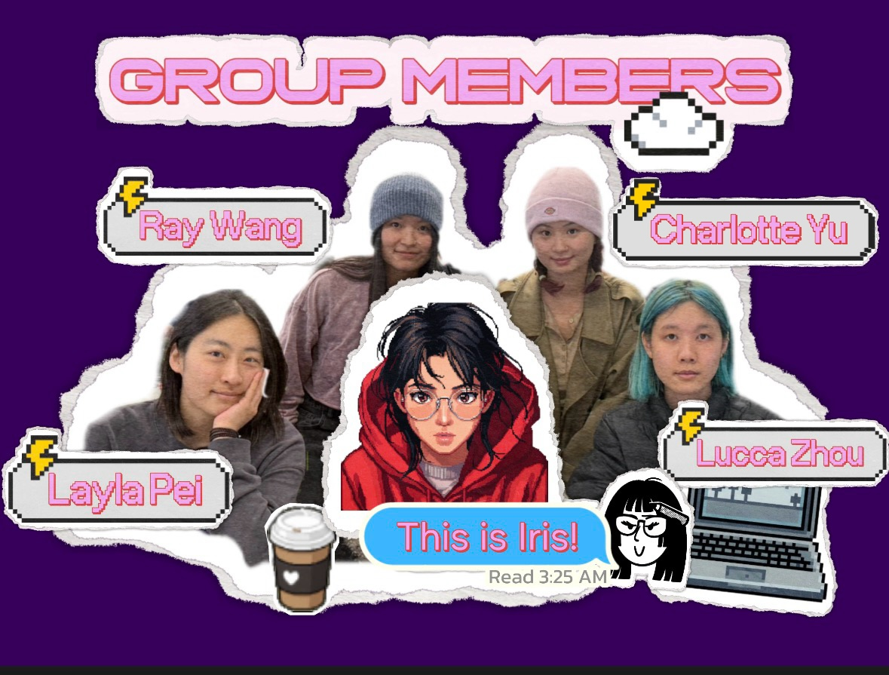</p>


<br>

<a name="table-of-contents"></a>
<h2 align="center">Table of Contents</h2>

<div align="center">

| # | Section | Description |
|:---:|:---:|:---|
| 00 | [Labs](#labs) | Weekly lab tasks & documentation |
| 01 | [Introduction](#introduction) | Game overview & what makes it novel |
| 02 | [Requirements](#requirements) | Ideation, use cases & user stories |
| 03 | [Design](#design) | System architecture, state machine & class diagrams |
| 04 | [Implementation](#implementation) | Key technical challenges |
| 05 | [Evaluation](#evaluation) | Qualitative & quantitative testing |
| 06 | [Process](#process) | Team workflow & reflection |
| 07 | [Conclusion](#conclusion) | Lessons learnt & future work |
| 08 | [Contribution](#contribution) | Individual contributions |

</div>

<br>


<br>

<a name="repository-structure"></a>
<h2 align="center">Repository Structure</h2>

```text
2026-group-7/
├── README.md               ← You are here — main project documentation
├── ArtAsset/               ← Raw art source files (sprites, backgrounds, UI, fonts, audio)
├── docs/
│   ├── pss/                ← Playable game (entry: sketch.js + all game source in src/)
│   │   ├── sketch.js       ← Main draw loop and global state machine
│   │   ├── src/            ← All game modules (Player, ObstacleSystem, Cutscene, etc.)
│   │   └── assets/         ← In-game assets loaded at runtime
│   ├── Labs/               ← Weekly lab documentation (one folder per week)
│   │   ├── Week_1_List_of_Ideas/
│   │   ├── Week_2_Paint_App/
│   │   ├── Week_3_Prototype/
│   │   ├── Week_4_User_Story/
│   │   ├── Week_5_Object_Orientated_Design/
│   │   ├── Week_7_Evaluation/
│   │   ├── Week_8_Evaluation_2/
│   │   └── Week_9_QA_Testing/
│   ├── assets/             ← Images and diagrams used in this README
│   ├── index.html          ← Project site — home page
│   ├── meetings.html       ← Project site — full meeting log
│   ├── labs.html           ← Project site — labs overview
│   └── technical.html      ← Project site — technical documentation
```

> **Meeting notes:** Every sprint planning session, stand-up, and retrospective is logged on the [Project Site](https://charlotteyu-47.github.io/2026-group-7/meetings.html). The meeting log is the canonical record of all decisions, action items, and velocity data across the project.

<br>


<br>

<a name="labs"></a>
<h2 align="center">Labs</h2>

<div align="center">

| Week | Title | Documentation |
|:---:|:---|:---:|
| 01 | **Lab 1: List of Game Ideas** | [README](./docs/Labs/Week_1_List_of_Ideas/) |
| 02 | **Lab 2: Paint System & Game Brainstorming** | [README](./docs/Labs/Week_2_Paint_App/) |
| 03 | **Lab 3: Prototype & Game Selection** | [README](./docs/Labs/Week_3_Prototype/README.md) |
| 04 | **Lab 4: User Stories & Requirements Engineering** | [README](./docs/Labs/Week_4_User_Story/README.md) |
| 05 | **Lab 5: Object-Oriented Design & Agile Estimation** | [README](./docs/Labs/Week_5_Object_Orientated_Design/README.md) |
| 07 | **Lab 7: Think Aloud Study & Heuristic Evaluation** | [README](./docs/Labs/Week_7_Evaluation/README.md) |
| 08 | **Lab 8: HCI Evaluation — NASA-TLX & SUS** | [README](./docs/Labs/Week_8_Evaluation_2/README.md) |
| 09 | **Lab 9: Quality Assurance — Black-Box & White-Box Testing** | [README](./docs/Labs/Week_9_QA_Testing/README.md) |

</div>

<br>


<br>

<a name="introduction"></a>
<h2 align="center">Introduction</h2>

**Park Street Survivor** is a narrative-driven runner set in the heart of Bristol, built around two distinct modes.

In **Story Mode**, each run is a chapter in Iris’s week — five days of escalating tension, branching dialogue, and choices that quietly reshape the ending. The run is the vehicle; the story is the destination.

In **Endless Mode**, the narrative falls away and only the run remains. Survive as long as possible on an ever-harder Park Street, chase a high score, and climb the leaderboard.

Both modes share the same core: keep moving, dodge obstacles, don’t fall behind. But woven beneath every sprint in Story Mode is a story that grows heavier with each passing day — one that asks whether surviving the hill is really the hardest part of Iris’s week.

<br>

## Gameplay — The Runner

The runner mechanics draw from the energy of two mobile classics. Like *Temple Run*[^1], the player must read the environment instantly and commit to split-second decisions. Like *Subway Surfers*[^2], the game takes place in a vivid urban setting full of life and hazards — buses, scooters, and everything Bristol throws at you.

<div align="center">

| Temple Run — Reflex-driven obstacle avoidance | Subway Surfers — Urban parkour runner |
|:---:|:---:|
|  | 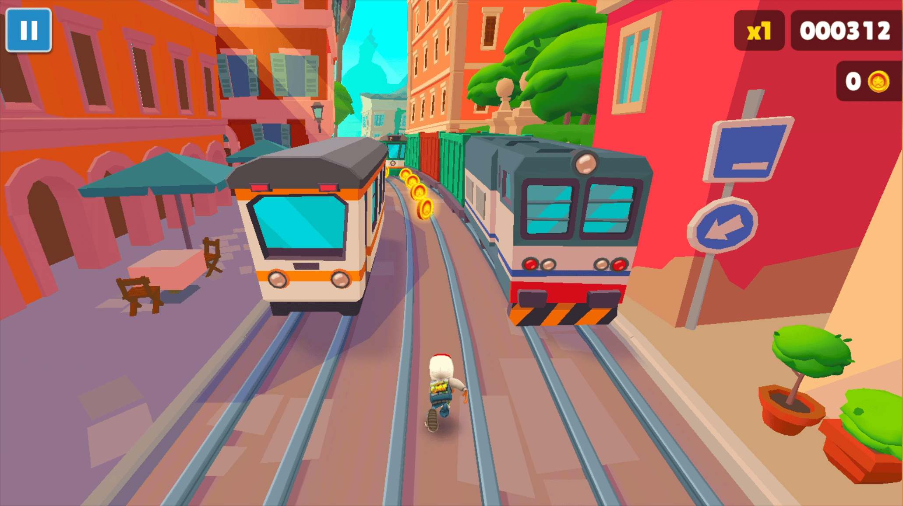 |

</div>

<br>

## Aesthetics & Narrative — Something Deeper

Unlike disjointed UI approaches, every visual and narrative element in Park Street Survivor is designed as a unified whole. The dreamlike quality of the storyline — Iris slipping between memory, exhaustion, and surreal vision — led us to *Omori*[^3] as a key aesthetic reference: its handcrafted pixel art and purple-pink palette perfectly capture that boundary between the subconscious and the waking world. The grounded warmth of everyday life draws from *Stardew Valley*[^4], while the bold, character-driven presentation takes its cues from *Persona 5*[^5]. To reflect this duality in our own palette, we chose pink and purple as the primary colour — representing the dream — and yellow as the contrast colour for reality, striking and immediately readable against the softer tones.

<div align="center">

<table>
<tr>
  <td align="center" width="50%" valign="top">
    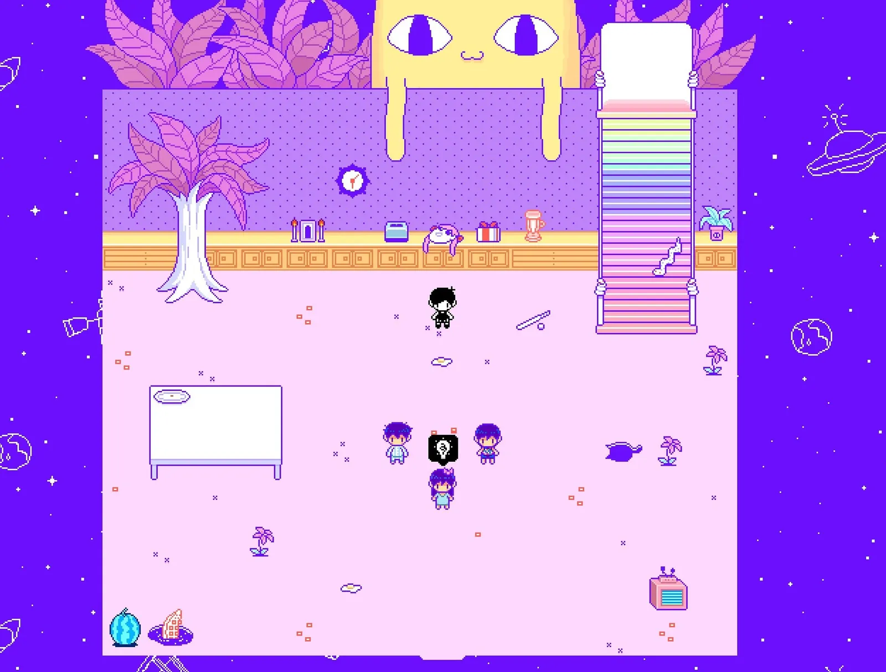
    <br><i>Omori — Dreamlike pixel art, purple-pink palette</i>
  </td>
  <td align="center" width="50%" valign="top">
    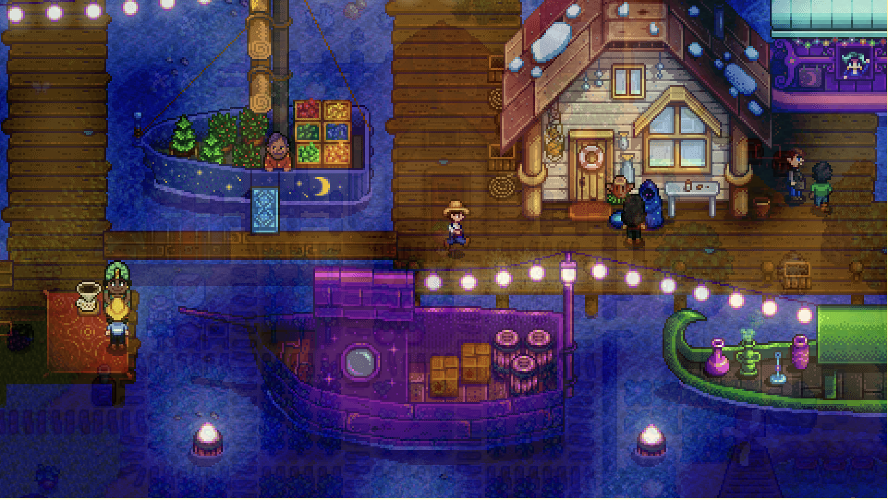
    <br><i>Stardew Valley — Pixel warmth & daily routine</i>
  </td>
</tr>
<tr>
  <td align="center" colspan="2">
    
    <br><i>Persona 5 — Bold UI & character-driven narrative</i>
  </td>
</tr>
</table>

</div>

<br>

## The Story — Five Days, One Question

Iris is a Bristol CS student who starts every morning the same way: pack her bag, climb Park Street, make it to class. Day one feels almost hopeful — bright weather, good energy, a straightforward hill to climb. But by day two, her body is already protesting. By day three, something feels off. By day four, the world itself seems to be unravelling.

Each run is a fragment of Iris’s week. The items she picks up, the people she meets, the choices she makes — they all accumulate. The story does not announce itself; it seeps through, line by line, until you realise this was never just a runner game.

*What exactly happened before this week began? And when the end of Day 5 arrives — what will you choose?*

## What Makes It Original

The game started as a parkour runner — fast, Bristol-set, fun to play. But the team felt it was too thin on its own. A runner without weight is forgettable, and the team wanted to make something that stayed with people.

The narrative layer came from asking an honest question: what pressures do we face now, as students, and what might we face after graduation? The story of Iris grew from that conversation — the exhaustion, the daily grind of climbing the same hill, the way small things accumulate into something harder to name. Several of the NPCs Iris encounters along the way are drawn in part from the team members themselves.

<br>

## What You'll Face on Park Street

*The cards below are taken directly from the in-game Help screen — Iris's survival reference before every run.*

<br>

**Characters**

<div align="center">

<table>
<tr>
  <td align="center" width="190">
    
    <br><sub><b>Iris</b></sub>
    <br><sub><i>Protagonist</i></sub>
  </td>
  <td align="center" width="130">
    
    <br><sub><i>NPC · Day 1</i></sub>
    <br><sub><b>???</b></sub>
  </td>
  <td align="center" width="130">
    
    <br><sub><i>NPC · Day 2</i></sub>
    <br><sub><b>???</b></sub>
  </td>
  <td align="center" width="130">
    
    <br><sub><i>NPC · Day 3</i></sub>
    <br><sub><b>???</b></sub>
  </td>
  <td align="center" width="130">
    
    <br><sub><i>NPC · Day 4</i></sub>
    <br><sub><b>???</b></sub>
  </td>
  <td align="center" width="130">
    
    <br><sub><i>NPC · Day 5</i></sub>
    <br><sub><b>???</b></sub>
  </td>
</tr>
</table>

</div>

> *5 people cross Iris's path across the five days — each carrying a gift for Iris. Play to find out who they are and why they are here.*

<br>

**Power-ups**

<div align="center">

<table>
<tr>
  <td align="center" width="150">
    
    <br><sub><b>Coffee</b></sub>
  </td>
  <td align="center" width="150">
    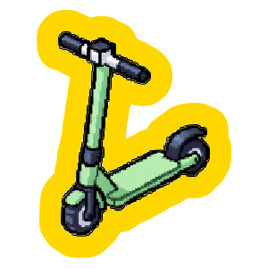
    <br><sub><b>Scooter</b></sub>
  </td>
  <td align="center" width="150">
    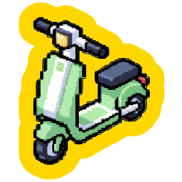
    <br><sub><b>Motorcycle</b></sub>
  </td>
</tr>
</table>

</div>

<br>

**Hazards**

<div align="center">

<table>
<tr>
  <td align="center" width="130">
    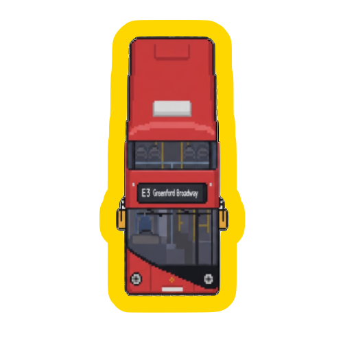
    <br><sub><b>Bus</b></sub>
  </td>
  <td align="center" width="130">
    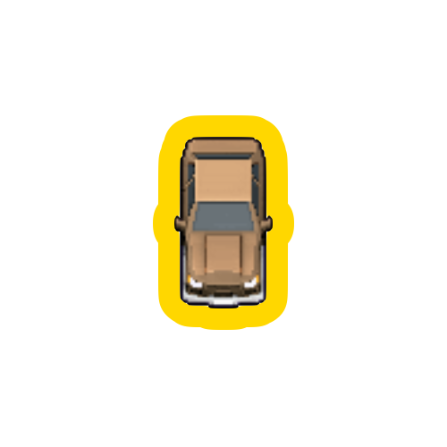
    <br><sub><b>Car</b></sub>
  </td>
  <td align="center" width="130">
    
    <br><sub><b>Ambulance</b></sub>
  </td>
  <td align="center" width="130">
    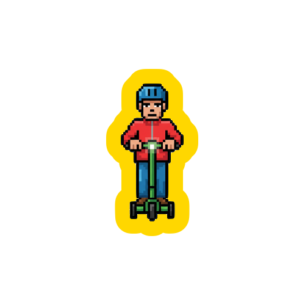
    <br><sub><b>Scooter Rider</b></sub>
  </td>
  <td align="center" width="130">
    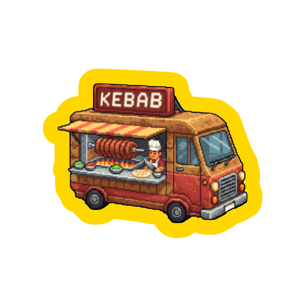
    <br><sub><b>Kebab Cart</b></sub>
  </td>
</tr>
<tr>
  <td align="center" width="130">
    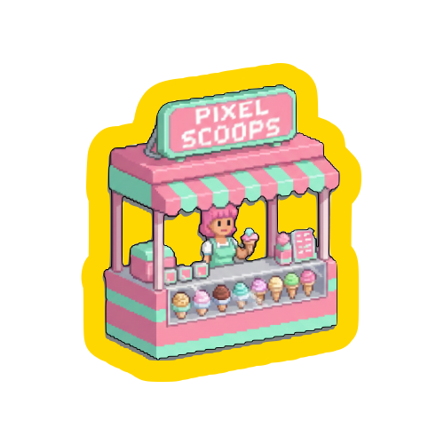
    <br><sub><b>Ice Cream Cart</b></sub>
  </td>
  <td align="center" width="130">
    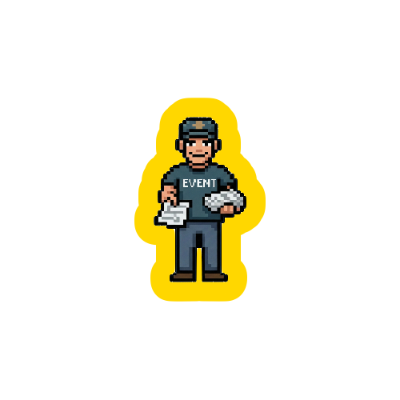
    <br><sub><b>Promoter</b></sub>
  </td>
  <td align="center" width="130">
    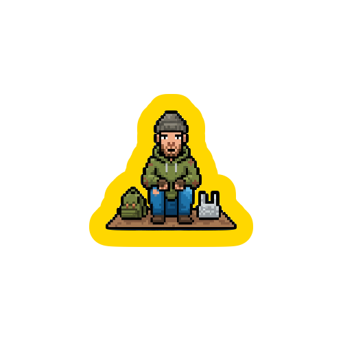
    <br><sub><b>Homeless</b></sub>
  </td>
  <td align="center" width="130">
    
    <br><sub><b>???</b></sub>
  </td>
  <td align="center" width="130">
    
    <br><sub><b>???</b></sub>
  </td>
</tr>
</table>

</div>

<br>

> *2 more hazards are waiting to catch you off guard. Press `P` during any run to pause — the full Help screen is one click away.*

<br>


<br>

<a name="requirements"></a>
<h2 align="center">Requirements</h2>

### 2.1 Early Design and Ideation

At the beginning of the project, each team member independently proposed game concepts based on personal interest and perceived technical viability within the p5.js framework[^12]. Eleven concepts were put forward spanning genres including tower defence, roguelike card games, cooperative puzzle-platformers, and sandbox simulations.

The selection process took place across two structured rounds. In the first round, six proposals were eliminated for being either too technically demanding or insufficiently differentiated from their source material: Balatro and Elemental Grove Defense were judged too mechanically complex to realise within the project timeline; Craft & Life presented prohibitive scope due to open-world persistence requirements; Flappy Bird lacked sufficient extendability; Tower at the End raised concerns around two-player synchronisation; and Super Mario Bros was ruled out as a direct adaptation of an existing IP with insufficient creative differentiation. The remaining five concepts were each assessed by all team members against four criteria — Creativity, Implementation Difficulty, Player Interest, and Extendability. Scores were summed to produce a total. Note that the **Difficulty** column is scored **inversely**: a higher implementation difficulty receives a *lower* score, since greater technical complexity is a negative factor for the team’s capacity within the project timeline. The remaining three criteria (Creativity, Interest, Extendability) are scored positively.

<div align="center">

| Game | Creativity | Difficulty ↓ | Interest | Extendability | Total |
| :--- | :---: | :---: | :---: | :---: | :---: |
| **Park Street Survivor** * | 5 | 0 | 3 | 3 | **11** |
| **The Strongest Support** * | 2 | 2 | 3 | 2 | **9** |
| Tableturf Battle | 3 | 0 | 2 | 2 | 7 |
| Pico Park | 0 | 4 | 0 | 2 | 6 |
| Plants vs. Zombies | 0 | 2 | 1 | 0 | 3 |

* Selected as finalists for prototype phase
↓ Difficulty is scored inversely — lower score = higher implementation complexity

Table 1: Game Concept Evaluation (Round 2 — after first-round eliminations)

</div>

The two highest-scoring concepts — Park Street Survivor and The Strongest Support — were carried forward into a prototype phase in Week 3. Each lead designer presented a short gameplay demonstration, after which the team discussed the two options and reached a consensus. The prototype covered three core states of play: the preparation phase before a run, a failure outcome, and a successful completion.

<div align="center">

#### Prototype A — Park Street Survivor

| | |
| :---: | :--- |
| 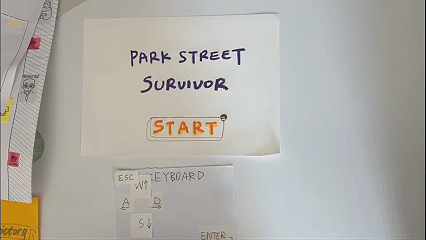 | **Prototype — Preparing for the run**<br><br>Before each run the player enters the Room scene, where they can interact with the desk to manage their backpack and choose a utility item to carry into the day. |
| 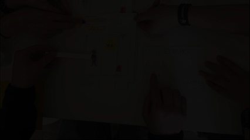 | **Prototype — Failure state**<br><br>If the player’s health drains to zero, they collide with a bus, or run out of time, the fail screen is triggered — each outcome displays a distinct reason code. |
| 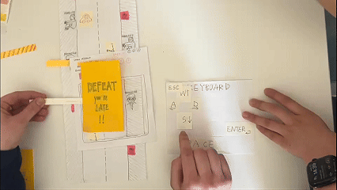 | **Prototype — Success state**<br><br>Reaching the day’s distance target with HP remaining triggers a brief victory transition before advancing the narrative to the next day. |

</div>

<div align="center">

#### Prototype B — The Strongest Support

| | |
| :---: | :--- |
| 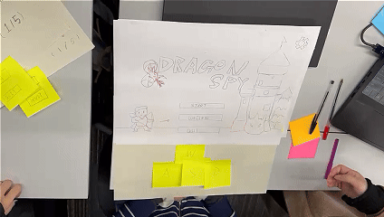 | **Prototype — Game Homepage**<br><br>Players can access the help, settings, or start game screen on the main menu. Once in the game, the story background will be introduced, and players can select a level. |
| 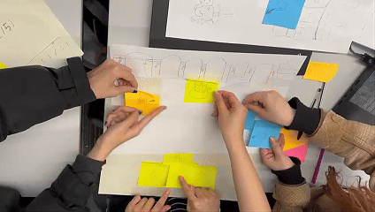 | **Prototype — Shooting Screen**<br><br>The player does not control the main attacking character. Instead, the player controls a supporting monster entity whose goal is to protect a hero NPC from incoming threats. |

</div>

Park Street Survivor was selected as the final concept for two reasons. First, it scored highest in originality and extendability, as it represents a wholly original game rather than a direct genre adaptation. Second, The Strongest Support’s indirect-control mechanic — where the player manages a support creature rather than a protagonist — was found to create too much psychological distance, making it difficult for players to form an emotional connection with the game.

Practical constraints reinforced this decision. A runner-style game offers a clear, self-contained gameplay loop that is well-suited to the p5.js framework, while still providing meaningful space for narrative layering and mechanical iteration. The high-level design goal was therefore established: to create a game rooted in the shared everyday experience of commuting to university, offering short, low-pressure sessions that gradually reveal a deeper story.

### 2.2 Stakeholders

<p align="center">
  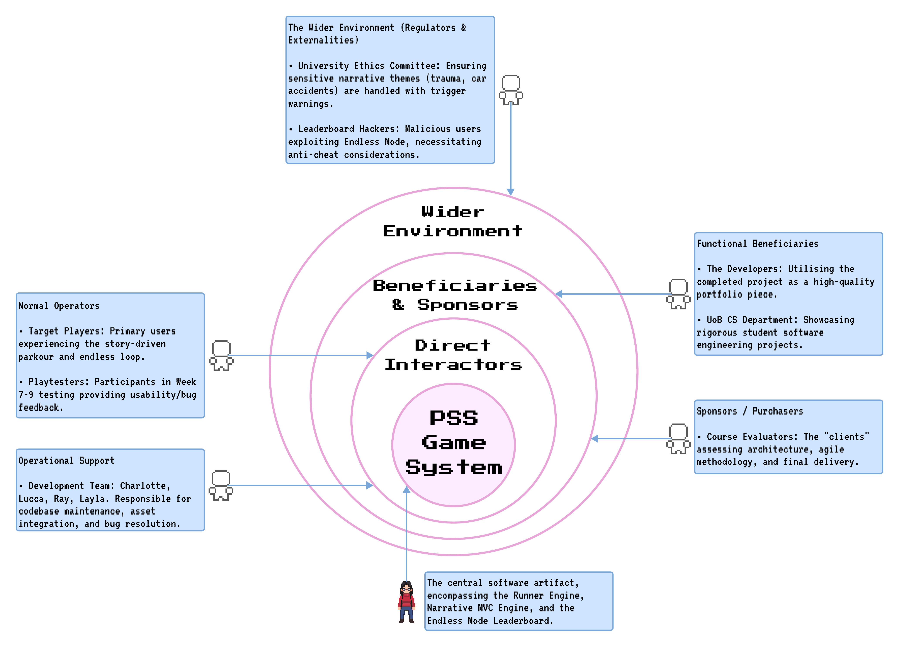
</p>

*Onion Model — Stakeholders are arranged in concentric layers based on their proximity to the system. The innermost core represents the game system itself; the immediate surrounding layer comprises direct interactors, including target players and the development team. Successive layers capture institutional beneficiaries, academic sponsors, and the broader societal context (such as ethical regulators and external threats) whose norms and expectations shape the product's design constraints.*[^9]

### 2.3 Epics

Development work was organised into four epics, each representing a distinct pillar of the game:

- **Infrastructure:** Version control, repository structure, GitHub Pages deployment, lab documentation, and the project website — everything outside the game itself.
- **Core Gameplay & Mechanics:** Player movement, lane-switching physics, health decay, collision detection, obstacle behaviour, procedural level generation, save system, state machine architecture, and all core engine systems.
- **Aesthetics, UX & Audio:** Visual asset design, HUD layout, feedback effects, background music routing, and sound effect integration.
- **Narrative Logic:** The five-day story structure, dialogue node graph, cutscene engine, branching choices, and the room scene between each run.

### 2.4 User Stories

User stories were formulated for each epic to translate design goals into testable development targets, following the "As a [user], I want to [goal] so that [reason]" structure[^7] with Given-When-Then acceptance criteria[^8].

#### Epic: Core Gameplay & Mechanics

> **Stakeholder: Target Player**
> *"As a player, I want my character’s health to deplete continuously during the run, so that I feel constant urgency and must actively seek out coffee to survive."*
>
> Given the run has started / When the run phase is active / Then the health bar decreases at a fixed decay rate each frame (0.02 HP/frame on Day 1, increasing to 0.04 HP/frame on Day 5), regardless of player actions.

<br>

> **Stakeholder: Target Player**
> *"As a player, I want to switch lanes using keyboard input, so that I can react quickly to oncoming obstacles."*
>
> Given the run is active and the player is not stunned / When I press A, D, or the left/right arrow keys / Then the character smoothly transitions to the adjacent lane using spring-damper physics.

<br>

> **Stakeholder: Target Player**
> *"As a player, I want different obstacle types to behave differently, so that each run feels varied and requires different responses."*
>
> Given a run is in progress / When a scooter obstacle is encountered / Then the player is temporarily stunned and their lane-change input is locked, rather than receiving direct health damage.

<br>

> **Stakeholder: Target Player**
> *"As a player, I want to use items I packed in my backpack during the run, so that my preparation choices before the run feel consequential."*
>
> Given the player is carrying an active item (e.g. Soft Gummy Vitamins, Rain Boots, Headphones) / When I press E / Then the item’s effect triggers (e.g. full heal, puddle immunity, promoter block) and the item’s charge count decrements by one.

<br>

> **Stakeholder: Target Player**
> *"As a player, I want scene transitions to feel immediate and glitch-free, so that background music and UI overlays never bleed into the wrong scene."*
>
> Given the game transitions between any two states (e.g., DAY-RUN to PAUSE, CUTSCENE to ROOM) / When the transition completes / Then no audio from the previous state continues playing and no UI element from the previous state remains visible.

<br>

> **Stakeholder: Returning Player**
> *"As a returning player, I want my progress to be saved automatically, so that I can resume from my last unlocked day without replaying completed content."*
>
> Given the player is in the room, run, or paused state / When three seconds have elapsed since the last save / Then the current day, unlocked progress, difficulty, and all dialogue choices are written to localStorage automatically.

<br>

> **Stakeholder: Competitive Player**
> *"As a competitive player, I want my endless run score to be submitted to a leaderboard, so that I can compare my performance against other players."*
>
> Given an endless run has ended / When the fail screen is shown / Then my survival time, distance, and hit count are ranked against stored scores and my position is displayed.

#### Epic: Narrative Logic

> **Stakeholder: Target Player**
> *"As a player, I want dialogue choices that influence the story outcome, so that my decisions feel consequential and encourage replay."*
>
> Given an NPC dialogue node with branching options is reached / When I select an option / Then the narrative advances to the corresponding branch node, the choice is recorded to the save file, and the selected path cannot be undone within the same playthrough.

<br>

> **Stakeholder: Target Player**
> *"As a player, I want a distinct room scene before each run, so that I can prepare my inventory and feel grounded in the story before the action begins."*
>
> Given a day has been selected / When the room scene loads / Then the player can interact with the desk to manage backpack items before proceeding to the run.

#### Epic: Aesthetics, UX & Audio

> **Stakeholder: Target Player**
> *"As a player, I want clear visual feedback when I take damage, so that I immediately understand the consequence of a collision without needing to check the HUD."*
>
> Given the player collides with a damaging obstacle / When the collision is registered / Then a full-screen red flash overlay activates briefly.

<br>

> **Stakeholder: Target Player**
> *"As a player, I want background music that changes between scenes, so that each phase of the game feels tonally distinct."*
>
> Given the game transitions to a new state / When the BGM manager detects a state change / Then the corresponding audio track fades in without overlap from the previous track.

<br>

> **Stakeholder: University Ethics Committee**
> *"As the University Ethics Committee, I want sensitive narrative themes (trauma, car accidents) to be preceded by a trigger warning, so that vulnerable players can make an informed choice before proceeding."*
>
> Given the game is first launched / When the splash screen completes / Then a dismissible trigger-warning screen is shown before any gameplay content is accessible.

<br>

> **Stakeholder: Target Player**
> *"As a player in a dimly lit or brightly lit environment, I want to adjust the in-game brightness, so that the display remains comfortable and readable regardless of my ambient lighting conditions."*
>
> Given the player opens the Settings screen / When they drag the Brightness slider / Then the entire browser viewport brightness adjusts in real time via CSS filter, persists across sessions, and resets to default when starting a new game.

<br>

> **Stakeholder: Target Player**
> *"As a player, I want to toggle fullscreen mode at any time using a keyboard shortcut, so that I can play without browser chrome interfering with the game canvas."*
>
> Given the player is on any screen / When they press [F] / Then the entire page enters or exits fullscreen; pressing [F] again reverses the state, and the game canvas scales to fill the display without distortion.

#### Epic: Infrastructure

> **Stakeholder: Development Team / Course Evaluator**
> *"As a contributor, I want the game to be playable directly from a GitHub Pages URL, so that reviewers and players can access it without any local setup."*
>
> Given a commit is pushed to the main branch / When the GitHub Pages deployment workflow completes / Then the game is accessible at the public URL in any modern desktop browser without installation.

<br>

> **Stakeholder: Development Team / Course Evaluator**
> *"As a team member, I want each week’s lab deliverable to be documented in a dedicated README, so that progress is traceable and the submission history is clear."*
>
> Given a lab week is completed / When the corresponding README is committed under `docs/Labs/` / Then it contains a summary of the deliverable, relevant assets, and a back-link to the project home, and is listed in the main README’s lab table.

<br>

> **Stakeholder: Playtester**
> *"As a playtester, I want to jump directly to any game state or dialogue node, so that I can validate specific mechanics without replaying from the beginning."*
>
> Given the Testing Panel is open / When I click a state button or cutscene node / Then the game transitions immediately to that state with valid initial conditions.

### 2.5 Functional Requirements (MoSCoW[^6])

<div align="center">

| Priority | Requirement |
| :--- | :--- |
| **Must Have** | Four-lane horizontal movement with spring-damper physics |
| **Must Have** | Passive health decay per frame and coffee collection to restore health |
| **Must Have** | Collision detection for vehicles, scooters, and NPC hazards |
| **Must Have** | Instant-fail on large vehicle (bus/ambulance) collision |
| **Must Have** | Five narrative days with distinct obstacle profiles and health decay rates |
| **Must Have** | Branching dialogue system with node-graph architecture and choice persistence |
| **Should Have** | Backpack inventory system with active item usage (E key) |
| **Should Have** | Procedural obstacle spawning with fairness and difficulty scaling |
| **Should Have** | Local leaderboard with high-score tracking per difficulty mode *(implemented)* |
| **Should Have** | Brightness control via CSS filter with persistent user preference |
| **Should Have** | Fullscreen toggle via keyboard shortcut ([F]) with whole-page Fullscreen API |
| **Could Have** | Puddle trap mechanic with interactive escape *(implemented)* |
| **Could Have** | Unlockable Casual and Hard difficulty modes (endless runs) |
| **Won’t Have** | Online multiplayer or networked leaderboard features |

Table 2: MoSCoW Functional Requirements

</div>

### 2.6 Prioritised Feature Breakdown

A risk-managed development approach prioritising core mechanics and technical feasibility over feature breadth. Sprint weeks correspond to the course timeline; estimated days reflect planning-stage forecasts, actual days are derived from commit history.

<div align="center">

| Priority | Feature | Sprint (Week) | Est. Days | Actual Days |
| :--- | :--- | :--- | :---: | :---: |
| **HIGH (MVP)** | Core engine — FSM state machine (20 states), global transition, unified input | Week 3 → Week 9 (ongoing) | 5–7 | ~14 |
| | Player controls — lane switching, spring-damper physics, health decay | Week 3–4 | 3–5 | 4 |
| | Obstacle system — spawn pipeline, collision detection, `ObConfig` | Week 3–4 | 4–6 | 5 |
| | Room scene — walkable AABB, desk/door proximity, required-items gate | Week 4 | 3–4 | 3 |
| | HUD — health bar, distance bar, energy bar, buff display | Week 4–5 | 2–3 | 4 |
| | Level controller — victory state, day progression, fail triggers | Week 4 | 2–3 | 2 |
| **MEDIUM** | Backpack / inventory system — drag-drop, slot logic, item mutex | Week 4–5 | 4–5 | 6 |
| | Dialogue / cutscene engine — data-driven node graph, typewriter UI | Week 5–7 | 5–7 | 7 |
| | Save system — localStorage auto-save, atomic restore | Week 7 | 2–3 | 3 |
| | Difficulty system — CASUAL / NORMAL / HARD presets, endless pacing | Week 7 | 2–3 | 2 |
| | Day content — Day 1–5 narrative, obstacle profiles, NPC dialogue | Week 7–8 | 6–8 | 9 |
| | Tutorial system — slide overlay, contextual hints, per-item onboarding | Week 7–9 | 3–4 | 8 |
| | Audio routing — BGM manager, per-state tracks, SFX integration | Week 7–8 | 2–3 | 4 |
| | Testing Panel — FSM jump, obstacle spawn, buff controls, story debug | Week 7–8 | 2–3 | 5 |
| **LOW (Stretch)** | Endless Mode — score tracking, infinite pacing, result screen | Week 8 | 3–5 | 4 |
| | Leaderboard — local `localStorage` + optional Supabase sync | Week 8 | 3–5 | 3 |
| | Loading screen — asset pre-check, splash, self-healing | Week 9 | 1–2 | 1 |
| | QA bug fixes — lane hyper-sensitivity, illusion coffee, homeless dialogue | Week 9 | 2–3 | 3 |

Table 3: Prioritised Feature Breakdown

</div>

> **Notable variances from estimate:**
>
> The **Tutorial system** logged the largest overrun — initial implementation (Week 7, ~2 days) produced a static image sequence that post-playtest feedback in Week 8 revealed was insufficient: first-time players consistently missed key mechanics. The system was completely rebuilt as a contextual, pause-and-click overlay with per-item onboarding, consuming an additional ~6 days across Weeks 8–9. This overrun was absorbed by features that completed ahead of schedule: the **Difficulty system** (estimated 2–3 days, delivered in ~2 days) and the **Level controller** (estimated 2–3 days, core logic settled in ~2 days), which created buffer for the tutorial rework.
>
> The **FSM state machine** was initially scaffolded in Week 3 (~5 days) but was continuously extended as new states were added throughout the project — `STATE_DIFF_SELECT`, `STATE_LOAD_GAME`, `STATE_TUTORIAL_SLIDES` and others were introduced as late as Weeks 7–9, bringing cumulative engineering effort to approximately 14 days across the full timeline.

### 2.7 Non-Functional Requirements

<div align="center">

| Category | Requirement |
| :--- | :--- |
| **Performance** | The game must maintain a stable 60 FPS on standard desktop browsers without hardware acceleration |
| **Usability** | A new player must be able to understand core controls within the first run without reading external documentation; fullscreen mode must be accessible via a single keypress ([F]) from any screen |
| **Accessibility** | All critical UI feedback (damage, buffs, progress) must be communicated through both visual and audio channels; display brightness must be player-adjustable to accommodate varied ambient lighting conditions |
| **Maintainability** | Game systems must be implemented as decoupled modules so that individual components can be modified without breaking unrelated systems |
| **Portability** | The game must run in modern desktop browsers via GitHub Pages without requiring installation or plugins |
| **Reliability** | The save system must not corrupt progress data on unexpected browser closure |

Table 3: Non-Functional Requirements

</div>

### 2.8 Use Case Diagram

> **Note on notation:** GitHub's Markdown renderer does not support PlantUML, which provides native UML Use Case diagram syntax[^10]. The diagram below is rendered using Mermaid's flowchart module — the closest available approximation within this environment. UML semantics are preserved: the subgraph represents the system boundary, nodes represent use cases, `P` represents the Player actor, and `<<include>>`/`<<extend>>` stereotypes follow standard UML convention.

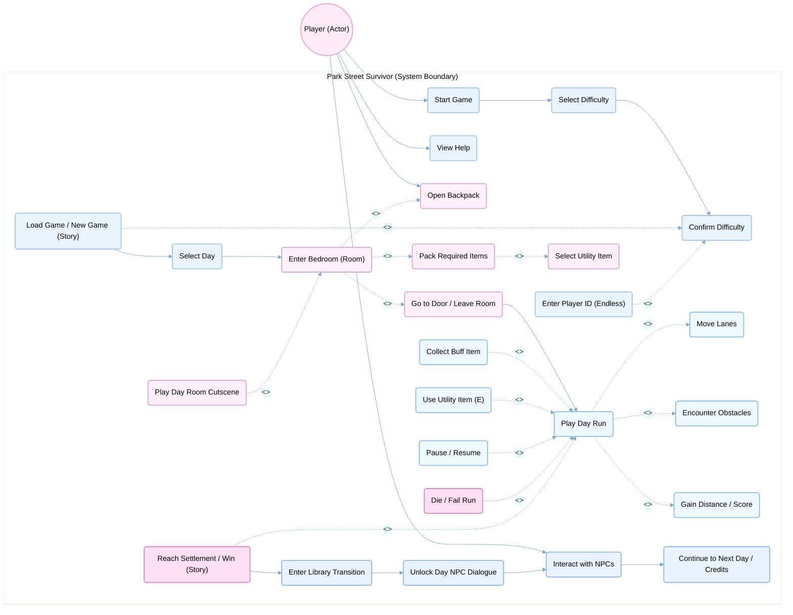
```mermaid
%%{init: {
  "theme": "base",
  "themeVariables": {
    "background": "#FFFDFE",
    "primaryColor": "#FDEBFF",
    "primaryBorderColor": "#E8A6D8",
    "lineColor": "#7AA7D9",
    "textColor": "#000000",
    "fontFamily": "Arial"
  }
}}%%
flowchart LR
  P(("Player (Actor)"))

  subgraph G["Park Street Survivor (System Boundary)"]

    %% ===== Menu / Setup =====
    SG("Start Game")
    VH("View Help")
    SD("Select Day")
    SDF("Select Difficulty")
    CFD("Confirm Difficulty")
    LG("Load Game / New Game (Story)")
    PID("Enter Player ID (Endless)")

    %% ===== Pre-run Room Flow =====
    RC("Play Day Room Cutscene")
    BR("Enter Bedroom (Room)")
    BP("Open Backpack")
    PK("Pack Required Items")
    DS("Select Utility Item")
    DR("Go to Door / Leave Room")

    %% ===== Run =====
    PG("Play Day Run")
    MV("Move Lanes")
    OB("Encounter Obstacles")
    PU("Use Utility Item (E)")
    BF("Collect Buff Item")
    SC("Gain Distance / Score")
    PS("Pause / Resume")

    %% ===== Outcomes =====
    DY("Die / Fail Run")
    WN("Reach Settlement / Win (Story)")

    %% ===== Post-Win Library (Story Mode only) =====
    LB("Enter Library Transition")
    ND("Unlock Day NPC Dialogue")
    IN("Interact with NPCs")
    NX("Continue to Next Day / Credits")
  end

  %% Actor associations
  P --> SG
  P --> VH
  P --> BP
  P --> IN

  %% Main setup sequence
  SG --> SDF --> CFD
  LG --> SD --> BR

  %% Story vs Endless detail
  LG -. "<<extend>>" .-> CFD
  PID -. "<<extend>>" .-> CFD

  %% Pre-run room sequence
  BR -. "<<include>>" .-> BP
  BR -. "<<include>>" .-> PK
  BR -. "<<include>>" .-> DR
  PK -. "<<include>>" .-> DS

  %% Optional room cutscene
  RC -. "<<extend>>" .-> BR

  %% Room to run
  DR --> PG

  %% Core gameplay decomposition
  PG -. "<<include>>" .-> MV
  PG -. "<<include>>" .-> OB
  PG -. "<<include>>" .-> SC

  %% Optional/conditional gameplay actions
  BF -. "<<extend>>" .-> PG
  PU -. "<<extend>>" .-> PG
  PS -. "<<extend>>" .-> PG

  %% Terminal outcomes
  DY -. "<<extend>>" .-> PG
  WN -. "<<extend>>" .-> PG

  %% Success path
  WN --> LB --> ND --> IN --> NX

  %% ===== Color classes (all text black) =====
  classDef actor fill:#FFEAF7,stroke:#E8A6D8,stroke-width:2px,color:#000000;
  classDef setup fill:#EAF4FF,stroke:#9FC6F2,stroke-width:2px,color:#000000;
  classDef room fill:#FFF0FA,stroke:#DFA5D3,stroke-width:2px,color:#000000;
  classDef run fill:#EEF9FF,stroke:#8CBEEA,stroke-width:2px,color:#000000;
  classDef outcome fill:#FFDFF3,stroke:#D98AC2,stroke-width:2px,color:#000000;
  classDef post fill:#E8F3FF,stroke:#8FB7E5,stroke-width:2px,color:#000000;

  class P actor;
  class SG,VH,SD,SDF,CFD,LG,PID setup;
  class RC,BR,BP,PK,DS,DR room;
  class PG,MV,OB,PU,BF,SC,PS run;
  class DY,WN outcome;
  class LB,ND,IN,NX post;
```

<br>
This use case diagram summarizes the core interaction flow of Park Street Survivor. The player begins from the game start flow, selects a difficulty, and — in Story Mode — proceeds through the Load Game screen to the day selection wheel, then into the bedroom preparation phase and the day run. During gameplay, the player navigates challenges and reaches either failure or success outcomes; in Story Mode, successful completion transitions into the library sequence where day-specific NPC dialogues are unlocked. Two mutual-exclusion constraints apply: selecting Story Mode (Load Game / New Game) and entering a Player ID for Endless Mode are mutually exclusive — only one applies per session depending on the chosen difficulty. Likewise, the Fail and Win outcomes are mutually exclusive within a single run. The post-win library path (LB → ND → IN → NX) applies to Story Mode only; in Endless Mode, the win outcome routes directly to the result screen.

<br>

### 2.9 Use Case Specifications

The table below provides a structured specification for each use case identified in the diagram above. Each entry documents the actor, preconditions, trigger, main flow, postconditions, and exception handling — verified against the implemented codebase.

<div align="center">

| UC ID | Use Case Name | Primary Actor | Preconditions | Trigger | Main Flow (Summary) | Postconditions | Alternatives / Exceptions |
| :--- | :--- | :--- | :--- | :--- | :--- | :--- | :--- |
| **UC1** | Start Game & Select Difficulty | Target Player | Main menu visible; assets loaded | Click START | Fade → `STATE_DIFF_SELECT`; player chooses CASUAL / NORMAL / HARD via arrow keys + ENTER | `selectedDifficulty` set; advance to `STATE_DIFF_CONFIRM` | ESC → return to `STATE_MENU` |
| **UC2** | Load or New Game | Target Player | NORMAL difficulty confirmed | ENTER on confirm screen | `SaveSystem.hasSave()` checked; NEW GAME (always) or CONTINUE (if save exists); `applyAndResume()` initialises run | Story run started at Day 1 or resumed from saved day | CASUAL / HARD skip this screen entirely; corrupted save treated as new game |
| **UC3** | Room Preparation | Target Player | `STATE_ROOM` active; day selected | Walk to desk + ENTER | Player opens backpack, packs Student ID + Laptop (required), selects utility item; walks to door + ENTER | Utility item synced to player; fade to `STATE_DAY_RUN` | Missing required items → door blocked; dialogue lists what is missing |
| **UC4** | Day Run | Target Player | `STATE_DAY_RUN`; player spawned at lane 1 | Frame tick in draw loop | Lane switching via spring physics; health decays each frame; distance accumulates; obstacles spawn and collide per `ObConfig` type | Win if distance target reached; Fail if HP = 0, bus hit, or time limit exceeded | Stun locks input for 0.5 s; item tutorial overlay freezes run until dismissed |
| **UC5** | Pause / Resume | Target Player | `STATE_DAY_RUN` or `STATE_ROOM` | P or ESC key | `previousState` cached; pause overlay shown with RESTART / SETTINGS / STORY / HELP / EXIT | Game resumes or transitions to selected option | RESTART from Room shows no RESTART RUN option; EXIT requires confirmation |
| **UC6** | Use Utility Item | Target Player | `STATE_DAY_RUN`; item equipped; charges > 0 | E key | Immediate items (Vitamins): full heal, charge consumed. Passive items (Tangle / Boots / Headphones): armed flag set; charge consumed only when matching obstacle is negated | Charges decremented; armed state cleared after obstacle negation | No item or charges = 0 → E key silently ignored; re-press while armed toggles disarm |
| **UC7** | Win / Fail Outcome | Target Player | `STATE_DAY_RUN`; run-end condition met | Distance target (win) or HP ≤ 0 / bus hit / time limit (fail) | Win: victory phase → NPC cutscene → win screen → next day unlocked. Fail: `failReason` stored (EXHAUSTED / HIT\_BUS / LATE) → fail screen with RETRY / EXIT | Win: next day unlocked, `SaveSystem.save()` called. Fail: retry or exit to menu | Endless Mode win routes to leaderboard result, not next story day |
| **UC8** | Enter Endless Mode | Competitive Player | CASUAL or HARD confirmed on diff screen | ENTER on confirm screen | Player ID entered (1–16 alphanumeric); `setupRunDirectly(1, runMode)` skips story setup; run starts with no distance win condition | `STATE_DAY_RUN` with leaderboard tracking active | Invalid ID → re-prompt; cancel → run not recorded on leaderboard |
| **UC9** | Dialogue / Cutscene | Target Player | Cutscene node triggered (room entry, win, tutorial) | Auto-trigger or player-initiated node | `CutsceneModule` reads node from `DialogueData`; typewriter renders text; ENTER advances; branching choices recorded | Choice stored in `_nodeChoices`; game returns to triggering context | Already-seen cutscenes skipped on continue; legacy and node-based systems auto-detected |
| **UC10** | Auto-save & Restore | Returning Player | `STATE_ROOM` / `DAY_RUN` / `PAUSED`; story mode only | 3-second timer in draw loop | `SaveSystem.tick()` snapshots day ID, unlocked day, difficulty, tutorial state, dialogue choices → `localStorage` | Save persists across browser refreshes | `localStorage` full → silent fail with console warning; endless mode does not auto-save |
| **UC11** | View In-Game Help | Target Player / Playtester | `STATE_PAUSED` or `STATE_MENU` | Select HELP from pause or main menu | 4-page overlay: Controls / Character Wiki / Power-ups / Hazards; navigate with arrow keys; ESC to exit | Help pages visited tracked; returns to pause or menu | From main menu: back → `STATE_MENU`; from pause: back → `STATE_PAUSED` |
| **UC12** | Leaderboard Submission | Competitive Player | Endless run ended in fail state | Run end triggers auto-submit | Stats compiled (survival time, distance, coffee count, car hits); sorted by survival time → distance → car hits; stored locally and pushed async to Supabase | Entry ranked and displayed on fail screen; persists in `localStorage` | Player cancels ID prompt → run not submitted; Supabase unavailable → local-only fallback |

Table X: Use Case Specifications

</div>

<br>

### 2.10 Reflection on Requirements Engineering

During the development of Park Street Survivor, defining epics and user stories taught us that requirements engineering is a highly iterative process driven by real user feedback rather than initial assumptions. Here are our key lessons learned:

#### Overcoming the "Curse of Knowledge" in User Stories

Initially, our user stories were broad and vague because the game was still conceptual. As developers, we suffered from the "curse of knowledge"[^11] — we understood the mechanics perfectly, making it difficult to anticipate a first-time player's confusion. It wasn't until we received extensive playtest feedback between Weeks 7 and 9 that we realised our onboarding was insufficient. Consequently, we refined our stories to be highly specific. For example, our tutorial evolved from a passive, auto-playing image sequence into a user-controlled, pause-and-click floating UI system, ensuring players digest information at their own pace.

#### Acceptance Criteria as a Communication Bridge

We learned that clear acceptance criteria (Given–When–Then) serve as a crucial communication bridge between narrative designers and mechanics developers. By actively discussing numerical tweaks and conducting continuous internal team testing after every adjustment, we established precise, testable outcomes. This rigour made our subsequent Black-Box and Boundary Value Testing phases exceptionally clear, as the exact triggers and thresholds were already well-defined and agreed upon.

#### Contextual Alignment and Architecture Trade-offs

Balancing the university's academic requirement for "two difficulty levels" with our game's core vision was a major challenge. We wanted Story Mode players to fully experience the narrative without extreme frustration, so we maintained a balanced four-lane design with progressive difficulty. To fulfil the high-difficulty requirement and cater to pure parkour fans, we decoupled the gameplay loop and created a dedicated Endless Mode. Introducing a Leaderboard system for this mode not only satisfied the technical brief but also provided strong replay motivation. Ultimately, aligning user stories with actual player context transformed our abstract concepts into a cohesive, dual-loop game experience.

<br>


<br>

<a name="design"></a>
<h2 align="center">Design</h2>

### 3.1 System Architecture

Park Street Survivor is built on a single-canvas p5.js application driven by a centralised Finite State Machine (FSM). The entry point, `SketchCore` (implemented in `sketch.js`), acts as the sole orchestrator: it owns every top-level system as a singleton, runs the main `draw()` loop, and routes execution to the appropriate subsystem based on the current game state integer held in `GameState`. Note that `SketchCore` is an architectural abstraction — in p5.js's global mode, `sketch.js` is not a JavaScript class but a collection of global functions (`preload`, `setup`, `draw`, etc.) that together form the engine's entry point. It is modelled as a class in the diagram to represent its logical ownership of all singleton instances. More broadly, our separation of engine, gameplay, UI, audio, and persistence reflects the modular view of game engines described by Lewis and Whitehead (2011), where large interactive systems are organised around clearly bounded responsibilities.[^16]

The key architectural constraint throughout is **one-directional data flow per subsystem**: gameplay classes signal upward to `LevelController` and `FeedbackLayer`, but neither has any knowledge of `MainMenu` or `SaveSystem`. This keeps coupling low and allows individual layers to be tested and replaced independently.

### 3.2 State Machine Diagram

The FSM comprises **20 discrete states** spread across four functional regions: Launch, Menu, Story/Endless, and Gameplay. The diagram below maps every reachable transition.

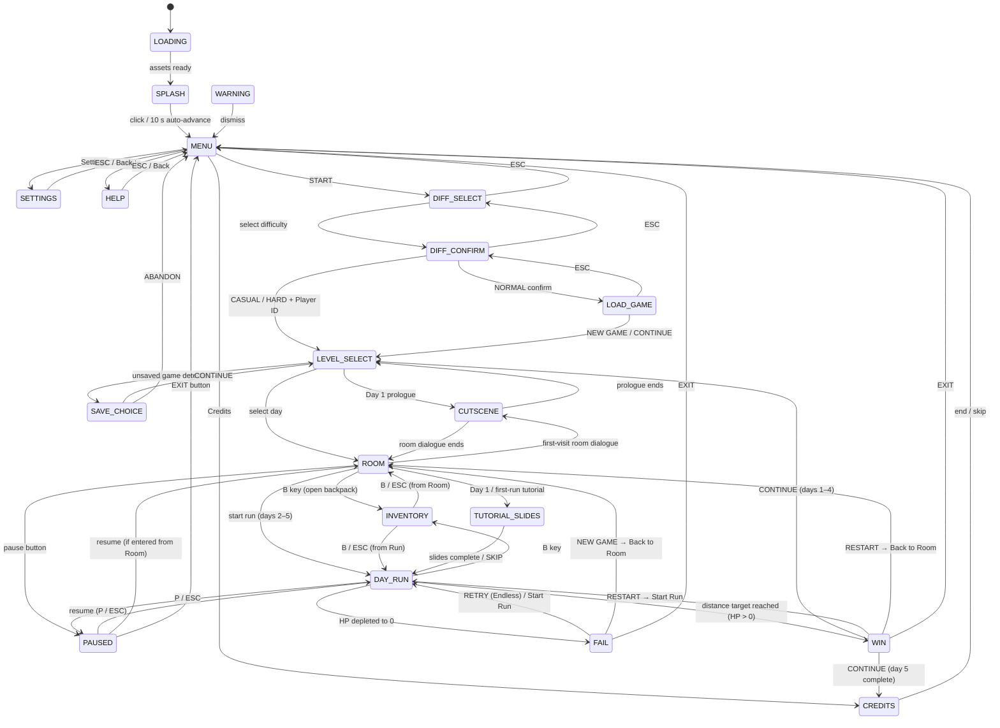
```mermaid
stateDiagram-v2
    direction TB

    [*] --> LOADING

    LOADING --> SPLASH : assets ready
    SPLASH --> MENU : click / 10 s auto-advance

    %% ── Main Menu ────────────────────────────────────────────────────
    MENU --> SETTINGS : Settings
    MENU --> HELP : Help
    MENU --> CREDITS : Credits
    MENU --> DIFF_SELECT : START
    SETTINGS --> MENU : ESC / Back
    HELP --> MENU : ESC / Back
    CREDITS --> MENU : end / skip

    %% ── Difficulty & Mode Selection ──────────────────────────────────
    DIFF_SELECT --> MENU : ESC
    DIFF_SELECT --> DIFF_CONFIRM : select difficulty
    DIFF_CONFIRM --> DIFF_SELECT : ESC
    DIFF_CONFIRM --> LOAD_GAME : NORMAL confirm
    DIFF_CONFIRM --> LEVEL_SELECT : CASUAL / HARD + Player ID
    LOAD_GAME --> DIFF_CONFIRM : ESC
    LOAD_GAME --> LEVEL_SELECT : NEW GAME / CONTINUE

    %% ── Level Select & Pre-Game ──────────────────────────────────────
    LEVEL_SELECT --> SAVE_CHOICE : unsaved game detected
    LEVEL_SELECT --> CUTSCENE : Day 1 prologue
    LEVEL_SELECT --> ROOM : select day
    SAVE_CHOICE --> LEVEL_SELECT : CONTINUE
    SAVE_CHOICE --> MENU : ABANDON

    %% ── Cutscene / Narrative ─────────────────────────────────────────
    CUTSCENE --> ROOM : room dialogue ends
    CUTSCENE --> LEVEL_SELECT : prologue ends

    %% ── Room (Preparation Phase) ─────────────────────────────────────
    ROOM --> CUTSCENE : first-visit room dialogue
    ROOM --> INVENTORY : B key (open backpack)
    ROOM --> TUTORIAL_SLIDES : Day 1 / first-run tutorial
    ROOM --> DAY_RUN : start run (days 2–5)
    ROOM --> PAUSED : pause button

    %% ── Overlay States ───────────────────────────────────────────────
    INVENTORY --> ROOM : B / ESC (from Room)
    INVENTORY --> DAY_RUN : B / ESC (from Run)
    TUTORIAL_SLIDES --> DAY_RUN : slides complete / SKIP

    %% ── Active Gameplay ──────────────────────────────────────────────
    DAY_RUN --> PAUSED : P / ESC
    DAY_RUN --> INVENTORY : B key
    DAY_RUN --> WIN : distance target reached (HP > 0)
    DAY_RUN --> FAIL : HP depleted to 0

    PAUSED --> DAY_RUN : resume (P / ESC)
    PAUSED --> ROOM : resume (if entered from Room)
    PAUSED --> MENU : EXIT button

    %% ── End Screens ──────────────────────────────────────────────────
    WIN --> LEVEL_SELECT : CONTINUE (days 1–4)
    WIN --> CREDITS : CONTINUE (day 5 complete)
    WIN --> DAY_RUN : RESTART → Start Run
    WIN --> ROOM : RESTART → Back to Room
    WIN --> MENU : EXIT

    FAIL --> DAY_RUN : RETRY (Endless) / Start Run
    FAIL --> ROOM : NEW GAME → Back to Room
    FAIL --> MENU : EXIT

    WARNING --> MENU : dismiss
```

### 3.3 Class Diagram

The diagram is colour-coded by system layer. Each colour group is summarised in the table above.

<div align="center">

| Colour | Category | Classes |
|--------|----------|---------|
|  Pink | **Engine** | `SketchCore` |
|  Purple | **State / Config** | `GameState`, `GlobalConfig` |
|  Yellow | **Menu** | `MainMenu`, `TimeWheel` |
|  Peach | **UI Components** | `UIButton`, `UISlider`, `DialogueBox` |
|  Mint | **Scene** | `RoomScene`, `BackpackVisual` |
|  Blue | **Gameplay** | `Player`, `Environment`, `ObstacleManager`, `LevelController`, `ProceduralLevel`, `TutorialLevel`, `FeedbackLayer` |
|  Lavender | **Data** | `InventorySystem`, `DialogueData` |
|  Amber | **Narrative** | `CutsceneModule` |
|  Green | **Audio** | `BGMManager` |
|  Rose | **Persistence** | `SaveSystem`, `LeaderboardManager` |
|  Red | **End Screens** | `EndScreenBase`, `FailScreen`, `SuccessScreen`, `EndScreenManager` |
|  Grey | **Dev Tools** | `TestingPanel` |

</div>

```mermaid
classDiagram
direction LR

    %% ══════════════════════════════════════════════════════════
    %% ENGINE / CORE
    %% ══════════════════════════════════════════════════════════

    class SketchCore {
        +int currentDayID
        +int currentUnlockedDay
        +bool developerMode
        +Object assets
        +Object fonts
        +Object globalFade
        +Object tutorialHints
        +Object titleDrop
        +float masterVolumeBGM
        +float masterVolumeSFX
        +Object bgms
        +preload() void
        +setup() void
        +draw() void
        +runGameLoop() void
        +triggerTransition(callback) void
        +setupRun(dayID) void
        +setupRunDirectly(dayID) void
        +renderGlobalFade() void
        +drawLoadingScreen() void
        +drawSplashScreen() void
        +drawOtherBgWithOverlay() void
        +drawPauseButton() void
        +renderPauseOverlay() void
        +renderStoryRecap() void
        +keyPressed() void
        +mousePressed() void
        +mouseReleased() void
        +mouseDragged() void
        +mouseMoved() void
    }

    class GameState {
        +int currentState
        +int previousState
        +String failReason
        +bool isFirstTimeInRoom
        +String runUtilityItemName
        +int runUtilityItemCharges
        +bool runUtilityItemArmed
        +setState(newState) void
        +resetFlags() void
        +saveRunUtilityItemSnapshot(name, charges, armed) void
        +clearRunUtilityItemSnapshot() void
    }

    class GlobalConfig {
        <<Module>>
        +int STATE_MENU
        +int STATE_LEVEL_SELECT
        +int STATE_SETTINGS
        +int STATE_ROOM
        +int STATE_DAY_RUN
        +int STATE_PAUSED
        +int STATE_FAIL
        +int STATE_WIN
        +int STATE_CUTSCENE
        +int STATE_CREDITS
        +int STATE_INVENTORY
        +int STATE_DIFF_SELECT
        +int STATE_LOAD_GAME
        +Object GLOBAL_CONFIG
        +Object PLAYER_DEFAULTS
        +Object DAYS_CONFIG
        +Object DIFFICULTY_PRESETS
    }

    %% ══════════════════════════════════════════════════════════
    %% MENU / UI
    %% ══════════════════════════════════════════════════════════

    class MainMenu {
        +int menuState
        +int helpPage
        +int difficultyIndex
        +int diffSelectIndex
        +int selectedDifficulty
        +int diffInfoShown
        +int loadGameIndex
        +bool isBGMMuted
        +bool isSFXMuted
        +float preMuteBGMVolume
        +float preMuteSFXVolume
        +TimeWheel timeWheel
        +UIButton[] buttons
        +UIButton backButton
        +UISlider bgmSlider
        +UISlider sfxSlider
        +display() void
        +setupButtons() void
        +handleBackAction() void
        +keyPressed(key) void
        +mousePressed() void
        +toggleBGMMute() void
        +toggleSFXMute() void
    }

    class TimeWheel {
        +Object daysConfig
        +int currentDayIndex
        +float bgAlpha
        +float cloudAlpha
        +Array drops
        +Object cloudDrop
        +float cloudScale
        +display() void
        +triggerEntrance() void
        +handleInput() void
        +renderCloudPreview() void
        +drawNavNode() void
        +drawDynamicBackground() void
        +drawSelectionArrows() void
        +drawMissionTitle() void
        +_updateDropPhysics() void
    }

    class UIButton {
        +float x
        +float y
        +float w
        +float h
        +String label
        +Function onClick
        +String fontKey
        +float currentScale
        +float targetScale
        +bool isFocused
        +update() void
        +display() void
        +isMouseOver() bool
        +handleClick() void
    }

    class UISlider {
        +float x
        +float y
        +float w
        +float min
        +float max
        +float value
        +String label
        +bool isDragging
        +display() void
        +update() void
        +getValue() float
        +setValue(val) void
        +handlePress() void
        +handleRelease() void
    }

    class DialogueBox {
        +bool persistent
        +bool autoPlayMode
        +bool active
        +String fullText
        +String speakerName
        +Image portraitImg
        +Object[] options
        +String[] highlight
        +int wordIndex
        +String displayedText
        +float wordTickMs
        +SoundFile typingSfx
        +reset() void
        +trigger(text, portrait, speaker, options, highlight) void
        +display() void
        +isActive() bool
        +isFinishedTyping() bool
        +skipToEnd() void
        -drawNineSlice(img, x, y, w, h, cap) void
        -drawPortraitMasked(img, x, y, w, h, r) void
        -resolvePortraitBySpeaker(name) Image
        -hasRenderablePortrait(img) bool
    }

    %% ══════════════════════════════════════════════════════════
    %% ROOM & INVENTORY
    %% ══════════════════════════════════════════════════════════

    class RoomScene {
        +float playerSpawnX
        +float playerSpawnY
        +Object walkableArea
        +Object carpetArea
        +float deskX
        +float deskY
        +float deskThreshold
        +float deskBoxW
        +float deskBoxH
        +float doorX
        +float doorY
        +float doorThreshold
        +bool isPlayerNearDesk
        +bool isPlayerNearDoor
        +int doorBlockTimer
        +String doorBlockMessage
        +DialogueBox dialogueBox
        +UIButton backButton
        +reset() void
        +isWalkable(x, y) bool
        +getValidPosition(nx, ny, ox, oy) Object
        +checkInteraction() void
        +display() void
        +drawInteractionIndicators() void
        +drawTutorialHints() void
        +drawDoorBlockedPrompt() void
    }

    class BackpackVisual {
        +InventorySystem inventory
        +RoomScene room
        +Object[] topSlots
        +Object[] scatteredItems
        +Object draggedItem
        +String dragSource
        +int dragIndex
        +bool backpackHighlight
        +Object itemZone
        +Object deskZone
        +Object itemFixedPositions
        +bool showReplaceDialog
        +Object replaceNewItem
        +int replaceSlotIndex
        +String messageText
        +int messageTimer
        +UIButton backButton
        +display() void
        +initScatteredItems() void
        +drawTopBar() void
        +drawScatteredItems() void
        +drawTooltip() void
        +drawReplaceDialog() void
        +handleMousePressed() void
        +handleMouseDragged() void
        +handleMouseReleased() void
        +tryAddToBackpack() void
        +executeReplace() void
        +hasRequiredItems() bool
        +getMissingRequiredItems() Array
        +showMessage(text) void
    }

    class InventorySystem {
        +Object[] items
        +int maxSlots
        +bool isVisible
        +addItem(itemData) bool
        +removeItem(index) void
        +display() void
        +drawSlots() void
        +handleKeyPress() void
    }

    %% ══════════════════════════════════════════════════════════
    %% GAMEPLAY — RUN PHASE
    %% ══════════════════════════════════════════════════════════

    class Player {
        +float x
        +float y
        +float width
        +float height
        +float hitboxW
        +float minX
        +float maxX
        +int currentLaneIndex
        +int targetLaneIndex
        +float laneVelocityX
        +float laneSpringK
        +float laneSpringDamping
        +bool leftHeld
        +bool rightHeld
        +String dir
        +float animFrame
        +bool isWalking
        +float health
        +float maxHealth
        +float healthDecay
        +float baseSpeed
        +float distanceRun
        +int playTimeFrames
        +int carHitCount
        +int coffeeCupCount
        +float[] runLaneCenters
        +update(scrollSpeed) void
        +display() void
        +applyHealthDecay() void
        +handleCollision(obstacle) void
        +takeDamage(amount) void
        +triggerGameOver() void
        +drawTopBar() void
        +drawClock() void
        +drawHealthBar() void
        +drawProgressBar() void
        +drawPauseIcon() void
        +resetStatsToDefault() void
        +applyLevelStats(dayID) void
        +handleRunMovement() void
        +handleRoomMovement() void
    }

    class Environment {
        +float scrollPos
        +int bgHeight
        +int centerX
        +Image defaultBg
        +Image[] defaultBgCycle
        +int defaultBgHeadIndex
        +Image destinationBg
        +Object layout
        +Object colors
        +Object victoryColors
        +Object[] victoryFireworks
        +int victoryFireworkCooldown
        +String weatherMode
        +Object[] raindrops
        +Object[] rainSplashes
        +update(speed) void
        +display() void
        +loadBackgrounds() void
        +configureWeather(themeKey) void
        +resetWeather() void
        +createRaindrop(spawnAnywhere) Object
        +updateWeather() void
        +drawWeatherOverlay() void
        +drawCenterLine(colors) void
        +drawVictoryMadeText(progress, isMoving) void
        +spawnVictoryFireworkBurst(cx, cy) void
        +getDefaultBgByTileIndex(i) Image
    }

    class ObstacleManager {
        +Object[] obstacles
        +int spawnTimer
        +Object currentLevelConfig
        +Object spriteCache
        +Object promoterInteraction
        +int promoterCooldownFramesRemaining
        +Object modeCycleState
        +Object spawnSchedulerState
        +int elapsedSpawnFrames
        +Object buffSpawnState
        +Object modeSwitchIndicator
        +Object hazardRhythmConfig
        +Object centerLaneFlowConfig
        +Object emergencyCoffeeConfig
        +Object emergencyCoffeeState
        +Object spawnSafety
        +setLevelConfig(config) void
        +update() void
        +spawnHazard() void
        +display() void
        +checkCollision(player) void
        +stopSpawning() void
        +secondsToFrames(s) int
    }

    class LevelController {
        +ProceduralLevel proceduralLevel
        +ProceduralLevel currentLevel
        +int currentDayID
        +String levelType
        +String levelPhase
        +float victoryStartScrollPos
        +float victoryPreRollDistance
        +int victoryZoneFrames
        +float victoryZoneStartY
        +bool failSettlementPending
        +String pendingFailReason
        +initializeLevel(dayID) bool
        +loadLevelBackgrounds(dayID) void
        +initializeProceduralLevel(dayID, config) void
        +applyDifficultyParameters(dayID) void
        +triggerVictoryPhase() void
        +getLevelPhase() String
        +resetRunPhaseState() void
        +update() void
        +display() void
    }

    class ProceduralLevel {
        +int dayID
        +Object config
        +bool setupDone
        +setup() void
        +update() void
        +display() void
        +reset() void
        +cleanup() void
        +getDifficultyConfig() Object
    }

    class TutorialLevel {
        +int dayID
        +Object config
        +String levelText
        +int frameCounter
        +int displayDuration
        +setup() void
        +update() void
        +display() void
        +reset() void
        +cleanup() void
    }

    class FeedbackLayer {
        +Object theme
        +int hitFlashFrames
        +int buffFlashFrames
        +int smallBusinessFlashFrames
        +int healthBarFlashFrames
        +int hitStopFrames
        +int cameraShakeFrames
        +float cameraShakeAmplitude
        +Object[] buffRipples
        +Object[] buffSpeedLines
        +Object[] smallBusinessRipples
        +int scooterStunFrames
        +Object sfxMap
        +onCollision(payload) void
        +onPickup(payload) void
        +update() void
        +display() void
    }

    %% ══════════════════════════════════════════════════════════
    %% NARRATIVE / CUTSCENE
    %% ══════════════════════════════════════════════════════════

    class CutsceneModule {
        <<Module>>
        +Object _cs
        +bool _cs.isNodeMode
        +String _cs.currentNodeId
        +String _cs.bg
        +Function _cs.onComplete
        +bool _cs.showingChoices
        +float _csFloatZoom
        +float _csFloatCrossfadeAlpha
        +bool _csDay5VoiceCtx
        +bool _isEndingActive
        +Object _screenEffect
        +Object _flashEffect
        +Object _showcase
        +bool _csBlurActive
        +float _csBlurIntensity
        +Object SPEAKER_PORTRAIT_MAP
        +startCutscene(bg, lines, onComplete) void
        +startCutsceneFromNode(nodeId, onComplete) void
        +csAdvance() void
        +drawCutsceneScreen() void
        +drawCinematicEnding() void
        +startCinematicEnding(lines, onDone) void
        +triggerGoodEnding() void
        -_resolveNodeAction(action) Function
        -_drawCutsceneBg() void
        -_drawEyeBlinkOverlay() void
        -_tickAndApplyScreenEffect() void
        -_parseContent(contentArray) Object
        -_onNodeOptionSelected(opt) void
        -_startShowcase(itemId) void
        -_showItemToast(itemName) void
    }

    class DialogueData {
        <<DataModule>>
        +Object DIALOGUE_DATA
        +Object prologue
        +Object day_room
        +Object day_npc_start
        +Object endings
        +Object awakening_reality
        +Object day1_npc_01..09
        +Object day2_npc_01..13
        +Object day3_npc_01..10
        +Object day4_npc_01..04
        +Object day5_szpital_01..12
        +Object day5_no_01..06
        +Object day5_yes_01..blk..end
        +Object day5_good_news_01..05c
        +Object day5_bad_news_01..05
    }

    %% ══════════════════════════════════════════════════════════
    %% AUDIO
    %% ══════════════════════════════════════════════════════════

    class BGMManager {
        <<Singleton>>
        -String _currentKey
        -String _cutsceneScene
        -bool _enabled
        -bool _isLocked
        +setCutsceneScene(scene) void
        +clearCutsceneScene() void
        +routeKey(state) String
        +play(key) void
        +stop() void
        +syncVolume() void
        +onStateChanged(state) void
        +setEnabled(enabled) void
        +getCurrentKey() String
        +getCutsceneScene() String
    }

    %% ══════════════════════════════════════════════════════════
    %% PERSISTENCE
    %% ══════════════════════════════════════════════════════════

    class SaveSystem {
        <<Singleton>>
        -int _lastSaveTime
        +save() void
        +load() Object
        +clear() void
        +hasSave() bool
        +tick() void
        +applyAndResume() void
        +formatTime(ms) String
    }

    class LeaderboardManager {
        +Object topScores
        +String currentPlayerId
        +Object lastSubmittedEntry
        +loadScores() void
        +saveScores() void
        +setPlayerId(id) bool
        +ensurePlayerIdForMode(mode) bool
        +getModeKey(mode) String
        +getModeLabel(key) String
        +getCurrentModeKey() String
        +submitEntry(score, day, frames) void
    }

    %% ══════════════════════════════════════════════════════════
    %% END SCREENS
    %% ══════════════════════════════════════════════════════════

    class EndScreenBase {
        <<Abstract>>
        +int selectedIndex
        +Object[] options
        +bool isActive
        +String stateStep
        +activate() void
        +drawOverlay() void
        +drawBox(bgImage) Object
        +drawProgressBar() void
        +drawButtons() void
        +handleKeyPress() void
        +handleClick() void
        +handleMouseMove() void
        +executeSelection() void
    }

    class FailScreen {
        +String failType
        +Object[] mainOptions
        +Object[] modeOptions
        +display() void
        +_getReasonText() String
        +executeSelection() void
    }

    class SuccessScreen {
        +Object[] mainOptions
        +Object[] modeOptions
        +display() void
        +executeSelection() void
    }

    class EndScreenManager {
        +Object failScreens
        +SuccessScreen successScreen
        +activateFail(type) void
        +activateSuccess() void
        +display() void
        +handleKeyPress() void
        +handleClick() void
        +handleMouseMove() void
    }

    %% ══════════════════════════════════════════════════════════
    %% DEBUG
    %% ══════════════════════════════════════════════════════════

    class TestingPanel {
        +bool visible
        +int selectedDay
        +Object layout
        +Object storyDebugData
        +bool showStoryDebugControls
        +String storyDebugActiveLayer
        +draw() void
        +handleClick(x, y) void
        +handleAction(actionId) void
        +drawCutscenePanel() void
        +drawBuffControlPanel() void
        +drawObstacleOverlay() void
        +drawStoryDebugPanel() void
        +drawLeaderboardPanel() void
    }

    %% ══════════════════════════════════════════════════════════
    %% STEREOTYPES
    %% ══════════════════════════════════════════════════════════

    <<Engine>>       SketchCore
    <<StateMachine>> GameState
    <<Module>>       GlobalConfig
    <<MenuController>> MainMenu
    <<LevelSelector>>  TimeWheel
    <<UIComponent>>    UIButton
    <<UIComponent>>    UISlider
    <<DialogueUI>>     DialogueBox
    <<Scene>>          RoomScene
    <<InventoryUI>>    BackpackVisual
    <<DataStore>>      InventorySystem
    <<Entity>>         Player
    <<WorldRenderer>>  Environment
    <<ObstacleSystem>> ObstacleManager
    <<LevelLifecycle>> LevelController
    <<LevelConfig>>    ProceduralLevel
    <<LevelConfig>>    TutorialLevel
    <<FeedbackSystem>> FeedbackLayer
    <<Module>>         CutsceneModule
    <<DataModule>>     DialogueData
    <<Singleton>>      BGMManager
    <<Singleton>>      SaveSystem
    <<Leaderboard>>    LeaderboardManager
    <<Abstract>>       EndScreenBase
    <<EndScreen>>      FailScreen
    <<EndScreen>>      SuccessScreen
    <<Manager>>        EndScreenManager
    <<DevTool>>        TestingPanel

    %% ══════════════════════════════════════════════════════════
    %% NOTES
    %% ══════════════════════════════════════════════════════════

    note for SketchCore "p5.js global draw-loop; owns all singleton instances,<br/>asset registry (images/sounds), and routes input<br/>to the active scene via state machine"
    note for GameState "Integer FSM: drives all scene transitions.<br/>Also carries run-utility-item snapshot for<br/>cross-scene buff continuity"
    note for GlobalConfig "Pure constants module: STATE_* integers,<br/>DAYS_CONFIG per-day tuning, PLAYER_DEFAULTS,<br/>and DIFFICULTY_PRESETS"
    note for MainMenu "Multi-screen menu: home, diff-select, diff-confirm,<br/>load-game, settings (audio sliders + mute), 4-page help,<br/>and scrolling credits with poem section"
    note for TimeWheel "Persona-5-style day navigator with staggered<br/>drop-in physics, cloud floating preview, and<br/>per-card BGM preview"
    note for DialogueBox "Typewriter VN-style box with nine-slice frame,<br/>masked portrait, word-by-word typing SFX,<br/>inline branch options, and auto-play mode"
    note for RoomScene "Bedroom scene: axis-separated AABB walkable<br/>collision, desk/door proximity detection,<br/>breathing tutorial hint icons"
    note for BackpackVisual "Drag-and-drop inventory: desk scatter zone to<br/>backpack slots, swap confirmation dialog,<br/>item tooltips, required-items check for door"
    note for Player "Spring-damper lane physics (laneSpringK/Damping),<br/>health/speed/distance tracking, walk-cycle<br/>animation, full HUD rendering"
    note for Environment "2-2-2 road renderer: multi-tile BG cycling,<br/>day/rain weather overlay with splash physics,<br/>victory firework particle burst"
    note for ObstacleManager "Complex spawn director: mode-cycle hazards,<br/>promoter interaction, buff items, center-lane flow,<br/>emergency coffee, rhythm-based spawn scheduling"
    note for LevelController "Level lifecycle: day routing to difficulty params to<br/>RUNNING to VICTORY_PRE_ROLL to VICTORY_ZONE<br/>with fail-settlement pending resolution"
    note for TutorialLevel "Day-1 tutorial variant: frame-counter based<br/>overlay text display with configurable duration"
    note for FeedbackLayer "Per-frame visual feedback: hit/buff flash,<br/>camera shake, ripple + speed-line particle<br/>effects, scooter stun overlay"
    note for CutsceneModule "Dual-mode narrative engine:<br/>Legacy array mode (prologue, day-room, Day 5)<br/>Node-graph mode (Days 1-4 NPC, good/bad endings)<br/>Supports screen effects, item showcase, bg crossfade"
    note for DialogueData "DIALOGUE_DATA node graph: ~300+ nodes for<br/>Days 1-5 NPC branches, szpital sequence,<br/>good/bad endings with action callbacks"
    note for BGMManager "Singleton audio router: maps game state +<br/>cutscene scene key to BGM track; handles<br/>lock during Day 5 VOICE opening sequence"
    note for SaveSystem "localStorage persistence: snapshot of day,<br/>unlocked progress, player stats, and run-utility<br/>item state; auto-tick every N frames"
    note for LeaderboardManager "Local high-score table: per-mode (casual/hard)<br/>top entries with player ID, score, day reached,<br/>and completion time"
    note for EndScreenBase "Abstract base: semi-transparent overlay,<br/>central result box with optional bg image,<br/>progress bar and keyboard/mouse navigation"
    note for FailScreen "Shows HIT_BUS / EXHAUSTED / LATE reason text<br/>with retry, change day, and main-menu options"
    note for SuccessScreen "Day-complete: hit count, optional leaderboard<br/>score submission, continue to next day or menu"
    note for EndScreenManager "Routes all input and display calls to the<br/>active FailScreen variant or SuccessScreen"
    note for TestingPanel "Overlay dev panel: jump to any state/day,<br/>trigger cutscenes/endings, live buff tweaking,<br/>obstacle overlay, story-node debug, leaderboard wipe"

    %% ══════════════════════════════════════════════════════════
    %% INHERITANCE
    %% ══════════════════════════════════════════════════════════

    FailScreen --|> EndScreenBase
    SuccessScreen --|> EndScreenBase
    TutorialLevel --|> ProceduralLevel

    %% ══════════════════════════════════════════════════════════
    %% COMPOSITION  (whole *-- part)
    %% ══════════════════════════════════════════════════════════

    MainMenu "1" *-- "1" TimeWheel
    MainMenu "1" *-- "3..*" UIButton
    MainMenu "1" *-- "2" UISlider
    EndScreenManager "1" *-- "3" FailScreen
    EndScreenManager "1" *-- "1" SuccessScreen
    LevelController "1" *-- "1" ProceduralLevel
    RoomScene "1" *-- "1" DialogueBox
    RoomScene "1" *-- "1" UIButton
    BackpackVisual "1" *-- "1" UIButton
    BackpackVisual "1" *-- "1" InventorySystem

    %% ══════════════════════════════════════════════════════════
    %% ASSOCIATIONS  (SketchCore owns all top-level singletons)
    %% ══════════════════════════════════════════════════════════

    SketchCore "1" --> "1" GameState
    SketchCore "1" --> "1" MainMenu
    SketchCore "1" --> "1" Player
    SketchCore "1" --> "1" Environment
    SketchCore "1" --> "1" ObstacleManager
    SketchCore "1" --> "1" LevelController
    SketchCore "1" --> "1" RoomScene
    SketchCore "1" --> "1" EndScreenManager
    SketchCore "1" --> "1" BackpackVisual
    SketchCore "1" --> "1" InventorySystem
    SketchCore "1" --> "1" FeedbackLayer
    SketchCore "1" --> "1" LeaderboardManager
    SketchCore "1" --> "1" SaveSystem
    SketchCore "1" --> "1" TestingPanel
    SketchCore "1" --> "1" BGMManager

    %% ── cross-system dependencies ────────────────────────────

    BackpackVisual --> RoomScene           : references
    Player --> LevelController             : signals_victory
    LevelController --> ObstacleManager    : stopSpawning
    LevelController --> Environment        : switchBackground
    ObstacleManager --> FeedbackLayer      : onCollision / onPickup
    ObstacleManager --> Player             : checkCollision
    BGMManager --> GameState               : listens_to_state
    SaveSystem --> GameState               : snapshots_state
    SaveSystem --> LevelController         : snapshots_progress
    CutsceneModule --> DialogueBox         : drives_text
    CutsceneModule --> DialogueData        : reads_nodes
    CutsceneModule --> BGMManager          : triggers_BGM
    CutsceneModule --> GameState           : setState_CREDITS
    TestingPanel --> CutsceneModule        : startCutsceneFromNode
    TestingPanel --> GameState             : setState_debug

    %% ══════════════════════════════════════════════════════════
    %% STYLES
    %% ══════════════════════════════════════════════════════════

    class SketchCore:::engine
    class GameState:::state
    class GlobalConfig:::state
    class MainMenu:::menu
    class TimeWheel:::menu
    class UIButton:::component
    class UISlider:::component
    class DialogueBox:::component
    class RoomScene:::scene
    class BackpackVisual:::scene
    class InventorySystem:::data
    class Player:::gameplay
    class Environment:::gameplay
    class ObstacleManager:::gameplay
    class LevelController:::gameplay
    class ProceduralLevel:::gameplay
    class TutorialLevel:::gameplay
    class FeedbackLayer:::gameplay
    class CutsceneModule:::narrative
    class DialogueData:::data
    class BGMManager:::audio
    class SaveSystem:::persistence
    class LeaderboardManager:::persistence
    class EndScreenBase:::endscreen
    class FailScreen:::endscreen
    class SuccessScreen:::endscreen
    class EndScreenManager:::endscreen
    class TestingPanel:::debug

    classDef engine      fill:#FFECF2,stroke:#FFB1C1,color:#7D3C4A,stroke-width:2px
    classDef state       fill:#F3E9FF,stroke:#D1B3FF,color:#5A4A75,stroke-width:2px
    classDef menu        fill:#FFF9E5,stroke:#FFE082,color:#6D5D30,stroke-width:2px
    classDef component   fill:#FFF0E5,stroke:#FFCCBC,color:#7E4E3A,stroke-width:2px
    classDef scene       fill:#E0F7F1,stroke:#B2DFDB,color:#2E5A56,stroke-width:2px
    classDef gameplay    fill:#E1F5FE,stroke:#B3E5FC,color:#375E71,stroke-width:2px
    classDef data        fill:#EDE7F6,stroke:#C5CAE9,color:#404468,stroke-width:2px
    classDef narrative   fill:#FFF3E0,stroke:#FFCC80,color:#6D4C1C,stroke-width:2px
    classDef audio       fill:#E8F5E9,stroke:#A5D6A7,color:#2E6B35,stroke-width:2px
    classDef persistence fill:#FCE4EC,stroke:#F48FB1,color:#7B2D42,stroke-width:2px
    classDef endscreen   fill:#FFEBE9,stroke:#FFCDD2,color:#803E3E,stroke-width:2px
    classDef debug       fill:#F5F5F5,stroke:#BDBDBD,color:#424242,stroke-width:2px,stroke-dasharray:4 2
```

### 3.4 Behavioural Diagrams

The Main sequence diagram illustrates the game’s high-level execution flow from the player starting the first level to completing it successfully. The process begins when the player starts Day 1 from the main menu, after which `sketch.js` calls `setupRun(dayID)` to initialise the level. During this setup phase, the system resets the player’s stats, resets the room scene, initialises the level controller and obstacle manager, and clears the run utility-item snapshot in `GameState`.

In the room phase, the player moves to the desk and opens the backpack system. The `BackpackVisual` interface is then used to pack the required items, specifically the Student ID and Laptop, which are mandatory before leaving the room. When the player moves to the door and attempts to exit, `RoomScene` checks whether these required items are packed. If they are missing, the exit is blocked; otherwise, the system synchronizes the selected backpack state to the player, starts the room-exit run sequence, and proceeds to tutorial slides or gameplay loading before entering `STATE_DAY_RUN`.

During the run phase, the game enters its main gameplay loop. At this stage, `LevelController`, `ObstacleManager`, and `Player` are updated continuously to manage level progression, obstacle spawning and collisions, and player movement and survival status. Once the player reaches the target distance for Day 1, the player triggers the victory phase, `GameState` switches to the win state, and the end screen manager activates the success screen. 

<p align="center">
  <br>
  Image 15: Main sequence diagram
</p>

A second sequence diagram focuses on utility-item interaction during the run phase. Unlike the overview diagram, this one presents a more detailed interaction flow for a specific mechanic: activating carried items with the keyboard. It shows how input is routed from `sketch.js` to the `Player`, how different item types are handled, and how the updated item state is synchronised back into `GameState`. Together, the two diagrams provide both a system-level overview of Day 1 progression and a more focused view of object interaction for a concrete gameplay feature.

<p align="center">
  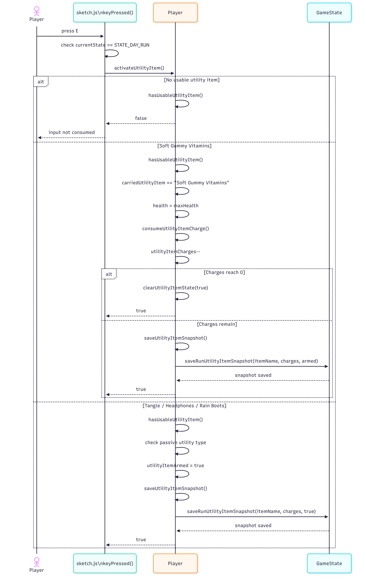<br>
  Image 16: Utility item interaction sequence diagram
</p>

<br>


<br>

<a name="implementation"></a>
<h2 align="center">Implementation</h2>

### Challenge 1: Complex State Management & Non-blocking Persistence

The engine manages 19 states inside a 60fps render loop. The core problem was that state transitions were easy to get wrong — the pause state can be triggered from the room, the story runner, or the endless runner, and without careful handling it was easy to return to the wrong scene on resume. On top of that, writing to localStorage synchronously during gameplay blocked the main thread and caused visible frame drops.

We solved the transition problem by centralising all side-effect handling inside `GameState.setState()`. When entering `STATE_PAUSED`, the engine caches the previous state ID. On resume, it always returns to the exact scene the player came from — not a hardcoded default.

<div align="center">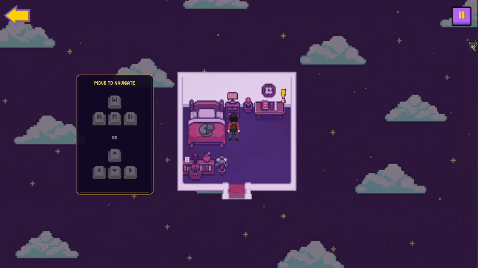<br><sub>Pausing from the Room scene preserves Room context</sub></div>
<div align="center">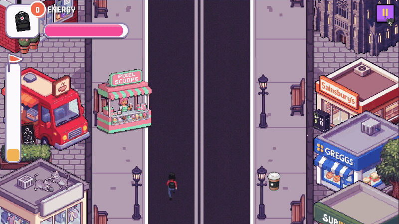<br><sub>Pausing from the run scene preserves run context</sub></div>

For transient data, we save a snapshot of the utility item state before a run starts via `saveRunUtilityItemSnapshot()`. If the player fails and restarts, the snapshot is kept so they can retry with the same item without going back through the room scene.

For storage, `SaveSystem.tick()` runs inside the draw loop with a 3000ms debounce so saves happen in the background without affecting frame rate. On load, `applyAndResume()` writes all global variables before calling `setupRun()` — this prevents the scene from rendering in a half-loaded state.

---

### Challenge 2: Node-based Narrative Engine & Dynamic Logic Injection

The narrative engine needs to handle branching dialogue and trigger game state changes at specific nodes, without adding overhead to the render loop. We split it into three independent layers so that changing the script never requires touching the engine code.

`dialogue_data.js` holds only text and node IDs. `Cutscene.js` handles graph traversal and logic. `DialogueBox` handles rendering. Because each layer only knows its own interface, a story branch can be reconnected by changing a single `next_id` field — no engine refactoring needed.

For side-effects at specific nodes, we built a two-tier injection system. Lightweight events like `event: "showcase"` are declared in the data layer and handled entirely by the engine. Heavyweight actions like `action: "good_ending"` go through `_resolveNodeAction()`, which hydrates a string into a closure only when the player clicks — keeping the data layer fully serialisable and independent of runtime state.

<div align="center">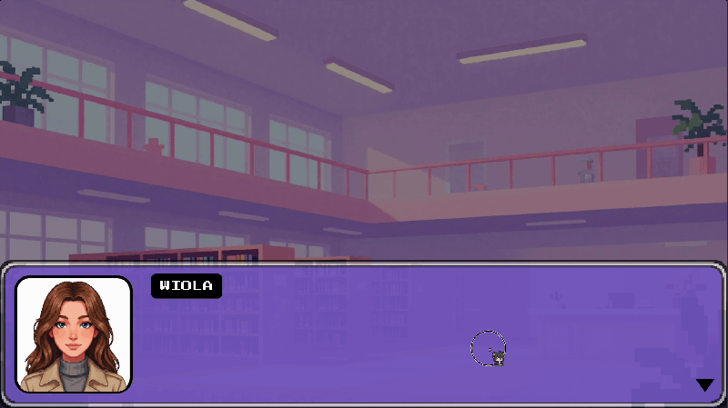<br><sub>event: "showcase" fires the item showcase pipeline</sub></div>

For performance, the engine checks `currentNodeId !== _csLastNodeId` every frame. Content only re-parses when the node actually changes — the typewriter animation never resets unnecessarily and the render loop stays clean regardless of how long the dialogue is.

<div align="center">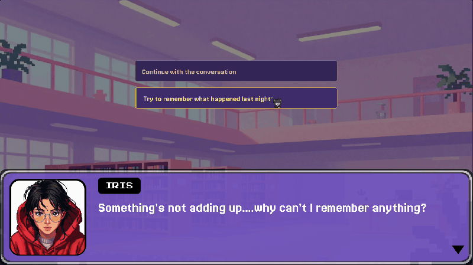<br><sub>Selecting Option 1 — unique branch path via next_id graph traversal</sub></div>
<div align="center"><br><sub>Selecting Option 2 — diverges into a distinct node sequence</sub></div>

---

### Challenge 3: Procedural Obstacle Generation and Fairness Control

**Problem Context**

The obstacle generation system is one of the most technically challenging modules in the game; it directly determines the game’s fairness, difficulty curve and the player’s actual experience. This game features a story mode with a limited parkour time limit, as well as an endless parkour mode derived from the story mode. In story mode, each level—which represents a single day within the game—must not only demonstrate a clear progression in difficulty but also align with the narrative’s pacing; whereas the endless mode requires this system to operate continuously and reliably.
    
Simple random generation was rejected at the outset of the game’s design, as obstacles might overlap spatially, or even completely block off the player’s living space; alternatively, the same set of obstacles might appear repeatedly, giving players the impression that the system was ‘targeting’ them. On the other hand, if the rules are too restrictive, randomness is significantly diminished, potentially resulting in completely obstacle-free stretches of road, which would make the overall experience monotonous and tedious. Therefore, the core objective of the generator is to strike a balance between randomness, fairness and pacing, whilst also managing potential conflicts between vehicles, pedestrian obstacles and power-ups.

**Engineering Difficulties**

- Spatial conflicts: The first challenge is conflicts arising from the placement of objects. Purely random placement can easily lead to overlapping obstacles or conflicts over lane usage; not only does this look unrealistic, but in severe cases it can directly result in ‘deadlock’ situations from which there is no escape. When we try to curb randomness with more rules, it creates new problems. As randomness decreases, the sense of predictability increases, and the player experience becomes tedious.

- To enhance the gameplay experience, this game features as many as 10 different types of obstacles, each varying in terms of movement speed, damage dealt and other attributes. Consequently, it is not feasible to apply a single generation rule to all obstacles; however, designing a unique generation method for each type would make the code difficult to modify and debug. Furthermore, to maintain the growing sense of pressure in the story mode, determining how to reasonably control the appearance frequency and distribution of these various obstacles presents another significant challenge.

**Solution Architecture and Implamentation**

To resolve these issues we developed a multi-stage procedural spawning pipeline coordinated by an ObstacleManager. The system progressively applies constraints and control mechanisms to transform raw randomness into controlled gameplay events.

- The first layer enforces spatial validity. Before confirming a spawn, the system checks lane spacing and bounding box separation, ensuring that obstacles do not overlap and that specific obstacle types only appear in permitted lanes. Mutual exclusion rules further prevent logically conflicting combinations.

- The second layer introduces controlled randomness. Instead of simple random selection, obstacle types are chosen through weighted probabilities combined with diversity penalties that reduce the likelihood of recently spawned types. Certain high-impact hazards also enforce minimum appearance intervals.

- A third layer manages spawn rhythm and difficulty progression. Each level is composed of five predefined difficulty modes arranged in a sequence to form a difficulty curve. Within each mode, symbolic spawn patterns regulate when hazards may appear, preventing both excessive clustering and extended empty periods. This use of recurring obstacle patterns to shape variation and pacing is consistent with the pattern-oriented design approach discussed by Björk and Holopainen (2005).[^18]

Finally, the system applies runtime fairness validation before committing a spawn. These checks ensure that at least one safe lane remains available and estimate whether the player retains sufficient reaction time based on obstacle speed and scrolling velocity. Buffs are handled through an independent timer-based control system that regulates spawn frequency and provides emergency recovery items when player health becomes critically low. Framed another way, the whole spawning pipeline treats pacing and difficulty as tunable constraints rather than accidental by-products, which aligns well with the search-based procedural content generation perspective surveyed by Togelius et al. (2011).[^19]<br>
<div align="center">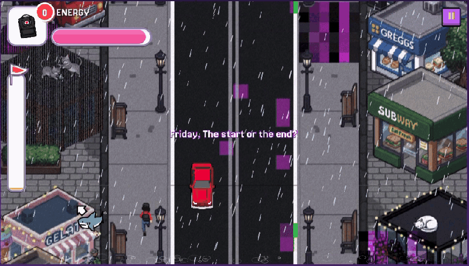<br><sub>Parkour clips from Day 5</sub></div>
<br>

Collision handling was refined using the same fairness-driven principle. During lane switching, the player does not traverse the screen as a perfectly horizontal body; due to the road perspective and spring-based lateral motion, the movement is perceived as a short diagonal transition between lanes. Under a conventional rectangular obstacle hitbox, this created edge cases in which visually empty corner regions still produced a collision. To reduce this mismatch, moving hazards were assigned an isosceles hexagonal collision profile rather than a full axis-aligned rectangle. The upper and lower points preserve the longitudinal extent of the vehicle, while the lateral edges are pulled inward to remove inactive corners and better approximate the perceived body of cars, buses, and scooter riders in motion. The player hitbox was correspondingly reduced to a compact lower-body rectangle, concentrating the effective contact area near the grounded path of travel. Static roadside obstacles continue to use simpler rectangular tests, but for moving hazards this polygonal approach produced more consistent collision outcomes during diagonal lane transitions and improved the overall readability and fairness of the run phase.

<div align="center"><br><sub>Diagram of the hard area and movement trajectory. <br>Red arrows indicate obstacle movement trajectories; green arrows indicate the player's projected movement trajectories.</sub></div>
<br>


<br>


<br>

<a name="evaluation"></a>
<h2 align="center">Evaluation</h2>

<h3>Qualitative Evaluation: Think Aloud & Heuristic Evaluation</h3> 

We performed a qualitative audit through two primary lenses: a **Think Aloud study** to observe real-time player mental models, and a **Heuristic Evaluation**[^13] based on Nielsen’s 10 Principles to identify expert-level UI friction.

<p align="center">

</p>
<p align="center" style="font-size: 0.7rem; color: #777;">
  Heuristic Evaluation form
</p>

**Key Findings:**

- **Semiotic Conflict (Think Aloud):** Participants repeatedly attempted to collide with Ice Cream and Kebab trucks, vocalizing: _"I thought these were shops for health."_ This violation of the "Food = Health" mental model led to unintended penalties.
    
- **Visibility of System Status (Heuristic Evaluation):** Experts flagged the HUD with a severity rating of 3.33. During high-intensity play, users developed "peripheral blindness," missing health updates while focusing on the character.
    
- **Navigation Issues:** Observations showed a "guidance vacuum" where players were unsure of their next objective, leading to stagnation in the room and street phases.
    

**Priority Improvement:** Synthesizing these findings, our primary qualitative goal is an **Integrated Guidance and Feedback Overhaul**.

- **Action Plan:** To resolve semiotic confusion, we are redesigning "Food Truck" hazards with explicit "danger" signifiers, such as flashing lights and darker palettes. To fix the visibility of system status, we implemented a **full-screen red filter** that activates upon taking damage, ensuring feedback is visible even when the player is focused on the character. Furthermore, we have added **yellow exclamation mark (!) icons** to point toward the next goal and integrated **in-game text prompts** and side-screen guidance to ensure the player's path is always clear.

<h3>Quantitative Evaluation: NASA-TLX</h3>

We conducted a **within-subjects study** with 14 participants to measure the perceived workload between Easy Mode and Hard Mode. To mitigate **learning effects**, participants were split into two counterbalanced groups: Group A played Easy Mode first, then Hard Mode; Group B played the reverse order.

**NASA-TLX**

NASA-TLX is a widely used workload evaluation tool for measuring perceived cognitive and physical demand during task performance[^14]. It was used to analyze the impact of difficulty on player workload in *Park Street Survivor*.

**Data Collection and Analysis information about NASA-TLX:**

NASA-TLX consists of six dimensions (Mental Demand, Physical Demand, Temporal Demand, Performance, Effort, and Frustration).  
Each user completed the NASA-TLX questionnaire after playing each difficulty level.  
To simplify administration, the **Raw TLX method** was used (i.e., no pairwise weighting).  
Ratings were collected on a 10-point scale and linearly transformed to a 0–100 scale.  
The overall workload score was calculated as the mean of the six dimensions.  
The statistical analysis used the **Wilcoxon signed-rank test** with a significance level of α = 0.05.

**Here are the NASA-TLX results:**

<div align="center">

| Metric | Easy Mode | Hard Mode |
|--------|:---------:|:---------:|
| Mental Demand | 35.0 | 68.6 |
| Physical Demand | 28.6 | 48.6 |
| Temporal Demand | 35.7 | 71.4 |
| Effort | 40.7 | 66.4 |
| Frustration | 29.3 | 53.6 |
| Performance* | 79.3 | 50.7 |
| **Total TLX** | **41.4** | **59.9** |

Table 1: NASA-TLX data result across all 14 participants (0–100, linearly transformed from a 10-point scale)  
*Performance was measured as "How successful were you?" (higher raw score = felt more successful). Easy (79.3) > Hard (50.7) correctly reflects that players felt more successful on Easy Mode. Unlike other dimensions, a higher Performance score here indicates lower workload burden.

</div>

<p align="center">
  
</p>
<p align="center" style="font-size: 0.7rem; color: #777;">
  NASA-TLX Dimension
</p>

**Data Analysis:**

Easy Mode: Average workload score of **41.4**  
Hard Mode: Average workload score of **59.9**  

Hard Mode shows a clear increase in perceived workload compared to Easy Mode. The largest increases are observed in **Temporal Demand** and **Mental Demand**, indicating that time pressure and cognitive load are the primary contributors to difficulty. **Effort** also increases substantially, reflecting higher sustained interaction demand.

**Statistical Analysis showed:**

Wilcoxon test result: W test statistic = **0** (n = 14)  
Critical value (n = 14, α = 0.05): **21**  

**Conclusion:** W < 21, indicating a statistically significant difference between difficulty levels.

**Interpretation:**

The workload score for Hard Mode is significantly higher than for Easy Mode, indicating that increased difficulty substantially elevates cognitive and temporal demands on players. However, frustration levels remain moderate, and the Performance score drop from 79.3 to 50.7 reflects that players felt less successful in Hard Mode — not a design failure, but an expected consequence of higher stakes. Together, these results suggest that Hard Mode's elevated workload is experienced as a meaningful challenge rather than an overwhelming burden.

Maintaining this balance between increased challenge and controlled workload is important for preserving player engagement while avoiding excessive cognitive strain.

<h3>Quantitative Evaluation: System Usability Scale (SUS)</h3>

Participants completed the standard 10-item SUS questionnaire[^15] after each difficulty level. Scores were computed using the Brooke (1986) method: odd-numbered items contribute (scale position − 1), even-numbered items contribute (5 − scale position), and the sum is multiplied by 2.5 to yield a score on a 0–100 scale.

<div align="center">

| Condition | Mean SUS Score | Benchmark | Rating |
| :--- | :---: | :---: | :---: |
| **Easy Mode** | **79.8** | 68.0 | Good |
| **Hard Mode** | **66.4** | 68.0 | Marginal |
| **Overall (both conditions)** | **73.1** | 68.0 | Good |

Table 2: SUS results across all 14 participants (industry benchmark = 68.0)

</div>

Easy Mode scores comfortably above the 68.0 industry benchmark, indicating a clear and accessible experience. Hard Mode falls slightly below the benchmark (66.4), suggesting that higher pacing and obstacle density introduce enough interaction overhead to reduce perceived usability — though the overall mean (73.1) remains in the "Good" band. This decline directly motivated the addition of a mandatory contextual tutorial before Hard Mode in the subsequent sprint.

Full per-item SUS data and raw scores are documented in [Lab 8 — HCI Evaluation](./docs/Labs/Week_8_Evaluation_2/README.md).

<h3>Black-Box Testing</h3>

To ensure software quality and validate functional requirements, we conducted comprehensive Black-Box Testing using **Equivalence Partitioning (EP)** and **Boundary Value Analysis (BVA)** methods.[^15] The following test cases verify that core gameplay loops, scene transitions, and inventory state management conform to the user stories and functional requirements defined in the design phase.

**1. Game Scene Switching Test**

<div align="center">

| Test Case | Input | Expected Output | Observed Output | Status |
| :--- | :--- | :--- | :--- | :--- |
| **1.1** | Player enters the Main Menu and clicks START | Game switches to the SELECT DIFFICULTY page (CASUAL / NORMAL / HARD) | Behaves as expected | **Pass** |
| **1.2** | Player selects NORMAL in the SELECT DIFFICULTY page | Game switches to the MODE confirmation page | Behaves as expected | **Pass** |
| **1.3** | Player confirms NORMAL mode and chooses NEW GAME | Game proceeds through opening cutscene to TIME WHEEL (level select) | Behaves as expected | **Pass** |
| **1.4** | Player selects a date in the TIME WHEEL page | Game switches to the corresponding ROOM scene | Behaves as expected | **Pass** |
| **1.5** | Player finishes preparation in ROOM and starts the run | Game switches to the DAY-RUN gameplay scene | Behaves as expected | **Pass** |
| **1.6** | Player presses P (or ESCAPE) during DAY-RUN | Game switches to the PAUSE SCREEN, gameplay loop is halted | Behaves as expected | **Pass** |
| **1.7** | Player selects EXIT in the PAUSE SCREEN | Game completely resets and returns to the MAIN MENU | Behaves as expected | **Pass** |
| **1.8** | Player reaches the total distance target with HP > 0 | Game transitions to WIN screen after a brief victory phase | Behaves as expected | **Pass** |
| **1.9** | Player selects CASUAL difficulty, enters a Player ID, and confirms | Game launches Endless Easy Mode (Day 1 pacing); player survives as long as possible with no distance victory condition; survival time and hit count shown on settlement screen | Behaves as expected | **Pass** |
| **1.10** | Player selects HARD difficulty, enters a Player ID, and confirms | Game launches Endless Hard Mode (Day 5 intensity); player survives under higher obstacle pressure with no distance victory condition; survival time and hit count shown on settlement screen | Behaves as expected | **Pass** |

Table 1: Game Scene Switching Test

</div>

**2. Player Movement and Control Interaction Test**

<div align="center">

| Test Case | Input | Expected Output | Observed Output | Status |
| :--- | :--- | :--- | :--- | :--- |
| **2.1** | Player presses W / UP_ARROW in ROOM scene | Player character moves north | Behaves as expected | **Pass** |
| **2.2** | Player presses S / DOWN_ARROW in ROOM scene | Player character moves south | Behaves as expected | **Pass** |
| **2.3** | Player presses A / LEFT_ARROW in ROOM scene | Player character moves west | Behaves as expected | **Pass** |
| **2.4** | Player presses D / RIGHT_ARROW in ROOM scene | Player character moves east | Behaves as expected | **Pass** |
| **2.5** | Player presses A / LEFT_ARROW in DAY-RUN | Player character changes to the left lane | Behaves as expected | **Pass** |
| **2.6** | Player presses D / RIGHT_ARROW in DAY-RUN | Player character changes to the right lane | Behaves as expected | **Pass** |
| **2.7** | Player presses P (or ESCAPE) during DAY-RUN | The PAUSE SCREEN is displayed instantly | Behaves as expected | **Pass** |
| **2.8** | Player presses ESC on a submenu or sub-screen | Game returns to the previous page | Behaves as expected | **Pass** |
| **2.9** | Player presses ENTER near the desk in the ROOM scene | Backpack / Inventory page is opened | Behaves as expected | **Pass** |
| **2.10** | Player presses SPACE 3 times while trapped in a PUDDLE | Puddle slow effect is cleared and run continues normally | Behaves as expected | **Pass** |
| **2.11** | Player presses SPACE 5 times during a PROMOTER interaction | Leaflet overlay is dismissed, run continues | Behaves as expected | **Pass** |
| **2.12** | Player presses E with a utility item equipped during DAY-RUN | Item effect activates; remaining charge count decreases by 1 | Behaves as expected | **Pass** |

Table 2: Player Movement and Control Interaction Test

</div>

#### 3. DAY-RUN Collision Test (Equivalence Partitioning)

> Instead of exhaustively testing every obstacle asset, EP groups obstacles into distinct behavioural classes (Fatal, Damage, Stun, Displacement, Status Effect, Illusory). Testing one representative from each class validates the underlying collision logic without redundant cases.

<div align="center">

| Test Case | Input (Obstacle Category) | Expected Output | Observed Output | Status |
| :--- | :--- | :--- | :--- | :--- |
| **3.1** | Player collides with a **large vehicle** — Bus / Ambulance (Fatal) | Game ends immediately; fail screen displays reason "HIT_BUS" | Behaves as expected | **Pass** |
| **3.2** | Player collides with a **small vehicle** — Police car / Sedan (Damage, −34 HP) | Player takes 34 HP damage; run continues if HP > 0 | Behaves as expected | **Pass** |
| **3.3** | Player collides with a **scooter rider** (Stun) | Player is stunned for 0.5 s then lane input is blocked for 1.0 s | Behaves as expected | **Pass** |
| **3.4** | Player collides with a **homeless NPC** (Displacement) | Player takes 10 HP damage and is forced into an adjacent lane | Behaves as expected | **Pass** |
| **3.5** | Player collides with a **small business** — ice cream cart / kebab stall (Damage, −10 HP) | Player takes 10 HP damage; run continues | Behaves as expected | **Pass** |
| **3.6** | Player walks into a **puddle** (Status Effect) | Player takes 20 HP damage and movement slows to 72% until 3× SPACE presses | Behaves as expected | **Pass** |
| **3.7** | Player approaches a **fantasy coffee** obstacle | Item disguise drops; obstacle flees at high speed — no damage dealt | Behaves as expected | **Pass** |

Table 3: DAY-RUN Collision Test

</div>

**4. Item Collection and Backpack System Test**

<div align="center">

| Test Case | Input | Expected Output | Observed Output | Status |
| :--- | :--- | :--- | :--- | :--- |
| **4.1** | Player collects a **Coffee** item during DAY-RUN | Player's HP is restored by +33; overflow at max HP grants 3 s invincibility | Behaves as expected | **Pass** |
| **4.2** | Player collects an **Empty Scooter** item during DAY-RUN | Player gains a 5 s speed boost (1.2×) and 7 s invincibility | Behaves as expected | **Pass** |
| **4.3** | Player selects a utility item (Vitamins / Tangle / Headphones / Rain Boots) in the ROOM backpack interface | Item is equipped as the active utility for the next run | Behaves as expected | **Pass** |
| **4.4** | Player carries a utility item into DAY-RUN | HUD correctly displays the item icon and remaining charge count | Behaves as expected | **Pass** |
| **4.5** | Player presses E to activate the **Vitamins** item | HP is immediately restored to max; charge count decreases by 1 | Behaves as expected | **Pass** |
| **4.6** | Player presses E to arm the **Rain Boots** then walks into a puddle | Puddle trap and slow are negated; charge count decreases by 1 | Behaves as expected | **Pass** |
| **4.7** | Player uses the last remaining charge of a utility item | HUD item icon returns to the default empty-backpack state | Behaves as expected | **Pass** |

Table 4: Item Collection and Backpack System Test

</div>

**5. UI, Visual Feedback and Audio Test**

<div align="center">

| Test Case | Input | Expected Output | Observed Output | Status |
| :--- | :--- | :--- | :--- | :--- |
| **5.1** | Player navigates menu options | Currently hovered option is visually highlighted | Behaves as expected | **Pass** |
| **5.2** | Player clicks a menu option | Menu selection sound effect plays | Behaves as expected | **Pass** |
| **5.3** | Player enters a new scene (e.g., DAY-RUN, Fail screen, Room) | Background music transitions smoothly to the scene-appropriate track | Behaves as expected | **Pass** |
| **5.4** | Player takes damage or collides with an obstacle | Visual hit feedback (red screen flash / screen shake) is shown | Behaves as expected | **Pass** |
| **5.5** | Player has no utility item equipped | HUD displays the default backpack icon and no charge badge | Behaves as expected | **Pass** |
| **5.6** | Player adjusts the MUSIC VOLUME slider in Settings | BGM volume changes in real time; new value persists when settings is closed | Behaves as expected | **Pass** |
| **5.7** | Player adjusts the SOUND EFFECTS slider in Settings | SFX volume changes in real time | Behaves as expected | **Pass** |

Table 5: UI, Visual Feedback and Audio Test

</div>

**6. Pause and Submenu Navigation Test**

<div align="center">

| Test Case | Input | Expected Output | Observed Output | Status |
| :--- | :--- | :--- | :--- | :--- |
| **6.1** | Player presses P (or clicks the Pause icon) during DAY-RUN | PAUSE SCREEN is displayed; gameplay loop is strictly halted | Behaves as expected | **Pass** |
| **6.2** | Player clicks BACK (or presses ESCAPE) in the PAUSE SCREEN | Game resumes exactly from the paused state | Behaves as expected | **Pass** |
| **6.3** | Player selects SETTINGS in the PAUSE SCREEN | Settings submenu is rendered with MUSIC VOLUME and SOUND EFFECTS sliders | Behaves as expected | **Pass** |
| **6.4** | Player selects HELP in the PAUSE SCREEN | Help pages cycle through Controls, Character Wiki, Buffs, and Hazards | Behaves as expected | **Pass** |
| **6.5** | Player selects STORY in the PAUSE SCREEN | Story recap with scrollable day summaries (Days 0–5) is rendered | Behaves as expected | **Pass** |
| **6.6** | Player selects EXIT in the PAUSE SCREEN and confirms | Game completely resets and returns to the MAIN MENU | Behaves as expected | **Pass** |
| **6.7** | Player selects RESTART → "BACK TO ROOM" | Player is returned to the ROOM scene for the current day | Behaves as expected | **Pass** |
| **6.8** | Player selects RESTART → "RESTART RUN" | Current DAY-RUN restarts from the beginning with full HP | Behaves as expected | **Pass** |

Table 6: Pause and Submenu Navigation Test

</div>

#### 7. Fail and Win Condition Test

<div align="center">

| Test Case | Input | Expected Output | Observed Output | Status |
| :--- | :--- | :--- | :--- | :--- |
| **7.1** | Player's HP decays to 0 through natural stamina loss | Fail screen displayed with reason "EXHAUSTED" | Behaves as expected | **Pass** |
| **7.2** | Player collides with a large vehicle (Bus / Ambulance) | Fail screen displayed with reason "HIT_BUS" | Behaves as expected | **Pass** |
| **7.3** | Player's in-game clock exceeds the 30-minute deadline | Fail screen displayed with reason "LATE" | Behaves as expected | **Pass** |
| **7.4** | Player reaches the total distance target with HP > 0 | 3-second victory transition plays; WIN screen is shown | Behaves as expected | **Pass** |

Table 7: Fail and Win Condition Test

</div>

#### 8. Boundary Value Analysis (BVA) Test

> Edge cases are the most common source of software faults. These tests target the extreme limits of the system's constraints — HP underflow clamping, stamina overflow, rapid inputs, empty-state interactions, and Player ID field boundaries — to ensure the engine remains stable under stress.

<div align="center">

| Test Case | Input (Boundary Scenario) | Expected Output | Observed Output | Status |
| :--- | :--- | :--- | :--- | :--- |
| **8.1** | **HP Lower Boundary:** Player HP is exactly 1, receives 1 HP of damage | HP drops to 0; fail state (EXHAUSTED) triggers immediately | HP reaches 0; fail state triggered | **Pass** |
| **8.2** | **HP Zero Overflow:** Player HP is exactly 1, receives 34 HP of damage (SMALL_CAR) | HP drops below 0; on the next update frame `health > 0` is false and fail state (EXHAUSTED) triggers | Fail state triggered on next frame after damage | **Pass** |
| **8.3** | **Stamina Upper Boundary — Coffee overflow:** Player collects Coffee at 100% HP | Coffee's +33 HP overflows max; HP locked at max for 3 s invincibility; no HP exceeds 100 | HP remains at 100; 3 s invincibility activates | **Pass** |
| **8.4** | **Lane Boundary — left edge:** Player presses LEFT_ARROW while already in lane 1 (leftmost) | Character stays in lane 1; no out-of-bounds movement | Movement restricted to lane 1 | **Pass** |
| **8.5** | **Lane Boundary — right edge:** Player presses RIGHT_ARROW while already in lane 4 (rightmost) | Character stays in lane 4; no out-of-bounds movement | Movement restricted to lane 4 | **Pass** |
| **8.6** | **Input Spam Boundary:** Player spams A / D extremely fast | Character changes lanes one at a time; 20-frame repeat delay prevents skipping lanes; stays within lanes 1–4 | Movement restricted to valid lanes with natural delay | **Pass** |
| **8.7** | **Empty Inventory Boundary:** Player presses E with no utility item equipped | No crash; input is safely ignored | Input safely ignored; no crash | **Pass** |
| **8.8** | **SPACE input outside interaction:** Player presses SPACE when no Puddle or Promoter is active | No crash; input is safely ignored | Input safely ignored; no crash | **Pass** |
| **8.9** | **Player ID — empty input (0 chars):** Player leaves ID field blank and presses ENTER on Endless confirm screen | Input rejected; confirm button remains disabled; run does not start | Confirm button remains disabled; no run launched | **Pass** |
| **8.10** | **Player ID — minimum valid (1 char):** Player enters a single alphanumeric character and confirms | ID accepted; Endless run launches with recorded ID | Run launches with 1-character ID | **Pass** |
| **8.11** | **Player ID — maximum valid (16 chars):** Player enters exactly 16 alphanumeric characters and confirms | ID accepted; Endless run launches with full 16-character ID | Run launches with 16-character ID | **Pass** |
| **8.12** | **Player ID — over limit (17 chars):** Player attempts to type a 17th character into the ID field | 17th character is not accepted; field remains at 16-character cap | Field capped at 16 characters; no overflow | **Pass** |
| **8.13** | **Player ID — invalid characters:** Player attempts to enter characters outside the allowed set (e.g., `!`, `@`, space) | Characters silently rejected; only letters, numbers, underscore (`_`), and hyphen (`-`) are accepted | Invalid characters silently ignored; field content unchanged | **Pass** |
| **8.14** | **Player ID — just above minimum (2 chars):** Player enters exactly 2 valid characters and confirms | ID accepted; Endless run launches with 2-character ID recorded on leaderboard | Run launches with 2-character ID | **Pass** |
| **8.15** | **Player ID — just below maximum (15 chars):** Player enters exactly 15 valid characters and confirms | ID accepted; Endless run launches with 15-character ID recorded on leaderboard | Run launches with 15-character ID | **Pass** |
| **8.16** | **HP just inside upper boundary:** Player at 99 HP receives 1 HP of passive decay damage | HP reduces to 98; no invincibility or special behaviour; run continues normally | HP correctly reduces to 98; run continues | **Pass** |
| **8.17** | **HP just inside lower boundary:** Player HP is exactly 2, receives 1 HP of passive decay damage | HP reduces to 1; `health > 0` remains true; fail state does not trigger; run continues | HP reduces to 1; run continues normally | **Pass** |

Table 8: Boundary Value Analysis Test

</div>

<h3>White-Box Testing</h3>

Due to p5.js's dependency on browser APIs (`loadImage`, `loadSound`, `p5.Font`), unit tests cannot be run in a Node.js environment without extensive mocking of the rendering context. Automated testing was therefore not feasible within the project's constraints; instead, white-box coverage was achieved through a purpose-built in-engine Testing Panel combined with structured manual test protocols.

White-box testing examined internal code structure — control flow paths, branch conditions, and data interactions — in two areas where internal complexity posed the highest risk.

**Control Flow Coverage — FSM State Machine:** The main draw loop in `sketch.js` manages over 20 distinct game states via a central `switch` statement. We constructed a state-transition path table and verified that every state is both reachable and escapable with no dead states, covering the critical path from `STATE_MENU` through to `STATE_WIN` and all diverging branches (ESC navigation, Endless vs. Story routing, pause sub-menus). The 20-case switch gives a cyclomatic complexity of V(G) ≥ 21; additional nested conditionals within certain states (mode-specific routing, ESC-handler branching) increase the true value further. All 20 states were confirmed reachable and escapable, giving **100% branch coverage** with no dead code identified.

**Branch Coverage — Utility Item Collision Handler:** The item activation logic spans `Player.js` (predicate functions `shouldTriggerRainBoots`, `shouldTriggerHeadphones`, `shouldTriggerTangle`) and `ObstacleSystem.js` (`handleCollision` dispatch). We designed a decision table exercising all five branch combinations per item type (item carried + armed + charges > 0; item carried but not armed; charges exhausted; no item; player invincible), confirming that guard conditions evaluate in the correct order with no unreachable branches. Because the decision points are distributed across two files, V(G) is derived from the path-count method: 5 linearly independent paths give **V(G) = 5**, achieving **100% branch coverage**. A V(G) of 5 is well within the accepted low-complexity threshold (≤ 10), satisfying the ISO 25010 *maintainability* sub-characteristic — each independent path is short, has a single clear responsibility, and can be modified without cascading side-effects in other branches.

Both analyses were enabled by the custom **Testing Panel** — a white-box testing tool built into the engine that allows testers to instantly set HP to any value, jump to any FSM state, spawn specific obstacle types on demand, and equip items with known charge counts. This compressed the time to reach a specific edge case from several minutes of play to a single button press. The white-box phase directly surfaced four bugs that had been invisible during informal playthroughs; full details of each bug, its root cause, and the fix are documented in [Lab 9 — Quality Assurance](./docs/Labs/Week_9_QA_Testing/README.md).

**ISO 25010 — Reliability (Error Handling):** The engine implements the ISO 25010 *fault tolerance* sub-characteristic via explicit error containment in `SaveSystem.js`: every `localStorage` read and write is wrapped in a `try/catch` block that logs a console warning and returns a safe fallback (`null`) rather than propagating the exception. This means a storage fault (e.g., quota exceeded or private-browsing restriction) produces a graceful degradation — the save is silently skipped and the session continues — rather than an uncaught failure that would crash the game. The Fault → Failure escalation chain is broken at the Fault level.

<h3>Conclusion</h3>

Black-box testing confirmed that all major gameplay systems of Park Street Survivor function reliably and in accordance with the defined requirements. Scene transitions, player controls, collision behaviours, item mechanics, pause navigation, and audio routing all behaved as expected. Boundary analysis verified that the engine handles edge cases — including HP underflow, lane overflow, Player ID field boundaries, and empty-state inputs — without crashes or undefined behaviour. The three distinct fail paths (EXHAUSTED, HIT_BUS, LATE) and the win condition each triggered correctly under their respective conditions. White-box testing complemented this by verifying internal control flow: every FSM state was confirmed reachable and escapable, and all conditional branches in the utility item collision handler were exercised. Together, the two methods gave us structured confidence in both external behaviour and internal correctness.

<br>


<br>

<a name="process"></a>
<h2 align="center">Process</h2>

<h3>Team Structure and Role Definition</h3>
<p>
At the project’s inception, we recognised that a clear division of labour was essential. Following a major team restructuring (detailed below), we adopted a specialised role structure where all four remaining members took collective ownership of the narrative, alongside their specific technical pillars:
</p>

<ul>
<li><strong>Charlotte Yu (Core Mechanism, Architecture & Co-Script Designer):</strong> Focused on the physics engine, character movement, and the implementation of the core health-depletion and collision systems.</li>
<li><strong>Lucca Zhou (Aesthetic, Asset Design & Co-Script Designer):</strong> Responsible for 2D environmental assets, character sprites, and ensuring a cohesive visual identity.</li>
<li><strong>Ray Wang (Level Design, Balancing & Co-Script Designer):</strong> Tasked with the architectural flow of the levels, balancing obstacle placement with power-up frequency.</li>
<li><strong>Layla Pei (UI/UX, Audio & Co-Script Designer):</strong> Developed the head-up display (HUD), menu navigation, and the soundscape providing crucial gameplay feedback.</li>
</ul>
<p>
Notably, the team operated without a designated Scrum Master or Product Owner. Leadership was distributed: each member had full autonomy over their own domain and could make adjustments without waiting for approval. Cross-domain decisions — such as when narrative requirements intersected with technical constraints — were resolved through peer discussion in our regular meetings, where every member gave and received feedback as an equal. This structure kept decision-making fast and avoided bottlenecks, though it also meant that resolving ambiguity in shared areas required more active coordination than a role-based hierarchy would have demanded.
</p>

<h3>Team Dynamics and Crisis Management</h3>
<p>
Our most significant test in project management involved team dynamics. Initially, our team included a fifth member assigned exclusively as the Script Writer. However, due to personal circumstances and an initially overly polite, indirect communication culture within our team, the narrative development stagnated. Because we hesitated to address the lack of progress directly to avoid conflict, the script — a critical dependency for our story-driven runner — became a major blocker.
</p>
<p>
Recognising this critical risk to the project timeline, we eventually initiated a transparent and candid discussion, resulting in the member amicably transferring to another group. To recover the lost time, the remaining four of us took collective ownership of the narrative as Co-Script Designers. This crisis forced us to collaboratively write the storyline from scratch and heavily invest time into engineering a robust <code>DIALOGUE_DATA</code> node graph and the <code>Cutscene.js</code> engine to vividly present the plot. This experience was our most valuable lesson in Agile risk management: the necessity of direct, transparent communication over conflict avoidance.
</p>

<p align="center">
  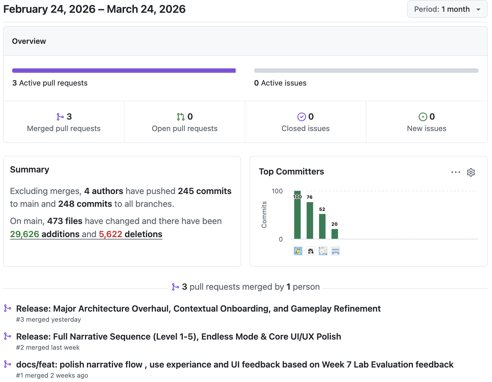
  <br><i>GitHub contribution summary — confirming that all delivered work was authored by the four remaining team members.</i>
</p>

<h3>Agile Ceremonies & Forward Planning</h3>
<p>
To maintain momentum after this restructuring, we relied on a dedicated WeChat group as our central hub for rapid problem-solving and daily synchronization.
</p>
<p>
A cornerstone of our workflow was our <strong>fortnightly Sprint Planning</strong> methodology. As each two-week sprint approached its conclusion, we convened to establish the objectives for the subsequent cycle. These forward-looking meetings were highly strategic: we determined our next Sprint Goals by strictly cross-referencing our actual development progress (team velocity) against the university’s upcoming syllabus deadlines. This continuous triangulation ensured that our Jira Backlog was not just a theoretical wish list, but a realistic, dynamic roadmap that guaranteed academic milestones were met without compromising the game’s technical integrity.
</p>

<p align="center">
  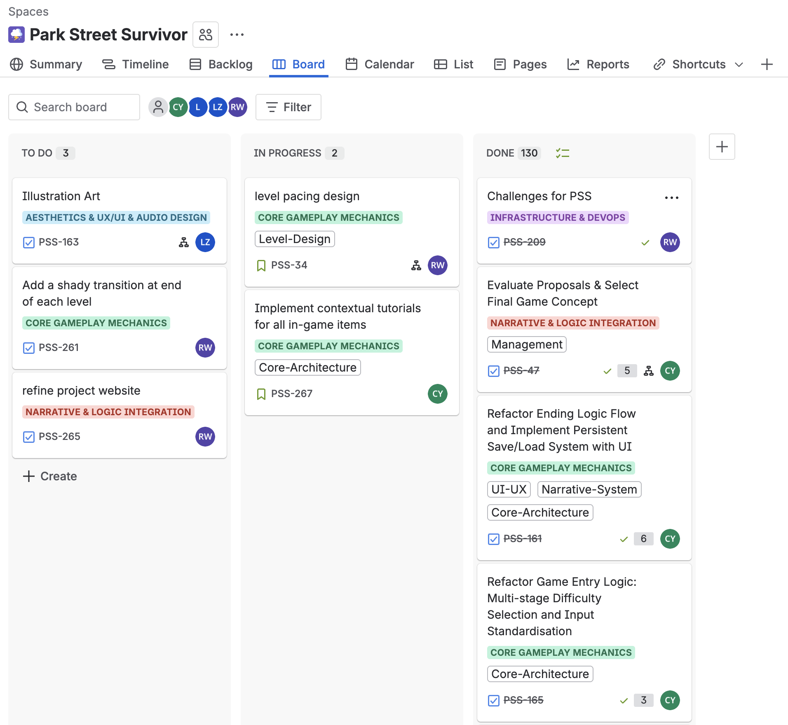
  <br><i>Our Jira Kanban board — each card corresponds to a task agreed upon in sprint planning ceremonies, providing real-time progress visibility across the team.</i>
</p>
<p>
Our Jira setup itself went through a significant evolution. We introduced issue keys in commit messages from the outset, but the initial board was configured without a clear understanding of how sprints and epics should relate. Once those early sprints were marked complete, Jira no longer allowed their structure to be modified. Rather than working around an ill-formed board, we made the decision to migrate the entire backlog to a new project with a consistent <code>PSS-</code> prefix, rebuilding the sprint and epic hierarchy from scratch. The migration was a substantial effort, but the resulting clarity — every task traceable to a sprint and an epic, every commit linked to a ticket — was immediately visible in how the team discussed and reviewed work. This was, in effect, process technical debt: accumulated quietly during the early weeks, expensive to resolve, but entirely worthwhile.
</p>
<p>
One deliberate departure from textbook Scrum was our approach to Sprint Retrospectives. Rather than holding a discrete retrospective ceremony at the end of each sprint, reflection was embedded continuously in our twice-weekly meetings — what went well, what was blocked, and what needed adjusting were discussed as standing agenda items rather than as a scheduled event. This kept feedback loops short and responsive. The trade-off was that improvement actions were not always formally documented or tracked, making it harder to verify in hindsight that identified issues had been resolved. In future projects, we would retain the continuous feedback cadence but add a brief written summary at the close of each sprint to capture decisions and action items explicitly.
</p>

<h3>XP Engineering Practices</h3>
<p>
Beyond Scrum ceremonies, several Extreme Programming (XP) practices emerged organically from how we worked together:
</p>
<ul>
<li><strong>Collective Code Ownership:</strong> Because architectural roles were specialised but not siloed, any team member could — and regularly did — modify code outside their primary domain. Charlotte's state machine was extended by Ray for level transitions; Layla's HUD was refactored during the tutorial overhaul. No part of the codebase was off-limits to any contributor.</li>
<li><strong>Sustainable Pace:</strong> Following the team restructuring, we deliberately avoided crunch by redistributing the narrative workload across all four members. Sprint scope was adjusted downward when velocity data indicated a risk of overload — the tutorial overhaul, for example, replaced a planned feature rather than being added on top of it.</li>
<li><strong>Continuous Integration:</strong> Every merge to <code>main</code> triggered an automatic GitHub Pages deployment, meaning the live game URL always reflected the latest integrated build. This gave the whole team — including non-technical members reviewing art and audio — immediate access to a working build without local setup.</li>
</ul>

<h3>Decoupled Pipeline & Version Control</h3>
<p>
Technically, we adopted a <strong>"Logic-First, Art-Later"</strong> pipeline. Charlotte and Ray would implement core mechanics using placeholders. Once spatial logic was verified, Lucca and Layla’s finalised assets were injected, preventing programmers from bottlenecking while waiting for art. When unforeseen challenges arose — such as a typography issue where item descriptions became illegible due to poor font kerning — our engineering response was to develop a custom in-game <strong>Testing Panel</strong>. This debug menu allowed us to hot-swap states rapidly, significantly accelerating later development stages.
</p>

<p align="center">
  
  <br><i>The Testing Panel — a custom debug overlay enabling rapid state hot-swapping during development.</i>
</p>

<p>
One concrete example of the "Logic-First, Art-Later" pipeline in action was the typography overhaul. Early builds used placeholder rendering with the original font, which produced poor kerning and made item descriptions difficult to read. Once the spatial logic was stable, we replaced the placeholders with finalised art assets, introduced a new font, and added a text highlight system — transforming legibility entirely.
</p>

<table align="center">
<tr>
  <td align="center" width="50%" valign="top">
    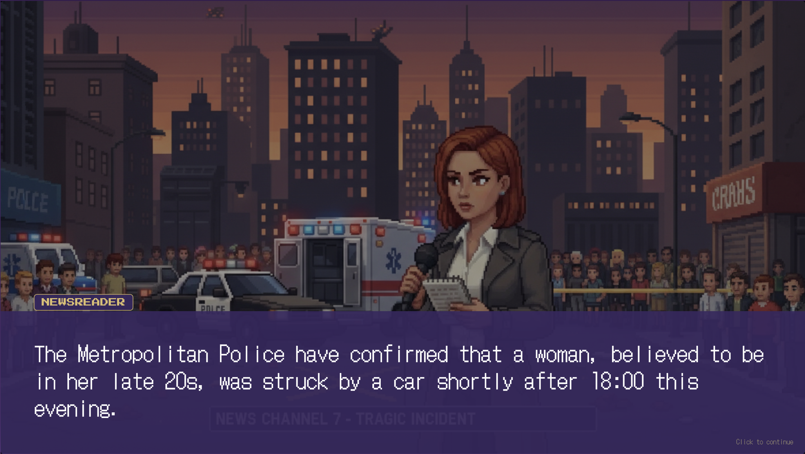
  </td>
  <td align="center" width="50%" valign="top">
    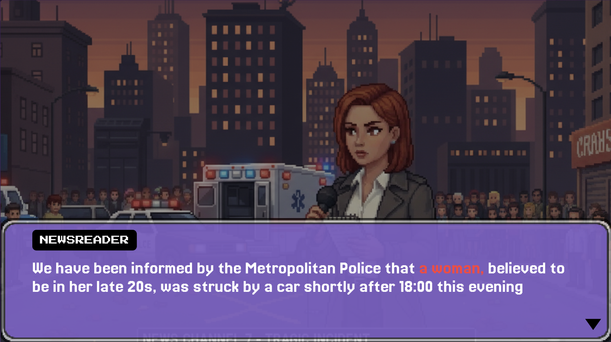
  </td>
</tr>
<tr>
  <td align="center"><i>Before — placeholder rendering with old font; poor kerning made descriptions illegible</i></td>
  <td align="center"><i>After — finalised assets, new font, and highlight system delivering clear, polished text</i></td>
</tr>
</table>

<p>
Our approach to version control also evolved. Initially pushing directly to <code>PSS-Dev</code>, we recognised the limitations by Week 8 and adopted GitHub’s Pull Request (PR) system. Our established pipeline became: <strong>Sprint Planning → Jira Backlog Assignment → Local Branch Development → Commit (with Jira Issue Keys) → WeChat Notification → Peer PR Review</strong>. Because architectural roles were isolated, true merge conflicts were rare; when they occurred, the PR system resolved them transparently.
</p>

<p align="center">
  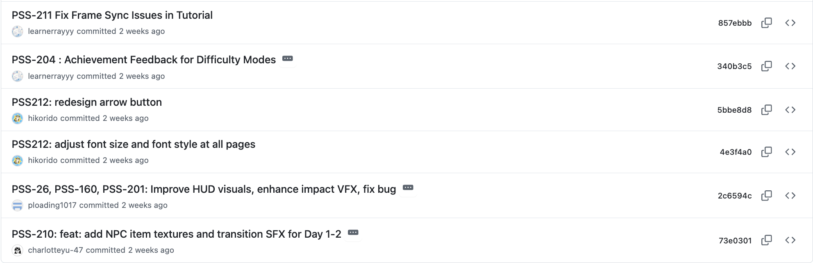
  <br><i>Commit history with embedded Jira issue keys — demonstrating full traceability from backlog ticket to merged code.</i>
</p>

<h3>Continuous QA and Iteration</h3>
<p>
Our most significant Agile pivot occurred following Week 8 playtesting. Qualitative feedback revealed a severe <strong>"Curse of Knowledge"</strong> — while mechanics were obvious to us, first-time players found the onboarding overwhelming. Consequently, we delayed our projected feature-freeze to completely overhaul the tutorial into a contextual, pause-and-click system. Because our robust Sprint Planning constantly aligned our technical pace with academic milestones, we had the temporal buffer necessary to absorb these crucial UX improvements, ultimately delivering a highly polished final product.
</p>

<table align="center">
<tr>
  <td align="center" width="50%" valign="top">
    
  </td>
  <td align="center" width="50%" valign="top">
    
  </td>
</tr>
<tr>
  <td align="center"><i>Before — original tutorial: passive and easily missed</i></td>
  <td align="center"><i>After — contextual pause-and-click system: interactive and guided</i></td>
</tr>
</table>

<br>


<br>

<a name="conclusion"></a>
<h2 align="center">Conclusion</h2>

Park Street Survivor started as a simple browser runner on Park Street in Bristol. By the end, it had grown into a narrative-driven game with a node-graph dialogue engine, a 20-state finite state machine, dual gameplay modes, a leaderboard, and a testing protocol that caught bugs we had missed for months. The difference between what we initially planned and what we actually built shows how much we developed as a team.

### Lessons Learnt

The most important lesson was not technical. When a team member's contributions stalled early on, we avoided addressing it for too long because we did not want to affect the team dynamic. When we eventually dealt with it directly and redistributed the work across the four remaining members, things moved forward immediately. Honest communication does not damage a team — avoiding it does.

Our process tools changed a lot during the project. Because our initial Jira board had configuration problems, we had to migrate all our work tasks to a new one. We also started using GitHub Pull Requests to merge branches into main around once a week, after we realised there was a more structured way to manage this. Every improvement we made came from a problem we ran into first.

Systematic testing taught us that playthroughs are not the same as testing. All four bugs we fixed during the QA phase had been in the codebase for multiple sprints without anyone noticing. It was only through Boundary Value Analysis and Equivalence Partitioning[^15] — testing the engine at its exact limits — that we found them. Testing is not a final check; it is how you actually discover problems.

### Future Work

The most immediate next step would be mobile and touchscreen support. The core mechanic of switching lanes feels like it would work naturally with swipe input, but making it work properly with p5.js touch events and responsive layout is a significant amount of work that we did not have time for in this project.

Beyond that, we want to keep improving based on user feedback. The evaluation methods we set up — Think Aloud, NASA-TLX[^14], heuristic review — give us a repeatable way to measure the impact of any future changes. The goal is not to add features for their own sake, but to refine what is already there based on what real players actually experience.

<br>


<br>

<a name="contribution"></a>
<h2 align="center">Contribution Statement</h2>

<div align="center">

| Team Member | Primary Role | Contribution |
|:---|:---|:---|
| **Charlotte Yu** | Core Mechanism, Architecture & Co-Script Designer | **coding:** state machine (FSM), backpack system, dialogue engine (`CutsceneModule`, `DialogueData`), save system (`SaveSystem`), Testing Panel (cutscene / story debug, buff controls, FSM state navigation)<br>**report:** User Stories, MoSCoW Requirements, System Architecture, State Machine Diagram, Class Diagram, Implementation, Introduction / Process / Conclusion (shared)<br>**scrum master:** managed Jira backlog, ran sprint planning and tracked team velocity<br>**script:** co-authored all five days of narrative dialogue |
| **Lucca Zhou** | Aesthetic, Asset Design & Co-Script Designer | **coding & art:** all character sprites, background art and environmental visual assets, dialogue system (visual layer)<br>**report:** Use Case Diagram, Evaluation (Heuristic + Quantitative), Introduction / Process / Conclusion (shared)<br>**product owner:** set the product vision, kept the feature priority up to date, and signed off on deliverables<br>**media:** made the slides and visual materials for the game video<br>**script:** co-authored all five days of narrative dialogue |
| **Ray Wang** | Level Design, Balancing & Co-Script Designer | **coding:** level design, procedural obstacle generation (`ObstacleSystem`, `ProceduralLevel`), leaderboard (`LeaderboardManager`), Testing Panel (obstacle spawn overlay, leaderboard debug panel)<br>**report:** Ideation & Game Concept Evaluation, Class Diagram, Implementation, Introduction / Process / Conclusion (shared)<br>**infrastructure:** built and maintained the project website<br>**script:** co-authored all five days of narrative dialogue |
| **Layla Pei** | UI/UX, Audio & Co-Script Designer | **coding:** HUD, menu system, audio routing (`BGMManager`), UI components (`UIButton`, `UISlider`), backpack visual layer<br>**report:** Sequence Diagrams, Evaluation (HCI study design & data collection), Introduction / Process / Conclusion (shared)<br>**script:** co-authored all five days of narrative dialogue |


</div>

<br>


<br>

<a name="references"></a>
<h2 align="center">References</h2>

[^1]: Imangi Studios (2011). *Temple Run*. iOS/Android.  
[^2]: Kiloo and SYBO Games (2012). *Subway Surfers*. iOS/Android.  
[^3]: OMOCAT LLC (2020). *Omori*. PC/Console.  
[^4]: ConcernedApe (2016). *Stardew Valley*. PC/Console.  
[^5]: Atlus (2016). *Persona 5*. PlayStation.  
[^6]: Clegg, D. and Barker, R. (1994). Case Method Fast-Track: A RAD Approach. Addison-Wesley. MoSCoW is a prioritisation technique where requirements are classified as Must Have, Should Have, Could Have, and Won't Have.  
[^7]: Cohn, M. (2004). *User Stories Applied: For Agile Software Development*. Addison-Wesley Professional.  
[^8]: North, D. (2006). "Introducing BDD". *Dan North & Associates*. The Given-When-Then format is a key practice in Behaviour-Driven Development (BDD).  
[^9]:  Alexander, I., "A Taxonomy of Stakeholders: Human Roles in System Development", *International Journal of Technology and Human Interaction*, 1(1), pp. 23–59, 2005.  
[^10]: Object Management Group (OMG) (2017). *Unified Modeling Language Specification*, Version 2.5.1. Available at: https://www.omg.org/spec/UML/2.5.1/  
[^11]: Heath, C. and Heath, D. (2007). *Made to Stick: Why Some Ideas Survive and Others Die*. Random House. The "curse of knowledge" describes the cognitive bias where a person with knowledge unknowingly assumes others share the same context.  
[^12]: McCarthy, L., Reas, C. and Fry, B. (2014). *p5.js*. The Processing Foundation. Available at: https://p5js.org  
[^13]: Nielsen, J. and Molich, R. (1990). *Heuristic evaluation of user interfaces*. Proceedings of CHI '90, pp. 249–256.  
[^14]: Hart, S.G. and Staveland, L.E. (1988). *Development of NASA-TLX (Task Load Index): Results of empirical and theoretical research*. In: Advances in Psychology, Vol. 52, pp. 139–183. North-Holland.  
[^15]: Pezze, M. and Young, M. (2007). *Software Testing and Analysis: Process, Principles and Techniques*. Wiley.  
[^16]: Lewis, C. and Whitehead, J. (2011). *The what's and why's of games and game engines*. Proceedings of the 1st International Workshop on Games and Software Engineering, pp. 25-28.  [^18]: Björk, S. and Holopainen, J. (2005). *Patterns in Game Design*. Charles River Media.  
[^19]: Togelius, J., Yannakakis, G.N., Stanley, K.O. and Browne, C. (2011). *Search-based procedural content generation: A taxonomy and survey*. *IEEE Transactions on Computational Intelligence and AI in Games*, 3(3), pp. 172-186.  

<br>


<div align="center">

<br>


&nbsp;


</div>
