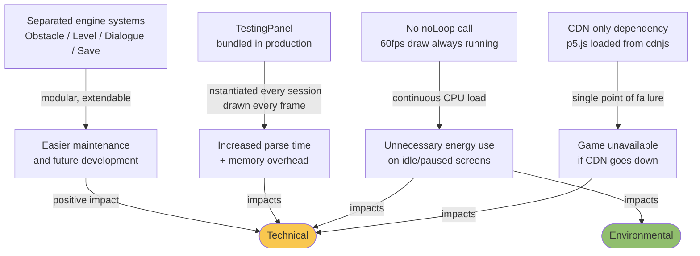

# Week 12 Lab: Sustainability Analysis

 

## Summary

> This lab applied the Sustainability Awareness Framework (SusAF) to Park Street Survivor across three dimensions, and used the Green Software Foundation pattern catalog to identify and implement concrete code-level improvements.

 

---

## Section 1: Sustainability Analysis (SusAF)

We analysed Park Street Survivor across three SusAF dimensions: Environmental, Technical, and Individual. For each dimension, we traced effect chains from design decisions to sustainability impacts using the SusAD methodology.

 

### Environmental

> [Full analysis → Environmental.md](./Environmental.md)

Park Street Survivor is browser-based with no physical copies, packaging, or hardware requirements beyond a standard computer and keyboard. This significantly reduces material waste compared to a traditional console or PC release.

Energy use is limited to file hosting and data transfer. The leaderboard runs on locally-managed online sheets rather than a dedicated server, which avoids constant heavy server-side processing.

Distribution is entirely digital, removing any shipping or logistics footprint. Some in-person collaboration and onsite testing did occur during development, so our transport impact is not zero, but it is small relative to a conventional release.

 

### Technical

> [Full analysis → Technical.md](./Technical.md)

Park Street Survivor is well-structured because the engine is built around separated systems — obstacle management, level control, dialogue, and save — which makes it extendable and easier to maintain over time.

However, three technical sustainability concerns were identified:

1. **CDN dependency** — p5.js and p5.sound were loaded from cdnjs.cloudflare.com with no local fallback. If the CDN goes down, the game does not load.
2. **Continuous draw loop** — `noLoop()` was never called. The game redraws at 60fps even on fully static screens like the pause menu and settings.
3. **TestingPanel in production** — the developer overlay remained bundled and running in every session. The entry points will be removed before final submission; the file is kept for development use.

 

### Individual

The game's core theme is workplace burnout and mental health, which makes the Individual dimension the most directly relevant. The design decisions here have real consequences for individual players.

**Positive impacts:**
- Content warnings are implemented before sensitive material, giving players informed consent
- The narrative portrays burnout and anxiety in a way that is intended to validate rather than trivialise those experiences
- The game is short and structured around five days, which keeps session length manageable

**Concerns:**
- The leaderboard introduces competitive social comparison, which could increase anxiety for some players
- The game is English-only, limiting accessibility for non-English speakers
- No accessibility options exist for players with visual impairments or motor difficulties

 

---

## Section 2: Green Software Foundation Patterns

We reviewed the [Green Software Foundation Web Patterns Catalog](https://patterns.greensoftware.foundation/catalog/web/) and identified all applicable patterns for this project.

 

### Patterns Applied to Game Code

These patterns have been implemented directly in the game codebase.

#### 1. Minimize Main Thread Work
**Pattern:** Reduce blocking operations on the browser's main thread.

**What we changed:** Added `_isStaticState()` helper in `sketch.js`. At the end of `draw()`, if the current state is static and no fade transition is running, `noLoop()` is called to pause the render loop. `loop()` is called at the top of `mouseMoved()` and `keyPressed()` so hover effects and input handling still work correctly.

Static states: `STATE_PAUSED`, `STATE_SETTINGS`, `STATE_HELP`, `STATE_DIFF_SELECT`, `STATE_DIFF_CONFIRM`, `STATE_LOAD_GAME`, `STATE_SAVE_CHOICE`.

**Files changed:** `sketch.js`

 

#### 2. Keep Request Counts Low
**Pattern:** Minimise the total number of HTTP requests.

**What we changed:** Downloaded p5.js (4.3 MB) and p5.sound.min.js (195 KB) into `docs/pss/lib/` and updated `index.html` to load them locally. This eliminates 2 external CDN requests on every page load and removes the single point of failure from the CDN dependency.

**Files changed:** `index.html`, added `lib/p5.js`, `lib/p5.sound.min.js`

 

#### 3. Avoid Tracking Unnecessary Data
**Pattern:** Eliminate redundant data collection practices.

**What we changed:** The item tutorial system previously stored one `localStorage` key per item (`pss_itemTutSeen_${item}`), which accumulates over time. These were consolidated into a single `pss_itemTuts` JSON object, reducing localStorage entries from N keys to 1.

**Files changed:** `sketch.js`, `src/TestingPanel.js`

 

### Patterns Pending — README / Documentation

These patterns apply to the project's documentation assets (GIFs, images) and will be applied once all team members have finalised their sections and the README is in its final state.

| Pattern | What needs changing |
|:---|:---|
| **Deprecate GIFs for animated content** | 20 GIF files across `docs/assets/` and `docs/Labs/` — convert to WebP |
| **Optimize image size** | Background and sprite assets in `docs/assets/` — compress without quality loss |
| **Minify web assets** | All JS source files in `docs/pss/src/` — minify for production build |

 

---

[Back to Project Home](../../../README.md)

