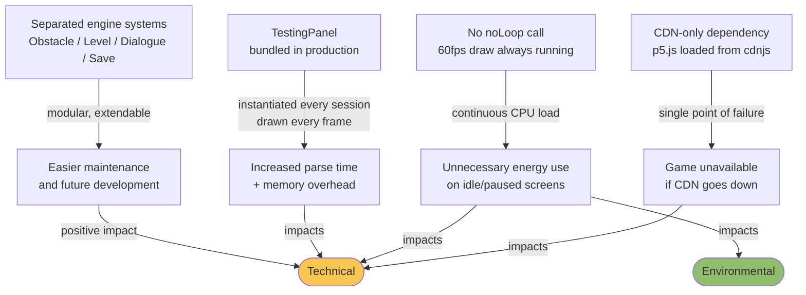

# Technical Sustainability

## SusAD Effect Chain

## Analysis

Overall, Park Street Survivor is well-structured because the engine is built around separated systems — obstacle management, level control, dialogue, and save — which makes it extendable and easier to maintain over time.

However, there are three technical sustainability concerns worth addressing.

The first is our CDN dependency. Both p5.js and p5.sound are loaded directly from cdnjs.cloudflare.com at runtime. There is no local fallback, so if the CDN goes down, the game simply does not load.

The second is the draw loop. p5.js calls `draw()` at 60 frames per second and we never call `noLoop()` — not during the pause menu, not on static screens, not on the main menu. This means the game continuously redraws even when nothing has changed, putting unnecessary load on the CPU.

The third is `TestingPanel`. We built this as a developer tool during development and the file is intentionally kept in the codebase. However, before final submission the entry points — instantiation and the draw call — will be removed so it does not run in the shipped version. This is the right approach: keeping the file available for development while making sure it does not add unnecessary overhead in production.

The CDN dependency and draw loop throttling remain as clear targets for a future improvement pass.
