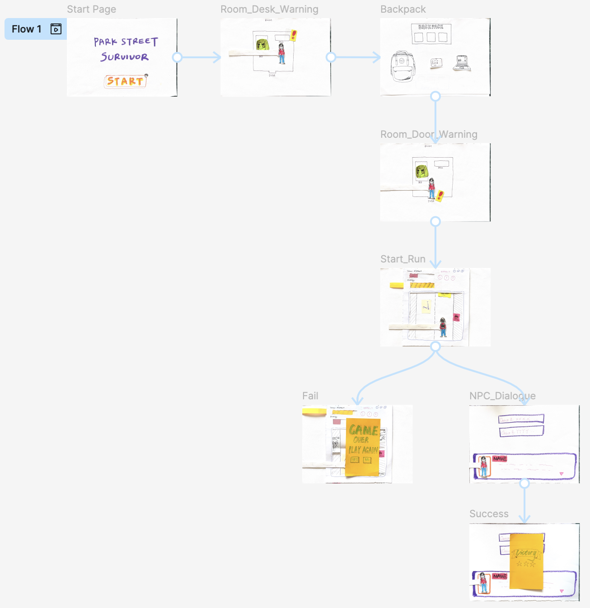
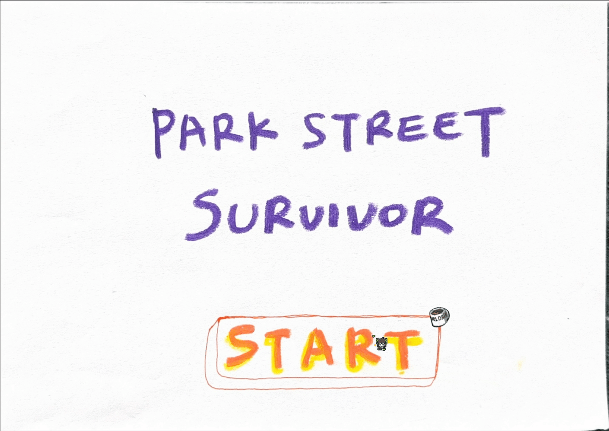

# Week 3 Lab: Prototype & Game Selection

 

## Summary

> The primary objective of Week 3 was **Game Concept Finalisation and Initial Prototyping**. After reviewing all proposed ideas from the previous weeks, our team reached a collective decision to move forward with **Park Street Survivor** as our chosen game concept. This week focused on translating the core design vision into a tangible wireframe prototype.

 

---

## Final Game Selection: Park Street Survivor

Following our group discussion, **Park Street Survivor** was selected as the project we will develop. The concept resonated with the whole team for its strong local identity, clear mechanical focus, and feasibility within p5.js. The game centres on a Bristol CS student navigating the iconic Park Street hill, managing survival stats while dodging real-world Bristol obstacles — buses, scooters, and steep inclines.

 

---

## Wireframe Flow

  <b>Overall Screen & State Flow</b> 
  

 

---

## Initial Prototype

> The following GIFs illustrate the preliminary prototype ideas for two core gameplay outcomes — a successful run and a failed run. These demonstrate the early thinking around player feedback, screen transitions, and state management.

 

| Success Path | Fail Path |
|:---:|:---:|
|  |  |
| Player reaches destination with stats intact | Player runs out of time or stamina |

 

> For detailed wireframe screenshots of individual screens, see the [`Wireframe_Flow_Pics/`](./Wireframe_Flow_Pics) folder, which includes: Start, Run, Room, Backpack, Dialogue, Fail, and Success screens.

 

---

**[ Back to Project Home ](../../../README.md)**

