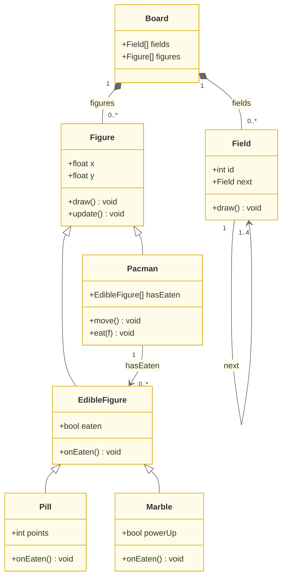
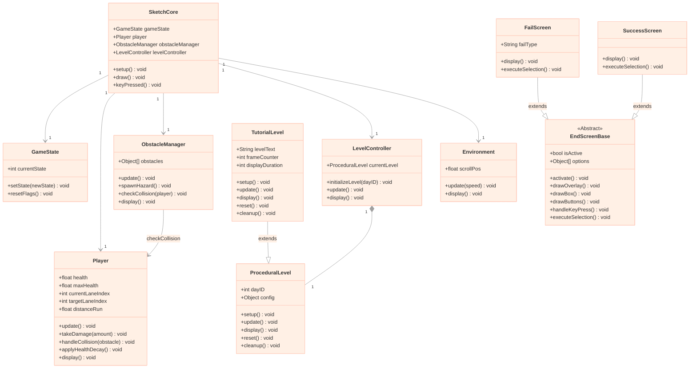

# Week 5 Lab: Object-Oriented Design & Agile Estimation

 

## Summary

> Week 5 marked a critical transition: from abstract requirements to concrete architecture. Using the Object-Oriented Design (OOD) theory introduced in the lab, we applied class modelling and UML diagramming directly to Park Street Survivor — defining the structural blueprint that would govern every sprint thereafter. We also ran our first formal Planning Poker session to size our backlog using story points.

 

---

## Section 1: Object-Oriented Architecture & UML Class Diagram

### The Hook — OOD via Pac-Man

The lab opened with a walkthrough of OOD fundamentals using Pac-Man as the teaching example. The class diagram below mirrors the structure introduced in the session — a `Board` that composes both `Field` tiles (with a self-referencing `next` chain of 1–4) and `Figure` objects. `Pacman` and `EdibleFigure` both extend `Figure`; `Pacman` additionally holds an association to `EdibleFigure` (tracking what it has eaten), while `Pill` and `Marble` specialise `EdibleFigure` further. Shared rendering and position logic lives in `Figure` once; only the unique behaviour of each subclass is overridden.

The exercise also included a warm-up and challenge task — modifying the `Spin` superclass to gradually decelerate, then creating a `Bounce` superclass as an alternative to spinning. These tasks were assigned to the fifth team member; however, as they departed the group during this sprint, the in-lab exercises were not completed. The OOD principles covered in the session were nonetheless applied directly to the Park Street Survivor architecture in the work below.

 

### Applying OOD to Park Street Survivor

We immediately mapped this thinking onto our own architecture. Two inheritance hierarchies crystallised clearly from the design session:

 

**Hierarchy 1 — Level Types**

The game has two distinct level behaviours: a standard procedural run, and a guided tutorial run for Day 1. Rather than duplicating all level logic, we defined `ProceduralLevel` as the base class — carrying the shared interface (`setup()`, `update()`, `display()`, `reset()`, `cleanup()`) — and derived `TutorialLevel` from it. `TutorialLevel` inherits the full lifecycle but overrides `display()` to inject frame-counted instructional text overlays, without touching any of the shared logic.

**Hierarchy 2 — End Screens**

Both the fail state and the win state need a semi-transparent overlay, a centred result box, a progress bar, and keyboard/mouse navigation. We defined `EndScreenBase` as an abstract parent carrying all of this shared rendering logic. `FailScreen` and `SuccessScreen` then extend it, each overriding only `display()` and `executeSelection()` to show their respective content (fail reason text vs. score submission). The `EndScreenManager` coordinates them from the outside without needing to know which concrete subclass is active.

**Why This Matters**

Both hierarchies embody the DRY principle directly. When we later updated the shared overlay style (border radius, backdrop alpha), we edited one method in `EndScreenBase` — not in every screen individually. When a new level type is needed in future, it can extend `ProceduralLevel` and override only what it needs. The architecture remains open for extension without requiring modification of existing, tested code.

 

### Early-Stage Class Diagram (Week 5 Design Session)

The diagram below represents our initial OOD thinking from the Week 5 session — a deliberately simplified view focusing on the core gameplay loop and the two inheritance hierarchies identified above.

> **Note on evolution:** This diagram captures the initial Week 5 design. The fully elaborated class diagram — incorporating all 25+ classes, composition chains, cross-system associations, and Mermaid styling — evolved over subsequent sprints and is documented in [`class_diagram.md`](./class_diagram.md).

 

### Sequence Diagrams

Alongside the class diagram, we produced two UML sequence diagrams to model the dynamic behaviour of the most critical gameplay flows.

**Main Sequence Diagram** — illustrates the high-level execution flow from Day 1 start to level completion: menu → `setupRun()` → room preparation → `STATE_DAY_RUN` → victory phase.

  

**Utility Item Interaction Diagram** — zooms in on the input-routing flow for utility item activation during the run: keyboard input → `Player` → item type branch → state update → `GameState` snapshot.

  

 

---

## Section 2: Minimum Viable Product (MVP) Development

### Core Philosophy

Our MVP definition was deliberately narrow: **prove that the core loop runs**. The core loop is: player moves between lanes → obstacle appears → collision is detected → health changes → game responds. Everything else — art assets, narrative, audio, menus — is non-essential until this loop is verified.

This philosophy directly maps onto the **"Logic-First, Art-Later"** pipeline described in our process documentation. Unblocking the collision and movement logic allowed Charlotte and Ray to iterate on mechanics independently of Lucca and Layla's art pipeline.

### What We Actually Built

In the MVP phase, all obstacle and environment visuals were replaced with placeholder geometry — coloured rectangles drawn directly via p5.js `rect()` calls. Lane boundaries were defined as numeric constants. The player sprite was a simple rectangle with a hitbox overlay visible in developer mode.

With placeholders in place, we were able to verify the following mechanics in isolation:

| Mechanism | Verified |
|:---|:---:|
| A / D lane switching with spring-damper physics | Yes |
| Lane boundary clamping (lanes 1–4, no overflow) | Yes |
| Per-frame health decay (`healthDecay` rate) | Yes |
| Collision detection triggering damage | Yes |
| HP reaching 0 → fail state transition | Yes |

Once these passed, the asset injection sprint began — Lucca and Layla's finalised sprites were dropped into the verified spatial framework without touching the logic layer.

 

---

## Section 3: Agile Estimation & Planning Poker

### Methodology

With the architecture defined and the MVP scope agreed, we ran our first Planning Poker session to assign story points to the Jira backlog using the Fibonacci sequence (1, 2, 3, 5, 8, 13…). The non-linear scale forces the team to acknowledge uncertainty: the gap between 5 and 8 is a deliberate prompt to discuss what makes a task harder than it first appears.

 

### Case 1 — Quick Consensus: Lane Switching

> *"As a player, I want to switch lanes using keyboard input, so that I can react quickly to oncoming obstacles."*
>
> Given the run is active and the player is not stunned / When I press A, D, or the left/right arrow keys / Then the character smoothly transitions to the adjacent lane using spring-damper physics.

| Team Member | Estimate |
|:---:|:---:|
| Charlotte | 3 |
| Lucca | 3 |
| Ray | 3 |
| Layla | 2 |

The team converged quickly. Layla initially estimated 2, reasoning it was a straightforward input check plus a position update. Charlotte clarified that the acceptance criterion explicitly required **spring-damper physics** (rather than an instant snap) — meaning a velocity value, a spring constant, and a damping coefficient all needed to be tuned and the movement had to feel responsive without overshooting. After a brief discussion, the team agreed on **3 points**.

 

### Case 2 — Productive Disagreement: Auto-Save System

> *"As a returning player, I want my progress to be saved automatically, so that I can resume from my last unlocked day without replaying completed content."*
>
> Given the player is in the room, run, or paused state / When three seconds have elapsed since the last save / Then the current day, unlocked progress, difficulty, and all dialogue choices are written to localStorage automatically.

| Team Member | Estimate |
|:---:|:---:|
| Charlotte | 8 |
| Lucca | 2 |
| Ray | 5 |
| Layla | 3 |

This story produced the widest and most revealing spread of the session. Lucca estimated 2, reasoning it was a single `localStorage.setItem()` call. Charlotte came in at 8 and outlined the hidden complexity the acceptance criteria implied:

1. **State snapshot breadth:** the save must capture not just the current day but unlocked progress, selected difficulty, *and* all dialogue choices — requiring a structured serialisation of multiple independent subsystems (`GameState`, `LevelController`, `SaveSystem`).
2. **Three-second timer synchronisation:** the auto-save must fire on a frame-accurate tick during live gameplay without causing a perceptible hitch — requiring the save to be decoupled from the draw loop.
3. **Corruption prevention:** an unexpected browser closure mid-write must not corrupt the existing save, which meant implementing a write-verify pattern and graceful `null`-check fallbacks on load.

Ray and Layla both revised their estimates upward after this discussion — Ray to 8 and Layla to 5. The team settled on **8 points**.

The value of this disagreement was not the final number — it was the pre-implementation discovery of three architectural constraints (serialisation scope, frame-decoupled ticking, corruption safety) that would have been expensive to retrofit had they surfaced mid-sprint as bugs.

 

---

## Reflection

Week 5 established the two structural foundations that every subsequent sprint built upon. The OOD session gave us a shared vocabulary — when a new screen was added in Week 9, everyone immediately knew it should extend `EndScreenBase` rather than duplicate its overlay logic. The Planning Poker session established a team norm: estimates are conversations, not verdicts. The most productive moments were never the unanimous quick agreements, but the cases where two people held different numbers and had to explain why.

 

---

[Back to Project Home](../../../README.md)

